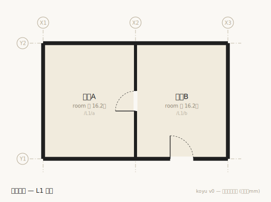
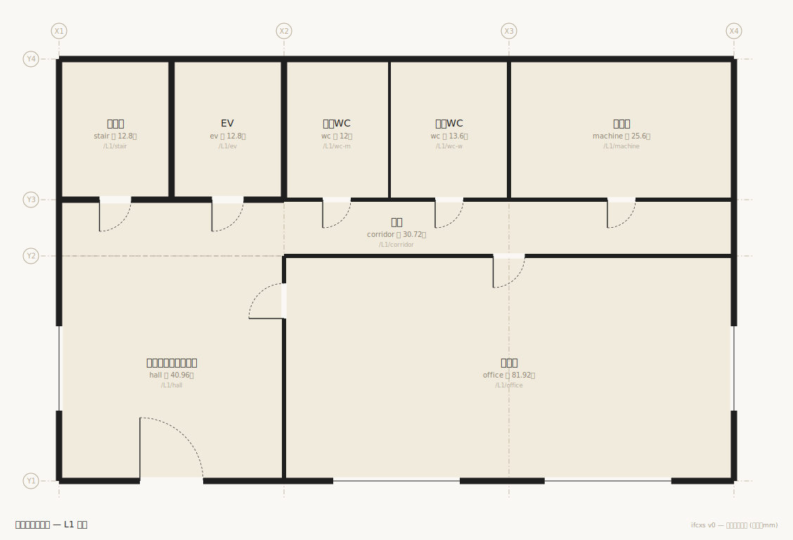
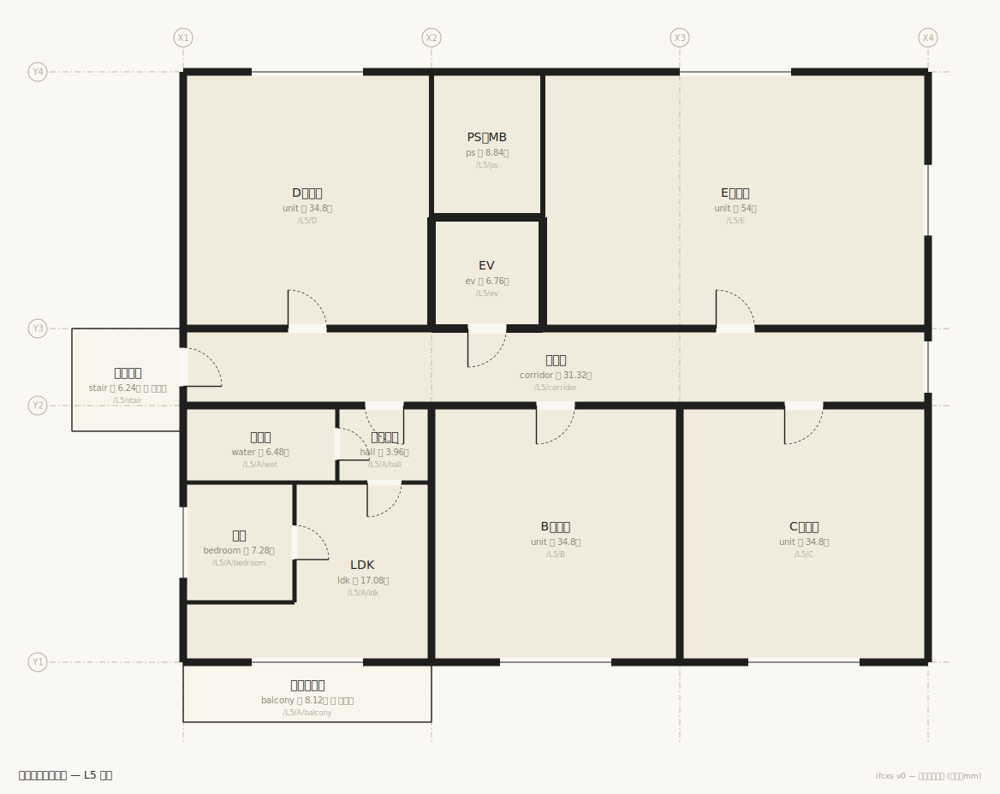

# IFCXS — 建築を書く

空間を一次要素とするテキストネイティブな建築記述の探求。壁は物ではなく二つの空間の境界という関係であり、形はソースではなく生成物である。建物一棟を数百行のテキストで書き、git・LLM・都市データと同じ土俵に載せることを狙う。主張の全文は [docs/writing-architecture.md](docs/writing-architecture.md)。

二室一扉はこう書く (全文 [examples/two-rooms.ifcxs](examples/two-rooms.ifcxs)):

```
space /L1/a room X1..X2 Y1..Y2 name:居室A
space /L1/b room X2..X3 Y1..Y2 name:居室B
space /out  exterior name:外部

boundary /L1/a /L1/b t:120 spec:PW1
  door w:780 h:2000
```

ここから平面図が生成される。壁を描く操作はどこにも無い — 壁は空間の割付から導出される。



2フロアのオフィス (廊下・コア・通り芯オフセット壁・階段/EV・高さの整合つき) でも約100行 ([examples/office.ifcxs](examples/office.ifcxs))。解像度は基本計画レベル — 垂れ壁を表現しないのは省略ではなく抽象度の選択で、計画初期にBIMが重すぎたという弱点の裏側がこの記述の主戦場である。高さ方向の一貫性は「天井高+上階slab ≤ 階高」という宣言された不変量の検査で担保する (ADR-0002)。



10階建て内廊下型集合住宅 (43戸、EV+屋外階段、屋上、Aタイプは間取り込み) は **183行** ([examples/mansion.ifcxs](examples/mansion.ifcxs))。基準階は一度だけ書き、`/L2..L9/A` のスパンが8フロアへ展開される (ADR-0004)。L字のLDKは矩形の合併、住戸は `zone` (数える集約) で間取りに割っても専有面積の言葉を保つ (ADR-0005)。吹抜けは `type:void` の垂直境界 — 床の不在も境界で書く (ADR-0006)。`doors` が「9階のLDKから地上まで扉3枚」に、`light` が住居系居室の1/7採光に即答する。



## 使い方

```sh
npm install
npm test

npm run ifcxs -- check examples/two-rooms.ifcxs        # 整合チェック
npm run ifcxs -- plan  examples/two-rooms.ifcxs -o out/two-rooms.svg
npm run ifcxs -- doors examples/two-rooms.ifcxs /L1/a /out   # → 2枚
npm run ifcxs -- graph examples/two-rooms.ifcxs        # 空間グラフ
npm run ifcxs -- stats examples/two-rooms.ifcxs        # 面積 (壁芯)
npm run ifcxs -- json  examples/two-rooms.ifcxs        # 正準JSON (機械形式)

npm run ifcxs -- plan   examples/office.ifcxs -l L2    # レベル別の平面図
npm run ifcxs -- levels examples/office.ifcxs          # テキストの矩計 (高さの積み上がり)
npm run ifcxs -- doors  examples/office.ifcxs /L2/office /out   # → 4枚 (階段経由)
npm run ifcxs -- stats  examples/mansion.ifcxs         # 面積・ゾーン集計・専有率
npm run ifcxs -- light  examples/mansion.ifcxs         # 採光 1/7 の粗い判定
```

## 構成

記法の仕様と書き比べは [spec/notation-v0.md](spec/notation-v0.md)、設計判断の記録は [docs/decisions/](docs/decisions/)、行程は [docs/roadmap.md](docs/roadmap.md) (Linear: [IFCXS](https://linear.app/munipersonal/project/ifcxs-2789f588a03a/overview) と対応)、日々の記録は [docs/log/](docs/log/)。実装は src/ に約900行 (パーサ・グラフ・チェック・平面図生成・CLI)、テストは test/。IFCXの読解メモは [docs/ifcx-notes.md](docs/ifcx-notes.md)、同じ二室一扉をIFC4・IFCXで書いた三方比較は [examples/comparison/](examples/comparison/README.md)。

## 技術方針

TypeScriptで書き、実行時依存はゼロに保つ。BIM/IFC系のツールが必要になったらThatOpenのOSS (web-ifc, @thatopen/components) を使う。参照リポジトリをクローンする場合は ~/Documents/github に置く。IFC_samples/ はIFC取り込み (M5) 用のサンプルコーパスでgitの外に置いている。

これは探求である。オーサリングツールは作らず、往復互換は捨て、直交グリッドに絞る。
