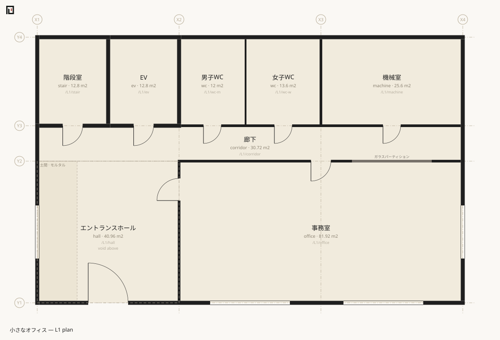
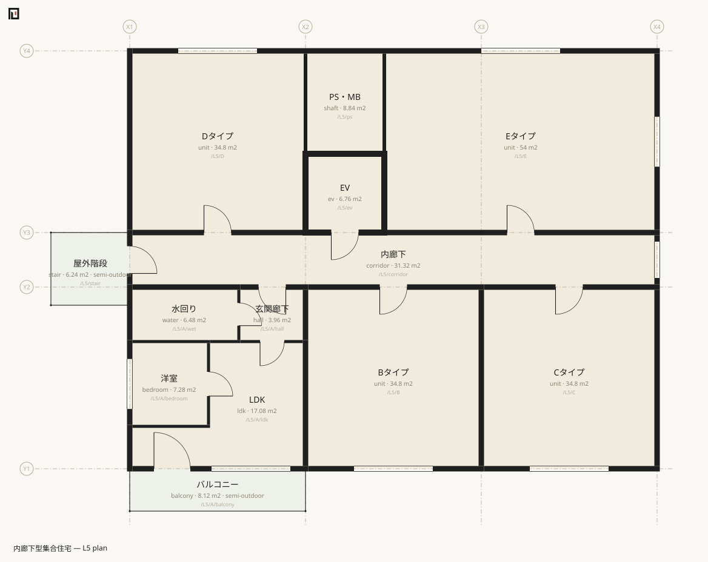

# koyu (戸牖) — writing architecture, not buildings

> 鑿戸牖以為室、当其無、有室之用
> *Cut doors and windows to make a room; it is the emptiness within that makes the room useful.* — Laozi, ch. 11

[日本語](README.ja.md)

**muro is the notation; koyu is the toolchain that reads it, and the name of this undertaking.** A `.muro` file declares which language it is written in, and the two carry [separate version lines](docs/reference/stability.md).

An exploration of text-native architectural description with **space as the primary element**. A wall is not a thing — it is the boundary between two spaces. An opening is a connection cut into a boundary. What is authored is spatial regions and the boundary relations between them; the form of building components is not source — it is generated. A whole building fits in a few hundred lines of text, which puts architecture on the same ground as git and LLMs, and makes it light enough to be a candidate for city-scale connection. The full argument (in Japanese) is in [docs/writing-architecture.md](docs/writing-architecture.md).

## Documentation

**[docs/](docs/index.md) is the documentation, and it is authoritative.** 155 pages, one tree in English, laid out by what you came to do.

- **[docs/start/](docs/start/index.md)** — the tutorial: one room to a two-storey house in 30–45 minutes. **If you are learning koyu, start here.**
- **[docs/why/](docs/why/index.md)** — the explanations: why space is primary, why a boundary is a relation, why the form must be unique.
- **[docs/howto/](docs/howto/index.md)** — recipes, by goal and by symptom.
- **[docs/reference/](docs/reference/index.md)** — the normative reference: [every `.muro` word](docs/reference/muro/index.md), [all 68 diagnostics](docs/reference/diagnostics/index.md), [the 15 verdicts](docs/reference/validate/index.md), [the CLI](docs/reference/cli/index.md), [the MCP server](docs/reference/mcp/index.md), [the API](docs/reference/api/index.md), [the derived form](docs/reference/form/index.md), [canonical JSON](docs/reference/json/index.md).
- **[AGENTS.md](AGENTS.md)** — the entry point for LLM agents working in this repository.

One room is written like this. Four lines, and it is a complete file.

```muro
grid X 0 3600
grid Y 0 4000
level L1 0 h:2400 slab:150
space /L1/a room X1..X2 Y1..Y2
```

`koyu plan` produces the floor plan. Not one wall is drawn — there is a space, but not one boundary.


Add one more `space` line. Change nothing else.

```muro
grid X 0 3600 5400
grid Y 0 4000
level L1 0 h:2400 slab:150
space /L1/a room X1..X2 Y1..Y2
space /L1/b room X2..X3 Y1..Y2
```


**A wall appears. There is no operation anywhere that draws a wall.** A wall is the boundary relation between two spaces, derived from the layout of those spaces. Where a pair of touching spaces has no declaration, that means "wall" rather than "undefined".

A two-story office — corridor, core, offset walls off the grid lines, stairs/elevator, vertical consistency — is about 100 lines ([examples/office.muro](examples/office.muro)). The resolution is schematic-design level. Not modeling downstand beams is not an omission but a chosen level of abstraction: the early design phase, where BIM has always been too heavy, is exactly where this notation lives. Vertical consistency is enforced as a declared invariant — ceiling height + slab above ≤ floor-to-floor height (ADR-0002).



A 10-story double-loaded apartment building — 43 units, elevator + exterior stair, roof, unit type A with its interior layout — is **187 lines** ([examples/mansion.muro](examples/mansion.muro)). The typical floor is written once and the span `/L2..L9/A` expands it across eight floors (ADR-0004). An L-shaped living room is a union of rectangles; units are `zone`s (counted aggregation), so subdividing a unit into rooms never loses the language of net area (ADR-0005). A double-height void is a vertical boundary of `type:void` — even the absence of a floor is written as a boundary (ADR-0006). `doors` answers "how many doors from the 9th-floor living room to the street"; `light` gives a first-pass check of the 1/7 daylighting ratio for habitable rooms.



The full-feature showcase is **[examples/tower/](examples/tower/)** — an 11-storey mixed-use corner building (retail below, housing above, a penthouse floor, ~4,786m² GFA) composed from 9 files. Its site is an irregular pentagon: site shape is the one thing this notation allows to be *written* as geometry (`polygon`, ADR-0011), because a site's shape is surveyed input from the world, not designed form — it lives in its own quarantined layer (site-geometry.muro) and the derived area, building containment, and the site boundary line on the plan all follow from it. Everything else demonstrates the rest of the notation at once: a two-storey entrance void, interlocking L-shaped units, balconies, a low-rise roof terrace written as an exception-floor *diff layer*, door/window assets with an auto-door, explicit grid-referenced positions, and one unit type subdivided into rooms. 178 spaces / 543 boundaries check clean; 66 habitable rooms pass the 1/7 daylight test; "how many doors from the 9th-floor living room to the street" answers 4.

A building can also be written as a set of files and composed — additive layering inspired by USD, with no silent overrides (layer strength is deliberately not adopted, ADR-0010) ([examples/house/](examples/house/)): a base layer declares the shared foundation (grid, levels) exactly once and `import`s the door/window assets, the site, and each floor — authored separately, merged additively, with conflicts (duplicate paths, duplicate asset names, re-declared grids) rejected at build time with file:line provenance. `koyu check main.muro` is the build gate for the whole building. Door/window types are `asset`s — Revit's Family, USD's Reference — referenced by instances that override their defaults (`door SD1 sill:800`), and opening positions can be written against the grid (`at:Y2+1820`) with overflow and overlap validated (ADR-0010).

## Getting started

1. **Install.** Clone this repository and run `npm install`.
2. **Write the four lines above** into `first.muro`, then run `npx tsx src/cli.ts check first.muro` and `npx tsx src/cli.ts plan first.muro -o out/first.svg`.
3. **Read a bundled example.** `npx tsx src/cli.ts check examples/two-rooms.muro` prints `✔ Consistent — 3 spaces / 3 boundaries`; `stats`, `graph`, and `doors` answer about the same file.

`grid` and `level` must be declared before anything that refers to them, and the type (`room`, the second positional word) is required; everything else — the `koyu` version line, `unit`, `name`, heights — is optional. From here, [docs/start/](docs/start/index.md) is a managed path from this one room to a two-storey house with per-floor plans, a circulation check, and a daylight check.

## Usage

```sh
npm install
npm test

npm run koyu -- check examples/two-rooms.muro        # consistency check
npm run koyu -- plan  examples/two-rooms.muro -o out/two-rooms.svg
npm run koyu -- doors examples/two-rooms.muro /L1/a /out   # → 2 doors
npm run koyu -- graph examples/two-rooms.muro        # the space graph
npm run koyu -- stats examples/two-rooms.muro        # areas (centerline)
npm run koyu -- json  examples/two-rooms.muro        # canonical JSON (machine form)
npm run koyu -- diff  a.muro b.muro                  # semantic diff, in the language of composition

npm run koyu -- plan   examples/office.muro -l L2    # per-level plans
npm run koyu -- levels examples/office.muro          # a textual section (height stack-up)
npm run koyu -- doors  examples/office.muro /L2/office /out   # → 4 doors (via the stair)
npm run koyu -- stats  examples/mansion.muro         # areas, zone rollups, efficiency ratio
npm run koyu -- light  examples/mansion.muro         # rough 1/7 daylight check
npm run koyu -- site   examples/house.muro           # site area, frontage, coverage, FAR
npm run koyu -- check  examples/house/main.muro      # multi-file composition: the build gate
npm run koyu -- site   examples/tower/main.muro      # showcase: polygon site, two roads, FAR
```

## LLM connection

`koyu-mcp` is a zero-dependency MCP server over stdio (ADR-0012): an LLM agent reads the building (`layers`), edits it (`write_layer`), and `check` acts as the build gate — errors come back with layer:line provenance. `doors` / `light` / `site` / `stats` are the same description read different ways. The whole 4,786m² showcase is 8,099 tokens as source (measured; IFC4 is 14x, IFCX 25x — see [examples/comparison/](examples/comparison/README.md)), so a whole building fits in one context with room to work. Whether an agent can *edit* it correctly is the next watershed — an edit eval is planned, not yet run ([docs/horizon.md](docs/horizon.md)). The horizon design (digital twin, ontology alignment via W3C BOT, city connection) is in the same document.

Registering it is one line (`claude mcp add koyu -- npx -p @kensnzk/koyu koyu-mcp`). Setup for Claude Code, Claude Desktop, and other clients, plus the standard loop, is in [docs/howto/install-mcp.md](docs/howto/install-mcp.md).

The MCP server and the CLI are the half that *judges*; the knowledge for working in muro ships separately as agent skills, loaded locally by the client so they cost nothing per call — [koyu-design](skills/koyu-design/SKILL.md) writes a building, [koyu-validate](skills/koyu-validate/SKILL.md) judges and repairs one, [koyu-revise](skills/koyu-revise/SKILL.md) changes one without breaking the rest. One skill per question the processor answers. Installation (Claude Code, Claude.ai, Claude Desktop) is in [skills/README.md](skills/README.md).

## Layout

The documentation lives in [docs/](docs/index.md) — tutorial, explanations, how-to, and the normative reference (the notation, diagnostics, verdicts, CLI, MCP, API, the derived form, canonical JSON). **That tree is authoritative**; ADRs in [docs/decisions/](docs/decisions/) record why each decision was made and are never amended, so they are history rather than current truth. Coverage against the IFC4 architectural core is [docs/ifc-coverage.md](docs/ifc-coverage.md); the roadmap is [docs/roadmap.md](docs/roadmap.md); daily logs are in [docs/log/](docs/log/). The implementation is ~7,500 lines in src/ (parser, graph, checks, plan generation, CLI, MCP server), tests in test/. Reading notes on IFCX are in [docs/ifcx-notes.md](docs/ifcx-notes.md); the same two rooms written three ways (this notation, IFC4, IFCX) is in [examples/comparison/](examples/comparison/README.md).

## Technical stance

TypeScript, zero runtime dependencies. When BIM/IFC tooling is needed, ThatOpen's OSS (web-ifc, @thatopen/components) is used. IFC_samples/ is a sample corpus for one-way IFC import (M5) and is kept out of git (third-party files; not redistributed).

This is an exploration. It is not aimed at commercialization; it builds no authoring tool, abandons round-trip compatibility, and restricts itself to orthogonal grids.

## The name

戸牖 (*koyu*) means doors and windows — openings. Laozi, chapter 11: cut doors and windows to make a room; it is the emptiness — the space — that makes the room useful, not the walls. For a notation in which space is primary, walls are relations, and openings are connections cut into boundaries, this is the oldest source there is. The homophone 固有 (*koyu*, "proper / intrinsic") is also intended: every space is addressed by a human-readable proper name, its hierarchical path.

The file extension is `.muro` (室, *muro* — room). The unit a file holds is not a building component but a room.

## License

Code (src/, test/, examples/, …) is under the [Apache License 2.0](LICENSE). Documents (docs/, and the essay "[建築を書く / Writing Architecture](docs/writing-architecture.md)") are under [CC BY 4.0](https://creativecommons.org/licenses/by/4.0/). Citation metadata is in [CITATION.cff](CITATION.cff).
