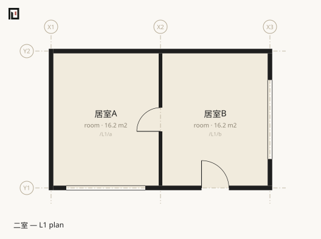

# two-rooms — the smallest unit of the notation

`examples/two-rooms.muro`. 26 lines / 3 spaces / 3 boundaries / 32.40 m² of interior floor area. Two rooms side by side, one door between them, one door to the outside, three windows. **It is the smallest scene in which every element of the notation appears once.**



## What it shows first

- **[`space`](../reference/muro/space.md)** — a path for identity, a type as the second positional, a region as a union of rectangles.
- **[`boundary`](../reference/muro/boundary.md)** — that a wall is not a thing but a **relation between two spaces**. The wall centerline segment is written nowhere; it is derived from the two rectangles.
- **Indented [`door`](../reference/muro/door.md) / [`window`](../reference/muro/window.md)** — an opening belongs to a wall (a boundary), never to a space.
- **`/out`** — the outside is a space too. It carries no region, so the envelope boundaries have to be **written explicitly**.
- **`edge:S`** — an opening onto the outside has to pick a side. The perimeter of `/L1/b` splits into three of them. X is east-positive and Y is north-positive, so N=+Y, S=-Y, E=+X, W=-X.
- **`daylight:1`** — whether the daylight check applies is never inferred from the type. Only the spaces that say so join the population `light` examines.

## The whole file

```muro
koyu 1.1
name 二室
unit mm

grid X 0 3600 7200
grid Y 0 4500
level L1 0 h:2400 slab:150

space /L1/a room X1..X2 Y1..Y2 name:居室A daylight:1
space /L1/b room X2..X3 Y1..Y2 name:居室B daylight:1
space /out name:外部 outside:1

boundary /L1/a /L1/b t:120 spec:PW1
  door w:780 h:2000

boundary /L1/a /out t:150 spec:EW1 fire:60
  window w:2600 h:1100 edge:S name:腰窓
boundary /L1/b /out t:150 spec:EW1 fire:60
  door w:900 h:2100 edge:S name:玄関
  window w:2600 h:1100 edge:E name:腰窓
```

**The wall between the rooms looks written, but what is actually written is only the relation.** `boundary /L1/a /L1/b` says no more than "A and B meet at a wall". The start and end of the segment fall out of the fact that the two rectangles overlap along X2 over the interval Y1..Y2. The thickness 120 is split 60 to either side of the centerline, and both rooms measure 3600 × 4500 = 16.20 m² at the centerline.

The three envelope lines (`boundary /L1/a /out` and the rest) have to be written, because `/out` has no region and so touching cannot be established from geometry. Conversely, deleting `boundary /L1/a /L1/b` still leaves a wall standing between A and B — a wall is what touching spaces default to. But that wall carries no door, so it **stops being passable**.

## Questions worth putting to it

### How many doors to get outside

Room A has no door to the outside, so the answer goes through room B.

```sh
npx tsx src/cli.ts doors examples/two-rooms.muro /L1/a /out
```

```text
2 doors — /L1/a → /L1/b → /out
```

### What does the adjacency look like as a whole

The distinction between "a wall" and "one door" is exactly the weight on the graph edge.

```sh
npx tsx src/cli.ts graph examples/two-rooms.muro
```

```text
/L1/a (居室A)
  — 1 door → /L1/b  (spec:PW1)
  | wall → /out  (spec:EW1 fire:60)
/L1/b (居室B)
  — 1 door → /L1/a  (spec:PW1)
  — 1 door → /out  (spec:EW1 fire:60)
/out (外部)
  | wall → /L1/a  (spec:EW1 fire:60)
  — 1 door → /L1/b  (spec:EW1 fire:60)
```

Windows never appear as edges. A `window` is a vessel for daylight, not an opening for passage.

### How is area counted

```sh
npx tsx src/cli.ts stats examples/two-rooms.muro
```

```text
L1
  /L1/a	居室A	room	16.20 m2
  /L1/b	居室B	room	16.20 m2
  Subtotal 32.40 m2
Total 32.40 m2 (indoor floor area)
  room: 32.40 m2
```

### Is there enough daylight

```sh
npx tsx src/cli.ts light examples/two-rooms.muro
```

```text
✔ /L1/a	居室A	window 2.86 m2 / floor 16.20 m2 = 1/5.7 (needs 1/7 ≈ 2.31 m2)
✔ /L1/b	居室B	window 2.86 m2 / floor 16.20 m2 = 1/5.7 (needs 1/7 ≈ 2.31 m2)
✔ Every room meets 1/7 — 2 rooms in scope (a rough judgement with no correction factor — this is validation, not what check guarantees)
```

The 2.86 m² of window came from 2600 × 1100. **The number 2.86 appears nowhere in the source.**

## Read next

- Multiple storeys and a void — [office](office.md)
- The same scene written in IFC4 and IFCX, measured — [koyu measured against IFC](vs-ifc.md)
