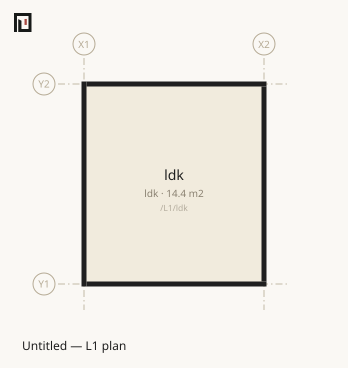
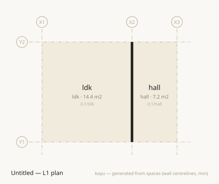
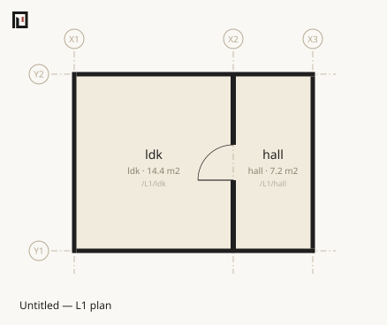
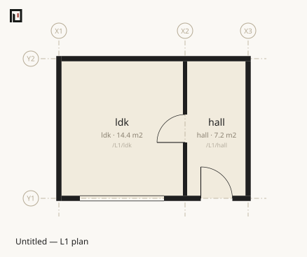
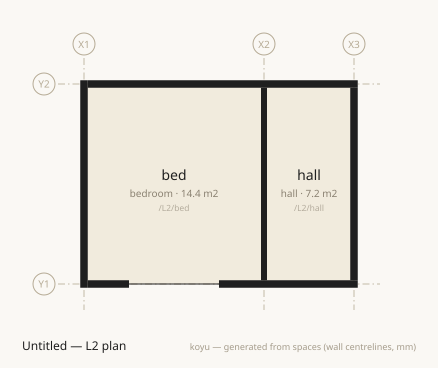
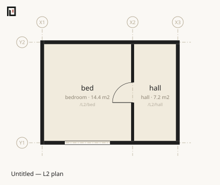
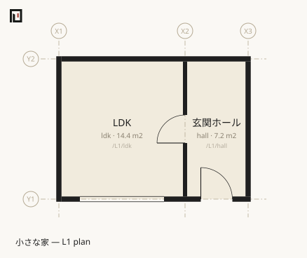
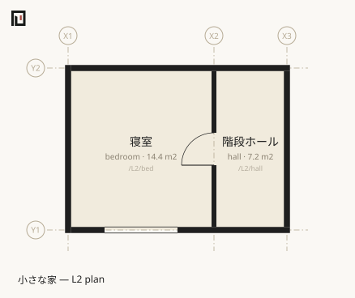

# Your first .muro — from one room to a two-storey house

Write one two-storey house in koyu, produce its plan drawings, and confirm its circulation and daylighting. It takes 30–45 minutes.

This document is a **lesson**. Work down it in order, writing exactly what it says. No choices appear. Explanation is kept to a minimum, and doorways into the reference are placed instead — read those once you have been through.

What you will have at the end:

- One 30-line `.muro` file
- A plan drawing (SVG) for each level
- Answers to "how many doors from the upstairs bedroom to the outside?" and "do the habitable rooms get enough daylight?"

**The tool speaks English.** Its output is pasted here exactly as it appears; `✔` marks success, `⚠` a warning, and `✖` an error. Names written in the examples stay in Japanese, because they are the author's words, not the tool's.

## Getting ready

All you need is Node.js (22 or newer). This page works from a clone of the repository. Installing from npm and the other routes are in [Installing koyu](install.md).

```sh
git clone https://github.com/kensnzk/koyu.git
cd koyu
npm install
mkdir -p out
```

The only file you will write from here on is `out/house.muro`. `out/` is in `.gitignore`, so nothing you put there dirties the repository. Run every command from the root of the repository.

The endpoint of each stage is kept under `examples/steps/`, from `01-one-room.muro` through `06-finished.muro`. Compare against them whenever you lose your way.

## Stage 1 — one room

Create `out/house.muro` and write these four lines.

```muro
grid X 0 3600 5400
grid Y 0 4000
level L1 0 h:2400 slab:150
space /L1/ldk ldk X1..X2 Y1..Y2
```

Here is what the four lines say.

- `grid X 0 3600 5400` — declares the **grid lines** of the X axis. They are named `X1`, `X2`, `X3` automatically, left to right. Position is always written in the language of these grid lines — apart from the shape of a site, there is no line in this notation that writes a coordinate directly.
- `grid Y 0 4000` — the same for the Y axis. `Y1` and `Y2` come into being.
- `level L1 0 h:2400 slab:150` — puts a level called `L1` at height 0 mm. `h:` is its nominal ceiling height, `slab:` the thickness of its floor construction.
- `space /L1/ldk ldk X1..X2 Y1..Y2` — puts down one space. `/L1/ldk` is this space's **path** (its identity itself), the `ldk` that follows is its **type**, and the rest is its region.

The type is the second positional argument and **cannot be omitted**. Because the path begins with `L1`, this space belongs to level `L1`.

Write `grid` and `level` before any line that uses them. This is the only place where line order carries meaning — a `boundary`, for instance, may refer to a space that has not been written yet.

Check it.

```sh
npx tsx src/cli.ts check out/house.muro
```

```text
✔ Consistent — 1 space / 0 boundaries
  Structural consistency only — architectural validity is what koyu validate says, separately
```

Produce the plan.

```sh
npx tsx src/cli.ts plan out/house.muro
```

```text
Generated the plan: out/house-L1.svg
```

Open `out/house-L1.svg` in a browser.



**Not one wall is drawn.** There is a space, but not one boundary. A wall is not a possession that hangs off a space.

What `check` looks at is only whether what is written is consistent. An empty file passes too, with `✔ Consistent — 0 spaces / 0 boundaries`. Green does not mean "a correct building" — stage 5 takes that head-on.

To look things up: [grid](../reference/muro/grid.md), [level](../reference/muro/level.md), [space](../reference/muro/space.md).

## Stage 2 — two rooms, and the wall you did not write

Add one `space` line. Change nothing else.

```muro
grid X 0 3600 5400
grid Y 0 4000
level L1 0 h:2400 slab:150
space /L1/ldk ldk X1..X2 Y1..Y2
space /L1/hall hall X2..X3 Y1..Y2
```

Check it.

```sh
npx tsx src/cli.ts check out/house.muro
```

```text
✔ Consistent — 2 spaces / 1 boundary
  Structural consistency only — architectural validity is what koyu validate says, separately
```

**Boundaries went from 0 to 1.** You wrote no boundary line at all.

Produce the plan again and open it.

```sh
npx tsx src/cli.ts plan out/house.muro
```



One line has appeared inside the SVG.

```text
<path d="M 261.5 284 L 261.5 84 L 266.5 84 L 266.5 284 Z" fill="#1f1f1f"/>
```

That is the wall. The previous stage's drawing had zero black bands; this one has one — and the only line you added was one `space`.

Stop here for a moment. **There is no operation in this notation that draws a wall.** A wall is the boundary between two spaces, derived from how the spaces are laid out. Where a pair of touching spaces carries no boundary declaration at all, that means "wall" rather than "undefined". Vertically the rule is its mirror image: you do not write floors, and the default is floor.

What the defaults are is in [Default boundaries](../reference/muro/defaults.md); how a wall centreline segment is raised from a shared edge is in [The form of boundaries](../reference/form/boundaries.md).

## Stage 3 — a door

The derived wall stands there as a thing, so without a door there is no way through. To cut a hole, you must **declare** that boundary. Add two lines, `boundary` and `door`, at the end (blank lines added for legibility).

```muro
grid X 0 3600 5400
grid Y 0 4000
level L1 0 h:2400 slab:150

space /L1/ldk ldk X1..X2 Y1..Y2
space /L1/hall hall X2..X3 Y1..Y2

boundary /L1/ldk /L1/hall t:120
  door w:800 h:2000
```

A `boundary` is a relation joining two space paths. You do not write a line segment — it is derived from how the two spaces are laid out. `t:120` is the wall thickness in mm.

The `door` line is **indented**. An indented line belongs to the parent line just above it, and that is the only nesting this notation has. A `door` needs a width, `w`.

Check it and produce the drawing.

```sh
npx tsx src/cli.ts check out/house.muro
npx tsx src/cli.ts plan out/house.muro
```

```text
✔ Consistent — 2 spaces / 1 boundary
  Structural consistency only — architectural validity is what koyu validate says, separately
Generated the plan: out/house-L1.svg
```

The boundary count is still 1. The wall that was derived has simply been replaced by a wall that is declared.



Ask the model whether the door gets you through.

```sh
npx tsx src/cli.ts doors out/house.muro /L1/ldk /L1/hall
```

```text
1 door — /L1/ldk → /L1/hall
```

**You declare a boundary only when you have something to say about it** — thickness, specification, an opening. If you have nothing to say, do not write it. The wall is there either way.

To look things up: [boundary](../reference/muro/boundary.md), [door](../reference/muro/door.md), [Opening positions](../reference/muro/positions.md).

## Stage 4 — the outside

The outside is a space. Declare it with `space /out exterior` and write the envelope boundaries yourself.

A space of type `exterior` need not carry a region. Add the following.

```muro-bad
grid X 0 3600 5400
grid Y 0 4000
level L1 0 h:2400 slab:150

space /L1/ldk ldk X1..X2 Y1..Y2
space /L1/hall hall X2..X3 Y1..Y2
space /out outside:1

boundary /L1/ldk /L1/hall t:120
  door w:800 h:2000

boundary /L1/ldk /out t:150
  window w:2400 h:1800
boundary /L1/hall /out t:150
  door w:900 h:2000
```

Checking it fails.

```sh
npx tsx src/cli.ts check out/house.muro
```

```text
✖ …/out/house.muro:line 13: There is more than one boundary segment; pick an edge with edge:N/E/S/W (/L1/ldk | /out)
✖ …/out/house.muro:line 15: There is more than one boundary segment; pick an edge with edge:N/E/S/W (/L1/hall | /out)
```

(Errors give their location as an absolute path; the front of it is elided with `…` here. This is [OPN05](../reference/diagnostics/opn.md#opn05).)

This is where the outside differs from the inside. A room-to-room boundary is a single shared edge, but a room-to-outside boundary is **the perimeter minus the stretches that touch other spaces**, and it breaks into several edges. `/L1/ldk` faces the outside on three sides — north, south and west — so the notation cannot tell where you want the window.

Pick an edge with `edge:`. The compass points are these.

| Symbol | Direction | On the drawing |
|---|---|---|
| `N` | +Y | up |
| `S` | -Y | down |
| `E` | +X | right |
| `W` | -X | left |

X is positive to the east and Y positive to the north. The `edge` direction is read **from the rectangle of the space written first**.

Put the window and the front door on the south face: add `edge:S` on lines 13 and 15. Add `daylight:1` to `ldk` at the same time — you will use it at the end of this stage.

```muro
grid X 0 3600 5400
grid Y 0 4000
level L1 0 h:2400 slab:150

space /L1/ldk ldk X1..X2 Y1..Y2 daylight:1
space /L1/hall hall X2..X3 Y1..Y2
space /out outside:1

boundary /L1/ldk /L1/hall t:120
  door w:800 h:2000

boundary /L1/ldk /out t:150
  window w:2400 h:1800 edge:S
boundary /L1/hall /out t:150
  door w:900 h:2000 edge:S
```

```sh
npx tsx src/cli.ts check out/house.muro
npx tsx src/cli.ts plan out/house.muro
```

```text
✔ Consistent — 3 spaces / 3 boundaries
  Structural consistency only — architectural validity is what koyu validate says, separately
Generated the plan: out/house-L1.svg
```



The black bands went from one to ten: the internal wall split in two by its door, plus the six perimeter edges with two of the southern ones each split in two by the window and the front door. **Internal walls are automatic; external walls are declared.** A boundary with the outside does not exist unless you write it, and `check` stays green whether you write it or not. Remember the envelope as the ground you have to hold with your own eyes.

Now that there is a window, you can ask about daylight. **koyu does not guess which rooms should be judged** — spelling a type `ldk` or `bedroom` is no grounds for judging anything. You write `daylight:1` on the rooms you want judged, which is what went onto line 5.

```sh
npx tsx src/cli.ts light out/house.muro
```

```text
✔ /L1/ldk	ldk	window 4.32 m2 / floor 14.40 m2 = 1/3.3 (needs 1/7 ≈ 2.06 m2)
✔ Every room meets 1/7 — 1 room in scope (a rough judgement with no correction factor — this is validation, not what check guarantees)
```

`hall` does not appear because `daylight:1` was written only on `ldk`. Type plays no part whatsoever: rewriting `hall` as `room` does not bring it into scope, and adding `daylight:1` while leaving it `hall` does. Only two space types are read structurally, `exterior` and `void`; every other type is a free word koyu does not interpret.

To look things up: [Orientation and edge](../reference/muro/orientation.md), [window](../reference/muro/window.md), [The daylight rules](../reference/validate/daylight.md).

## Stage 5 — a second storey, and the green trap

Put a second storey on. Add one `level` line, two spaces, one stair boundary, and two envelope boundaries upstairs.

```muro
grid X 0 3600 5400
grid Y 0 4000
level L1 0 h:2400 slab:150
level L2 2800 h:2400 slab:400

space /L1/ldk ldk X1..X2 Y1..Y2 daylight:1
space /L1/hall hall X2..X3 Y1..Y2
space /L2/bed bedroom X1..X2 Y1..Y2 daylight:1
space /L2/hall hall X2..X3 Y1..Y2
space /out outside:1

boundary /L1/ldk /L1/hall t:120
  door w:800 h:2000

boundary /L1/ldk /out t:150
  window w:2400 h:1800 edge:S
boundary /L1/hall /out t:150
  door w:900 h:2000 edge:S

boundary /L1/hall /L2/hall type:stair

boundary /L2/bed /out t:150
  window w:1800 h:1200 edge:S
boundary /L2/hall /out t:150
```

Spaces whose path begins `/L2/…` belong to `L2`. The `2800` in `level L2 2800` is the height of L2's floor, and `slab:400` is the thickness of its floor construction.

`boundary /L1/hall /L2/hall type:stair` is the stair. Spaces on consecutive levels become adjacent automatically wherever their plans overlap, and the default reading is "there is a floor" — you declare only the exceptions. `stair` is passable, `shaft` connects without being passable, and `void` means the absence of a floor.

Check it.

```sh
npx tsx src/cli.ts check out/house.muro
```

```text
✔ Consistent — 5 spaces / 7 boundaries
  Structural consistency only — architectural validity is what koyu validate says, separately
```

Look at how the heights stack up.

```sh
npx tsx src/cli.ts levels out/house.muro
```

```text
L2	z:2800	h:2400	slab:400
L1	z:0	h:2400	slab:150
  ↑ storey height 2800 = ceiling 2400 + slab 400
```

A section in text. If ceiling height plus the slab above exceeds the storey height, `check` makes it an error. Here 2400 + 400 = 2800 fits exactly.

Produce the upstairs plan. Choose the level with `-l`.

```sh
npx tsx src/cli.ts plan out/house.muro -l L2
```

```text
Generated the plan: out/house-L2.svg
```



It looks like an ordinary upstairs plan. `check` is green. Now ask about circulation.

```sh
npx tsx src/cli.ts doors out/house.muro /L2/bed /out
```

```text
Cannot reach /out from /L2/bed
```

**The bedroom is sealed shut.** `/L2/bed` and `/L2/hall` touch, so a default wall was derived between them, and that wall has no door. This is not a forgotten line; not writing anything is what carried the meaning "wall".

Fix it. Declare the boundary between the bedroom and the stair hall, and cut a door. Add two lines after `boundary /L1/hall /L2/hall type:stair`.

```muro
grid X 0 3600 5400
grid Y 0 4000
level L1 0 h:2400 slab:150
level L2 2800 h:2400 slab:400

space /L1/ldk ldk X1..X2 Y1..Y2 daylight:1
space /L1/hall hall X2..X3 Y1..Y2
space /L2/bed bedroom X1..X2 Y1..Y2 daylight:1
space /L2/hall hall X2..X3 Y1..Y2
space /out outside:1

boundary /L1/ldk /L1/hall t:120
  door w:800 h:2000

boundary /L1/ldk /out t:150
  window w:2400 h:1800 edge:S
boundary /L1/hall /out t:150
  door w:900 h:2000 edge:S

boundary /L1/hall /L2/hall type:stair

boundary /L2/bed /L2/hall t:120
  door w:800 h:2000

boundary /L2/bed /out t:150
  window w:1800 h:1200 edge:S
boundary /L2/hall /out t:150
```

```sh
npx tsx src/cli.ts check out/house.muro
npx tsx src/cli.ts doors out/house.muro /L2/bed /out
```

```text
✔ Consistent — 5 spaces / 7 boundaries
  Structural consistency only — architectural validity is what koyu validate says, separately
2 doors — /L2/bed → /L2/hall → /L1/hall → /out
```

Two doors from the bedroom, through the entrance hall, to the outside. A stair is not a door, so it does not count.

**The boundary count has not moved from 7.** The wall that was derived has simply been replaced by a wall with a door in it. Not one character of the `check` output differs before and after — `check` does not distinguish a sealed house from a usable one.

Redraw, and the door appears in the wall.

```sh
npx tsx src/cli.ts plan out/house.muro -l L2
```



This is the most important thing about using koyu.

> A green `check` does not mean the building works. Confirm circulation with `doors`, daylight with `light`, and the envelope with your own eyes.

Why that line is where it is, and how far you may trust it, is in [What check guarantees](../why/green-is-not-a-building.md).

To look things up: [Vertical circulation](../reference/muro/vertical-circulation.md), [koyu levels](../reference/cli/levels.md), [koyu doors](../reference/cli/doors.md).

## Stage 6 — finishing

Finally, add what has been left out so far.

```muro
koyu 1.1
name 小さな家

grid X 0 3600 5400
grid Y 0 4000
level L1 0 h:2400 slab:150
level L2 2800 h:2400 slab:400

space /L1/ldk ldk X1..X2 Y1..Y2 name:LDK floor:オーク daylight:1
space /L1/hall hall X2..X3 Y1..Y2 name:玄関ホール floor:タイル
space /L2/bed bedroom X1..X2 Y1..Y2 name:寝室 floor:オーク daylight:1
space /L2/hall hall X2..X3 Y1..Y2 name:階段ホール
space /out name:外部 outside:1

boundary /L1/ldk /L1/hall t:120 spec:PW1
  door w:800 h:2000 name:LDK扉

boundary /L1/ldk /out t:150 spec:EW1
  window w:2400 h:1800 edge:S name:掃き出し窓
boundary /L1/hall /out t:150 spec:EW1
  door w:900 h:2000 edge:S name:玄関

boundary /L1/hall /L2/hall type:stair

boundary /L2/bed /L2/hall t:120 spec:PW1
  door w:800 h:2000

boundary /L2/bed /out t:150 spec:EW1
  window w:1800 h:1200 edge:S
boundary /L2/hall /out t:150 spec:EW1
```

Three kinds of thing were added.

- **`koyu 1.0`** — the language version declaration. A file that omits it is always read with the semantics of the newest version, so its meaning can move when the tool's version moves. **Write it in every new file.**
- **`name`** — the building's name (it becomes the drawing title), and names for spaces, boundaries and openings.
- **`floor:` and `spec:`** — attributes koyu does not interpret and simply carries. The stance of this notation is that the names of things (RC, LGS, EW1 …) go in the value of `spec`.

The keys you may write are a fixed set. **A key that is not in that set cannot be written unless it carries a namespace**, like `acme.sensor` — the boundary exists to separate "not looked at" from "looked at and fine". Both `floor` and `spec` are in the set. The full list is in [Attributes](../reference/muro/attributes.md).

The `unit mm` you see in the bundled examples need not be written. Lengths are mm and nothing else.

Check it, then produce areas.

```sh
npx tsx src/cli.ts check out/house.muro
npx tsx src/cli.ts stats out/house.muro
```

```text
✔ Consistent — 5 spaces / 7 boundaries
  Structural consistency only — architectural validity is what koyu validate says, separately
L1
  /L1/ldk	LDK	ldk	14.40 m2
  /L1/hall	玄関ホール	hall	7.20 m2
  Subtotal 21.60 m2
L2
  /L2/bed	寝室	bedroom	14.40 m2
  /L2/hall	階段ホール	hall	7.20 m2
  Subtotal 21.60 m2
Total 43.20 m2 (indoor floor area)
  ldk: 14.40 m2
  hall: 14.40 m2
  bedroom: 14.40 m2
```

Areas are measured to wall centrelines. Produce both plans.

```sh
npx tsx src/cli.ts plan out/house.muro -l L1
npx tsx src/cli.ts plan out/house.muro -l L2
```





Finally, as stage 5 instructed, confirm circulation and daylight.

```sh
npx tsx src/cli.ts doors out/house.muro /L2/bed /out
npx tsx src/cli.ts light out/house.muro
```

```text
2 doors — /L2/bed → /L2/hall → /L1/hall → /out
✔ /L1/ldk	LDK	window 4.32 m2 / floor 14.40 m2 = 1/3.3 (needs 1/7 ≈ 2.06 m2)
✔ /L2/bed	寝室	window 2.16 m2 / floor 14.40 m2 = 1/6.7 (needs 1/7 ≈ 2.06 m2)
✔ Every room meets 1/7 — 2 rooms in scope (a rough judgement with no correction factor — this is validation, not what check guarantees)
```

From 30 lines of text came a two-storey house, its plan drawings, and the answers about circulation and daylight.

## The words you have used

There are only 16 words that can begin a line in this notation, and 9 kinds of line that can sit indented. What you have used so far is `grid`, `level`, `space`, `boundary`, the indented `door` and `window`, plus `koyu` and `name` — that is enough for one house.

The rest — `unit`, `zone`, `band`, `stack`, `asset`, `polygon`, `column`, `import`, `over`, `drop`, the indented `seg`, `line` and `area`, the `space` that sits indented as a band member, and the `+` `-` `=` that sit under `over` — are the words for when the scale grows and when a building is split across files. The full list is in [Every construct in .muro](../reference/muro/index.md).

Where to go next is laid out one page per reader in [What to read next](next.md).
