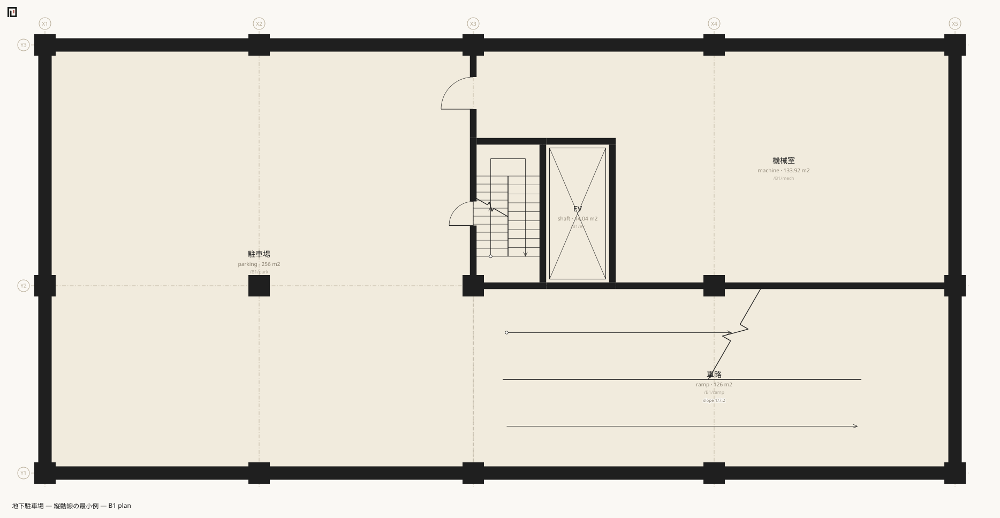

# basement — the minimal example of vertical circulation

`examples/basement/main.muro`. 86 lines / 1 file / 15 spaces / 49 boundaries / 1,242.08 m² of interior floor area. Two basement levels and a car ramp. **It is not even a building** — it exists to settle how vertical circulation is written. In the spirit of two-rooms-one-door, it contains nothing but two basement levels, parking, one scissor ramp, a stair, a lift and an exit to grade.



## What it shows first

- **[Vertical circulation](../reference/muro/vertical-circulation.md) is a space.** A ramp and a stair have area, can be walked, and form part of an escape route. Reduce them to connections and they fall out of the aggregation.
- **Riser count, tread and slope are never written.** What is written is where, how large, and which way up — the rules produce the form.
- **`slope:` declares a limit, not a value.** The actual slope is the level difference divided by the derived going, and the declaration is used for checking.
- **Spirals are not written.** They are written as a sequence of returns (`form:return`). No curves are introduced.
- **Underground is a declaration.** `level B2 -7400 … underground:1`. It is never inferred from a negative z.
- **Earth-retaining walls live in the `spec` vocabulary.** `spec:RC土圧壁`. No new boundary kind — the name of a thing is what `spec` carries.
- **[`column`](../reference/muro/column.md)** — one line, `column 800 B2..L1`. The positions of the columns appear nowhere.

## Excerpts

Levels and columns. Being underground is said with an attribute.

```muro-part
level B2 -7400 h:2600 slab:800 underground:1
level B1 -3700 h:2600 slab:800 underground:1
level L1 0 h:4000 slab:900
level R 4900 slab:500

column 800 B2..L1
```

The two basement levels. The same layout is written once as `/B2..B1/`.

```muro-part
space /B2..B1/park parking X1..X3 Y1..Y3 name:駐車場 use:parking
space /B2..B1/ramp ramp X3..X5 Y1..Y2 name:車路 use:parking ramp:E form:return slope:6
space /B2..B1/st stair X3..X3+2600 Y2..Y2+5400 name:避難階段 use:common stair:N form:return
space /B2..B1/ev shaft X3+2600..X3+5200 Y2..Y2+5400 name:EV use:common lift:1
```

`ramp:E` is "a ramp rising east", `stair:N` is "a stair rising north", `lift:1` is "a lift". `form:return` makes it a scissor arrangement. **Those four words are the whole of vertical circulation in this notation.**

The vertical relations are three lines.

```muro-part
stack ramp B2..L1 type:stair
stack st B2..L1 type:stair
stack ev B2..L1 type:shaft
```

A ramp and a stair are the same relation — "you can get between these levels". The difference between the devices is a difference in the rules that generate form, so they share the boundary kind `stair`.

The perimeter is earth. It is said in the `spec` vocabulary rather than by adding boundary kinds.

```muro-part
boundary /B2..B1/park /out edge:W t:500 spec:RC土圧壁
boundary /B2..B1/park /out edge:S t:500 spec:RC土圧壁
boundary /B2..B1/ramp /out edge:E t:500 spec:RC土圧壁
```

The vehicle shutter is a `door`, exactly like a door for people. Only the dimensions and the asset name differ.

```muro-part
asset VG1 door w:6000 h:3000 style:sliding name:車路シャッター
boundary /L1/ramp /road edge:E t:200 spec:RC
  door VG1 name:車路出入口
```

## Questions worth putting to it

### How many risers, what tread, what slope

None of it is in the source. [`runs`](../reference/cli/runs.md) answers.

```sh
npx tsx src/cli.ts runs examples/basement/main.muro
```

```text
B2→B1	lift	EV	/B2/ev
B2→B1	ramp	車路	rise 3700mm	return	slope 1/7.2	going 26800mm	/B2/ramp
B2→B1	stair	避難階段	rise 3700mm	return	21 risers of 176mm, tread 300mm	going 6000mm	/B2/st
B1→L1	lift	EV	/B1/ev
B1→L1	ramp	車路	rise 3700mm	return	slope 1/7.2	going 26800mm	/B1/ramp
B1→L1	stair	避難階段	rise 3700mm	return	21 risers of 176mm, tread 300mm	going 6000mm	/B1/st
L1→R	lift	EV	/L1/ev
```

`21 risers of 176mm` is the level difference of 3700 mm divided into the usual range, and `slope 1/7.2` is 3700 over 26800. The going of 26800 mm is the derived run length of a return ramp fitted into a space 9000 mm wide by 7000 mm deep. **All of it comes out of three written facts: the z of the levels, the rectangle of the space, and `form:return`.**

`slope:6` declares "do not make this steeper than 1/6". The derived 1/7.2 is shallower, so [`validate`](../reference/cli/validate.md) says nothing.

### Can a car get out of the car park

```sh
npx tsx src/cli.ts doors examples/basement/main.muro /B2/park /out
```

```text
2 doors — /B2/park → /B2/ramp → /B1/ramp → /L1/ramp → /L1/st → /out
```

That is the route for a **person** — it goes `/L1/ramp → /L1/st → /out`, out through the stair door. The opening wide enough for a vehicle (the ramp shutter) opens onto `/road`, and is reached separately. Write it so that cars cannot get out and validation catches it as `koyu.schematic.access.parking`.

### Do the heights fit

```sh
npx tsx src/cli.ts levels examples/basement/main.muro
```

```text
R	z:4900	slab:500
L1	z:0	h:4000	slab:900
  ↑ storey height 4900 = ceiling 4000 + slab 500 + 400 left over
B1	z:-3700	h:2600	slab:800
  ↑ storey height 3700 = ceiling 2600 + slab 900 + 200 left over
B2	z:-7400	h:2600	slab:800
  ↑ storey height 3700 = ceiling 2600 + slab 800 + 300 left over
```

`left over` is the remainder. The invariant **ceiling height + the slab above ≤ the floor-to-floor height** holds, and what is left becomes plenum. Break it and `check` stops with an error.

## Read next

- The same vocabulary of vertical circulation at nineteen storeys — [complex](complex.md)
- Columns, lines and bands in one pass — [Look it up by what you want to write](by-pattern.md)
