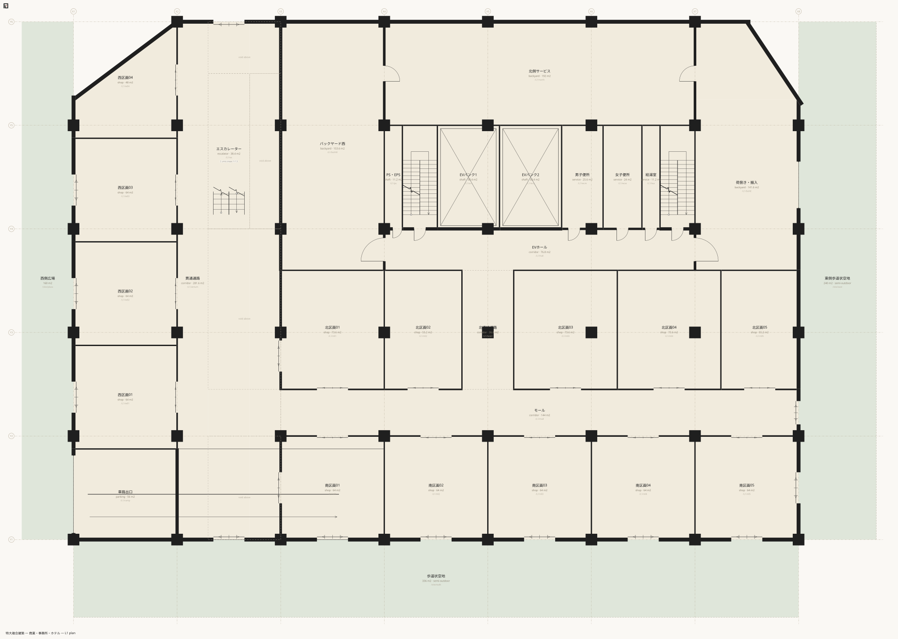
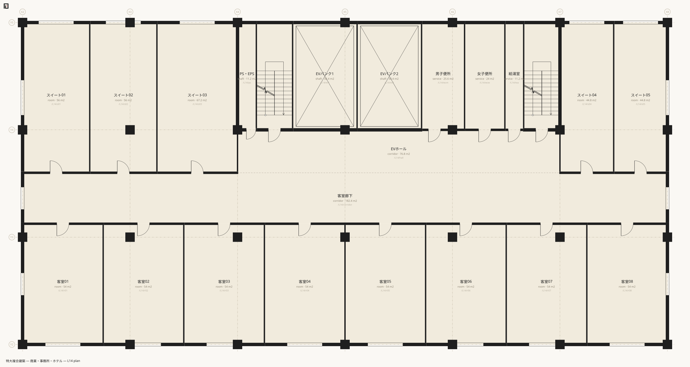

# complex — 特大複合建築

`examples/complex/`。646行 / 10ファイル / 空間425 / 境界1,364 / 屋内床面積 31,606.24㎡。地下2階＋地上19階、22レベルの複合建築 (商業・機械階・事務所・ホテル)。[tower](tower.md) の一桁上で、**規模そのものが壁になるかどうかを確かめるための例**である。



構成はこうなっている。

| 帯 | 階 | 中身 |
|---|---|---|
| 基壇 | 1〜5F | 物販・飲食。階高4,800・天井3,300 |
| 設備 | 6F | 機械階。基壇と塔屋の間に一層まるごと |
| 中層 | 7〜13F | 事務所。矩形の基準階を一度だけ書く |
| 高層 | 14〜19F | ホテル。客室は帯で割る |
| 地下 | B1〜B2 | 駐車場・機械室・荷捌き。折返し斜路一本 |
| コア | B2〜L19 | 2階段＋2EVバンク。**9行** |

## 初めて示すもの

- **[線](../reference/muro/line.md) — 斜めを書く。**基壇の隅切りは `line X1,Y5+2000 X2,Y6` と書かれる。頂点座標はどこにも無い — 線は通り参照の言葉で引かれ、境界がその線に沿って切られる。
- **[柱](../reference/muro/column.md) — 位置を書かない要素。**`column 900 B2..L6` は寸法と階だけを言う。柱は通り芯の交点のうち、その階に床のあるところに立つ。**壁が境界から現れるのと同型の規則を、点の要素に適用したもの**である。
- **エスカレーター** — `escalator:N` の空間と、`stack es L1..L5 type:stair`。
- **アトリウム** — `stack atrium L1..L5 type:void` が5層貫通の吹抜けを2行で立てる。
- **採光の対象は型ではなく宣言で決まる**ことの実演 — ホテル客室は `daylight:0`、事務所も対象外、住宅系だけが対象になる。
- **十層規模のコア**が、レベルスパンで畳めること。

## 抜粋

コアの層。**21レベル分のコアが9行**である。

```muro-part
space /B2..L19/ps shaft X4..X4+1400 Y4..Y5 name:PS・EPS use:common
space /B2..L19/st1 stair X4+1400..X4+4100 Y4..Y5 name:階段1 use:common stair:N form:return
space /B2..L19/ev1 shaft X4+4100..X4+8900 Y4..Y5 name:EVバンク1 use:common lift:1
space /B2..L19/ev2 shaft X4+8900..X4+13700 Y4..Y5 name:EVバンク2 use:common lift:1
space /B2..L19/wcm service X4+13700..X4+16900 Y4..Y5 name:男子便所 use:common
space /B2..L19/wcw service X4+16900..X4+19900 Y4..Y5 name:女子便所 use:common
space /B2..L19/tea service X4+19900..X4+21300 Y4..Y5 name:給湯室 use:common
space /B2..L19/st2 stair X4+21300..X7 Y4..Y5 name:階段2 use:common stair:N form:return
space /B2..L19/hall corridor X4..X7 Y4-3200..Y4 name:EVホール use:common
```

**EVホールが幅いっぱいに通り、階段も便所も給湯室も PS も、すべてホールから直接開く。**便所を給湯室から入る、階段を PS から入る、といった割付は平面としては閉じていても建物としては成立しない — 導出された図がそれを露わにした。

斜めは所与の線 (隣地境界) にだけある。

```muro-part
boundary /L1/w04 /out t:300 spec:カーテンウォール
  line X1,Y5+2000 X2,Y6
boundary /L1/bohE /out t:300 spec:カーテンウォール
  line X7+4000,Y6 X8,Y5+2000
```

設計された斜め (モールを斜めに貫く通路) は一度書いて捨てた。規則正しい区画が並ぶモールに斜めを通すのは、記法ができるからやっただけで設計判断ではなかったからである。**線の本数は設計判断の数と一致すべきで、この例に残った斜めは所与の線に従うものだけである。**

柱は寸法と階しか書かない。

```muro-part
column 900 B2..L6
column 800 L7..L13
column 700 L14..L19
```

上へ行くほど細くなる。位置はどこにも書かれていない。

ホテル客室は帯で割る。**6層 × 13室 = 78室が13行の帯の宣言から展開される。**

```muro-part
band X X2..X8 Y2..Y2+9000
  space /L14..L19/r01 room w:6000 name:客室01 use:rentable daylight:0
  space /L14..L19/r02 room w:6000 name:客室02 use:rentable daylight:0
  space /L14..L19/r03 room w:6000 name:客室03 use:rentable daylight:0
  space /L14..L19/r08 room w:rest name:客室08 use:rentable daylight:0
```

`daylight:0` は「この室に 1/7 の規則は掛からない」という設計者の判断である。窓の大きさの話ではない — 同じ寸法の室でも、共同住宅の居室なら対象で、ホテルの客室なら対象外になる。**判断は書き手が書き、処理系はそれに従う。**



## 投げる問い

### 同じ大きさの階段室に、何段入るか

階高が違えば段数が違う。原本には段数も踏面も書かれていない。

```sh
npx tsx src/cli.ts runs examples/complex/main.muro
```

```text
B2→B1	lift	EVバンク1	/B2/ev1
B2→B1	lift	EVバンク2	/B2/ev2
B2→B1	ramp	車路	rise 4200mm	return	slope 1/9.2	going 38800mm	/B2/ramp
B2→B1	stair	階段1	rise 4200mm	return	24 risers of 175mm, tread 300mm	going 6600mm	/B2/st1
B2→B1	stair	階段2	rise 4200mm	return	24 risers of 175mm, tread 300mm	going 6600mm	/B2/st2
B1→L1	lift	EVバンク1	/B1/ev1
B1→L1	lift	EVバンク2	/B1/ev2
B1→L1	ramp	車路	rise 5100mm	return	slope 1/7.6	going 38800mm	/B1/ramp
B1→L1	stair	階段1	rise 5100mm	return	29 risers of 176mm, tread 300mm	going 8400mm	/B1/st1
B1→L1	stair	階段2	rise 5100mm	return	29 risers of 176mm, tread 300mm	going 8400mm	/B1/st2
L1→L2	escalator	エスカレーター	rise 6600mm	straight	slope 1/1.5	going 9800mm	/L1/es
L1→L2	lift	EVバンク1	/L1/ev1
L1→L2	lift	EVバンク2	/L1/ev2
L1→L2	stair	階段1	rise 6600mm	return	37 risers of 178mm, tread 300mm	going 10800mm	/L1/st1
L1→L2	stair	階段2	rise 6600mm	return	37 risers of 178mm, tread 300mm	going 10800mm	/L1/st2
```

(全90行のうち先頭15行。)

**同じ一つの階段室に、地下では24段、エントランス階では37段が入る。**階段室の矩形は `/B2..L19/st1` として一度しか書かれておらず、変わったのはレベルの z だけである。踏面は300mmに揃い、余りが踊り場になる。

### 敷地はどう読まれるか

10頂点の角地で、南と東に道路がある。

```sh
npx tsx src/cli.ts site examples/complex/main.muro
```

```text
Site /site (敷地)
  Site shape: polygon with 10 vertices (a polygon declaration — given geometry)
  Site area (derived): 3854.00 m2
  Road: /road-s (南側道路) width 22000mm / frontage 56000mm
  Road: /road-e (東側道路) width 16000mm / frontage 40000mm
  Building footprint (horizontal projection, rough): 2204.00 m2 → building coverage ratio 57.2%
  Total floor area: 31606.24 m2 → floor area ratio 820.1%
```

敷地面積の宣言 (`area:`) が書かれていないので `derived` だけが出ている。書けば突き合わせが起きる。

### 用途ごとの床はどう分かれるか

```sh
npx tsx src/cli.ts stats examples/complex/main.muro
```

```text
Total 31606.24 m2 (indoor floor area)
  ...
  parking: 2049.60 m2
  machine: 1612.80 m2
  backyard: 2615.20 m2
  escalator: 153.60 m2
  shop: 4680.00 m2
  office: 7526.40 m2
  room: 4204.80 m2
By use: common 12809.44 m2 (40.5%) / parking 2385.60 m2 (7.5%) / rentable 16411.20 m2 (51.9%)
```

(末尾8行。)

レンタブル比 51.9% は、コアと機械階とバックヤードを正直に持った結果である。

## 規模は壁だったか

**壁は規模ではなく、四つの設計判断だった。**

- **縦動線** — 階段・斜路・エスカレーター・昇降機は一つの関係で、装置は形の生成規則の違いにすぎない。
- **斜め** — 空間が名詞、線が動詞、境界はその出会い。読めば斜めと分かる書き方で、頂点座標はどこにも無い。
- **地下** — 宣言 (`underground:1`) であって推定ではない。土に接する壁は `spec` 語彙が運ぶので、境界の型も属性も増えなかった。
- **柱** — 位置を書かない要素。通り芯の交点と床の交わりから現れる。

規模を上げて実際に壊れたのは、乗り込みの床を持たない階段 (扉が段板に直接ぶつかった)、幅3.2mの一台として立ち上がったエスカレーター、柱と重なった扉、そして「一度斜めにしたから上階の吹抜けまで斜め」という惰性だった。どれも導出された図を見た人間の指摘で見つかり、規則の側を直した。柱と扉の重なりは、いまは [`validate`](../reference/cli/validate.md) の `column.blocksdoor` が捕まえる。

## 次に読む

- もう一桁上 — [twin](twin.md)
- 同じ規模を IFC で書いたときの実測 — [koyu と IFC の実測比較](vs-ifc.md)
