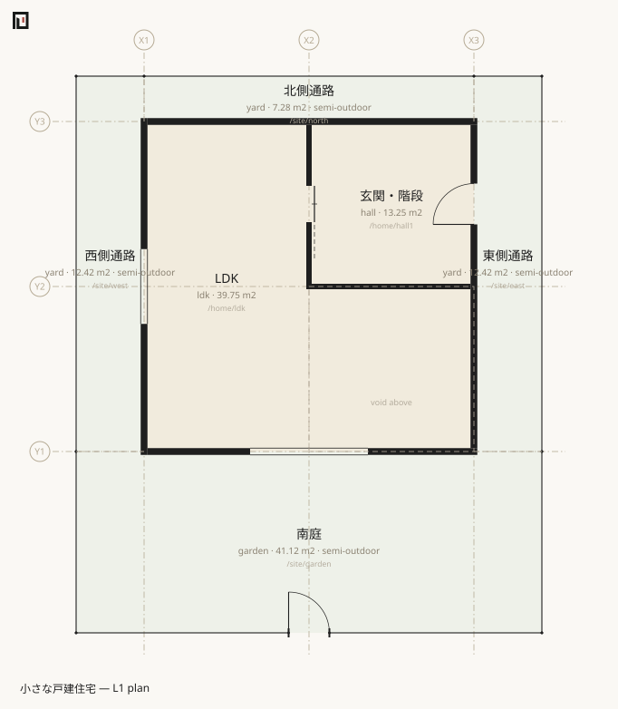
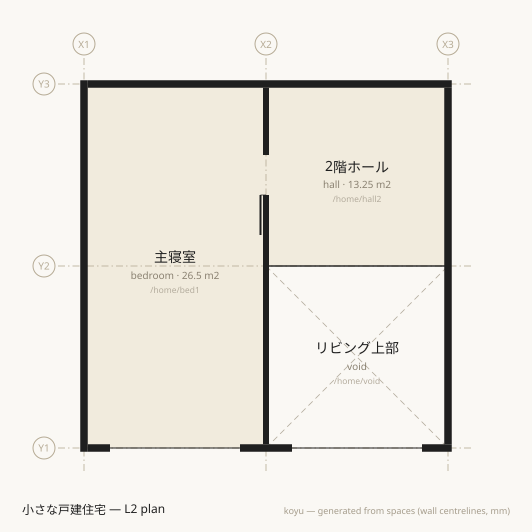

# house — site, semi-outdoor, layer composition

The same small detached house **written two ways**. `examples/house.muro` is one file of 89 lines; `examples/house/` is five files of 102 lines. Both give 13 spaces / 31 boundaries / 92.75 m² of interior floor area / 73.24 m² semi-outdoor, and the output of `stats`, `light` and `site` is identical between them.





## What it shows first

- **The `level:` attribute** — the paths run `/home/…`, so the storey cannot be read off the first segment. It is stated as an attribute instead. **The first meaning of a path is the hierarchy of aggregation, not the storey**, and this is the consequence.
- **[`zone`](../reference/muro/zone.md)** — `/home` (the dwelling) and `/site`. No geometry; they bundle by path prefix.
- **The site** — `zone /site … site:1 area:126.24` and `space /out/road exterior … road:6000`. `/out` splits into several exteriors by orientation and character.
- **Exterior spaces on the ground** — the garden and the paths are real spaces on L1 that tile around the building. **The L1 plan doubles as the site plan.**
- **Semi-outdoor by derivation** — the garden is never declared semi-outdoor. It becomes so because it carries an `air:1` boundary (a block wall) with the outside.
- **L-shaped unions** — `X1..X2 Y1..Y3 + X2..X3 Y1..Y2`.
- **`hinge:` / `swing:`** — the hand of a door.
- **A partial void** — `boundary /home/ldk /home/void type:void`. The coverage is small, so the ceiling height of the LDK stays within the storey.

What the composed version adds:

- **[`import`](../reference/muro/import.md)** — `main.muro` is the base layer, declaring `koyu` / `name` / `unit` / `grid` / `level` once, and stacking `assets` / `site` / `L1` / `L2` on top. Boundaries that cross storeys (the stair, the void) live in the base layer.
- **[`asset`](../reference/muro/asset.md)** — door and window types declared in one place, referenced by name from the openings, with instance attributes overriding.
- **Explicit grid-based positions** — `at:X2`, `at:Y2+1820`. Unlike a ratio these are not clamped; overshoot and it is an error.

## Excerpts

A wall is a value in the `spec` vocabulary of a boundary, and the gate is a door on that boundary. **The turn is here: the thing (a wall, a fence) becomes an attribute of a relation rather than an element.**

```muro-part
boundary /site/garden /out/road edge:S t:120 spec:ブロック塀+フェンス air:1 h:1200
  door w:900 name:門扉
boundary /site/garden /out/w edge:W t:120 spec:ブロック塀 air:1 h:1200
```

`air:1` means "something is there but it blocks neither outside air nor light". That one word makes the garden **semi-outdoor** by derivation, so it drops out of the interior floor area and is reported separately. It also means a window looking across the garden takes no daylight penalty.

The base layer of the composed version. Consistency lives here, and layers stack on top.

```muro-part
grid X 0 3640 7280
grid Y 0 3640 7280

level L1 0 h:2400 slab:400
level L2 2900 h:2400 slab:500
level R 5800 slab:500

import ./assets.muro
import ./site.muro
import ./L1.muro
import ./L2.muro
```

The asset layer is nine lines.

```muro-part
asset D1  door   w:900  h:2100 style:hinged  name:玄関ドア
asset SD1 door   w:800  h:2000 style:sliding name:片引き戸
asset GT1 door   w:900  h:1200 style:hinged  name:門扉
asset W1  window w:2600 h:2200 sill:0        name:掃き出し窓
asset W2  window w:1650 h:1100 sill:900      name:腰窓
asset W3  window w:2600 h:1100 sill:1100     name:高窓
```

The first-floor layer pulls them in by name. `window W1 at:X2` says only "the full-height window, at grid line X2".

```muro-part
boundary /home/ldk /site/garden t:150 spec:EW
  window W1 at:X2 name:掃き出し窓
boundary /home/hall1 /site/east t:150 spec:EW
  door D1 at:Y2+1820 name:玄関
```

## Questions worth putting to it

### Do the site figures agree

`area:126.24` is a declared survey figure. It is reconciled against the derived one.

```sh
npx tsx src/cli.ts site examples/house.muro
```

```text
Site /site (敷地)
  Site area: declared 126.24 m2 / derived 126.24 m2
  Road: /out/road (南側道路) width 6000mm / frontage 10280mm
  Building footprint (horizontal projection, rough): 53.00 m2 → building coverage ratio 42.0%
  Total floor area: 92.75 m2 → floor area ratio 73.5%
```

The frontage of 10280 mm is the sum of the boundary segment lengths between spaces under the site zone and exterior spaces carrying `road:`. **An external wall of the building facing the road is not frontage.** What coverage ratio and floor area ratio mean is in [Japanese building and regulatory terms](../glossary/japanese-building-terms.md).

### Is there enough daylight

```sh
npx tsx src/cli.ts light examples/house.muro
```

```text
✔ /home/ldk	LDK	window 7.54 m2 / floor 39.75 m2 = 1/5.3 (needs 1/7 ≈ 5.68 m2)
✔ /home/bed1	主寝室	window 5.72 m2 / floor 26.50 m2 = 1/4.6 (needs 1/7 ≈ 3.79 m2)
✔ Every room meets 1/7 — 2 rooms in scope (a rough judgement with no correction factor — this is validation, not what check guarantees)
```

The LDK's 7.54 m² is the full-height window (2.6 × 2.2 = 5.72 m²) plus the sill window (1.65 × 1.1 = 1.815 m²). The garden is open to the sky, so the coefficient applied was 1.0.

### How do the two ways of writing it differ

`stats`, `light` and `site` agree exactly. The only difference is how the openings are written, and [`diff`](../reference/cli/diff.md) says so in the language of composition.

```sh
npx tsx src/cli.ts diff examples/house.muro examples/house/main.muro
```

```text
+ asset D1
+ asset GT1
+ asset SD1
+ asset W1
+ asset W2
+ asset W3
± boundary /home/bed1 | /home/hall2: + door 寝室引き戸 SD1 w:800 h:2000 style:sliding name:寝室引き戸 / − door at:0.5 (w:800)
± boundary /home/bed1 | /out/road edge:S: + window at:0.5 ref W1 / + window at:0.5 name 掃き出し窓
± boundary /home/hall1 | /home/ldk: + door edge:E at:0.5 ref SD1 / + door edge:E at:0.5 h 2000 / + door edge:E at:0.5 name 片引き戸 / + door edge:E at:0.5 style sliding
± boundary /home/hall1 | /site/east: door 玄関 at 0.5 → Y2+1820 / + door 玄関 ref D1 / + door 玄関 h 2100 / + door 玄関 style hinged
± boundary /home/ldk | /site/garden: + window at:X2 W1 w:2600 h:2200 sill:0 name:掃き出し窓 / − window 掃き出し窓 (w:2600 h:2200 sill:0 name:掃き出し窓)
± boundary /home/ldk | /site/west: + window at:0.5 ref W2 / + window at:0.5 name 腰窓
± boundary /home/void | /out/road edge:S: + window 吹抜けの高窓 ref W3
± boundary /out/road | /site/garden edge:S: + door at:X2 GT1 w:900 h:1200 style:hinged name:門扉 / − door 門扉 (w:900 name:門扉)
```

What shows up is that assets appeared, and that opening positions moved from ratios to grid references. Not line order, not formatting. **Splitting the file into five is not itself a difference.**

## Read next

- Writing the typical floor once — [mansion](mansion.md)
- Layers written separately, built as one building — [tower](tower.md)
