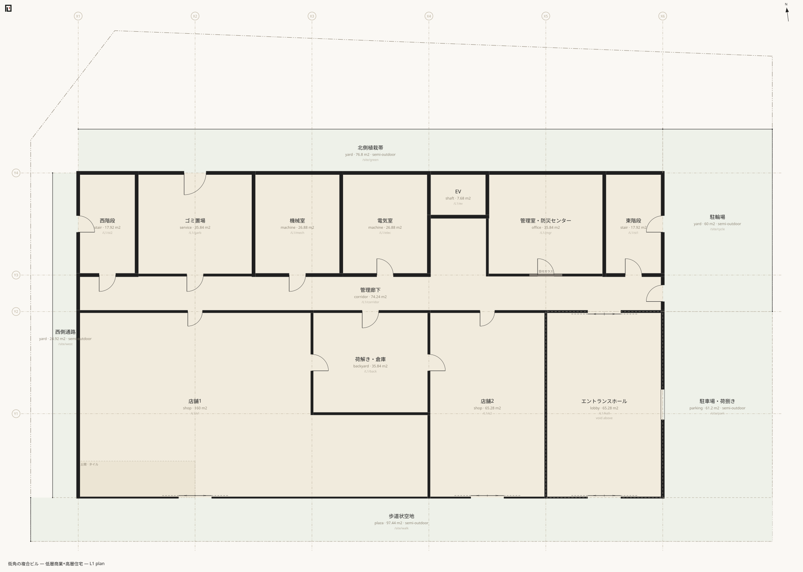
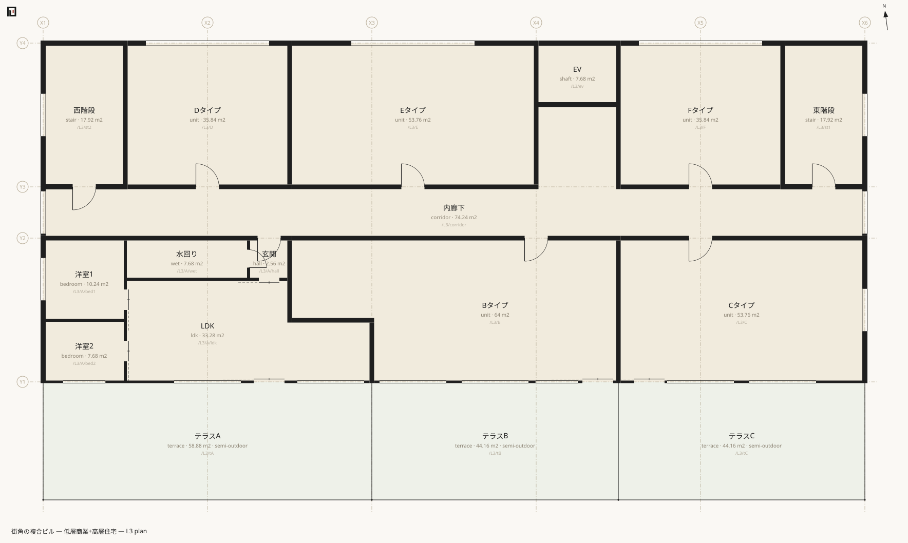
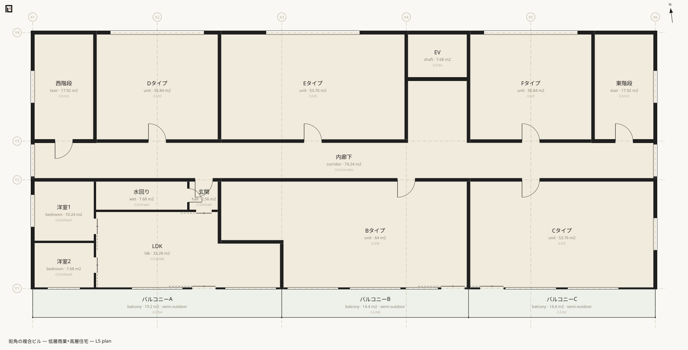
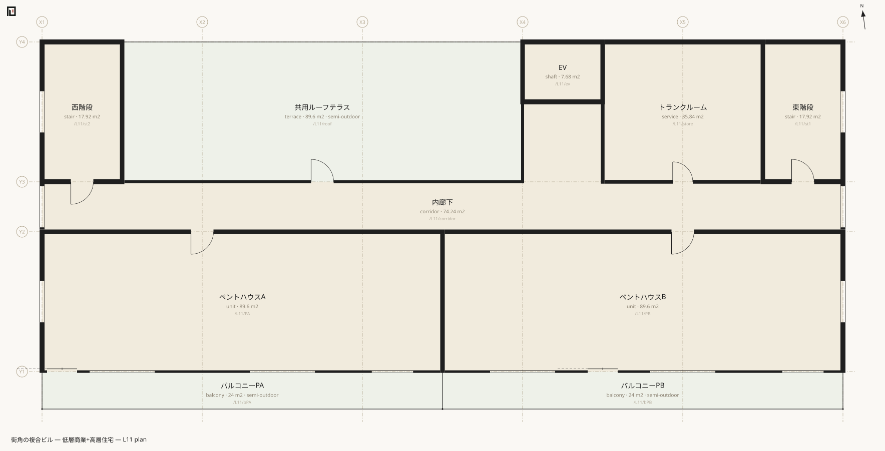

# tower — 敷地形状・例外階・帯

`examples/tower/`。453行 / 9ファイル / 空間178 / 境界543 / 屋内床面積 4,785.92㎡ / 半屋外 941.16㎡。11階建ての複合ビル (低層商業＋高層住宅)、角地・非矩形敷地。**分担して書かれたレイヤーが一棟としてビルドされる**例である。

構成は `main.muro` が base 層、`assets` / `site-geometry` / `site` / `L1` / `L2` / `typical` / `L3` / `L11` の8層。



## 初めて示すもの

- **[`polygon`](../reference/muro/polygon.md) — 敷地形状。**この記法で唯一、格子に載らない自由頂点で「書かれる形」。敷地は設計の生成物ではなく測量由来の所与だから、例外として認められている。隔離レイヤー (`site-geometry.muro` は実質1行) に置く運用が標準。
- **例外階を差分レイヤーとして書く。**`typical.muro` が L3..L10 の住戸と L3..L11 のコアを供給し、`L3.muro` は「南のバルコニーの代わりに低層部屋根のテラスが来る」という**差分だけ**を31行で書く。
- **要素ごとに異なるスパン。**住戸は `/L3..L10/`、コアは `/L3..L11/`、バルコニーは `/L4..L10/`。一つのファイルの中で使い分けられる。
- **複数道路の接道** — 南12m・東6mの角地。接道長は境界線分長の合計として導出される。
- **「上に何があるか」の導出** — 屋根や庇を書く場所はどこにも無く、上階の空間の重なりから読まれる。
- **[`band`](../reference/muro/band.md) — 寸法と並びで割る。**A タイプの洋室2室と水回り・玄関は、領域ではなく幅 `w:` の並びで書かれている。
- **`style:auto`** — 自動ドア。平面の建具表現が変わる。

## 抜粋

敷地形状の層。コメントを除けば本体は1行である。

```muro-part
polygon /site -2600,-7000 38000,-7000 38000,19600 2000,21000 -2600,15000
```

基準階の帯。位置ではなく寸法と並びを書き、位置を導出させる。

```muro-part
band Y X1..X1+3200 Y1..Y2
  space /L3..L10/A/bed2 bedroom w:2400 name:洋室2 daylight:1
  space /L3..L10/A/bed1 bedroom w:3200 name:洋室1 daylight:1

band X X1+3200..X2+3200 Y1+4000..Y2
  space /L3..L10/A/wet  wet  w:4800 name:水回り
  space /L3..L10/A/hall hall w:1600 name:玄関
```

どちらも `w:rest` を使わない**閉じた帯**で、幅の合計が帯幅と一致することを解析時に照合する — 寸法の打ち間違いの検算になる。帯は展開されて通常の空間になり、モデルにも[正準JSON](../reference/json/index.md)にも残らない。**位置で書いた版と同じ正準JSONを与える。**

例外階の差分レイヤー (`L3.muro` の冒頭)。基準階の住戸には一切触れず、テラスを足して窓を張り替えるだけである。

```muro-part
space /L3/tA terrace X1..X3 Y1-4600..Y1 name:テラスA
space /L3/tB terrace X3..X4+3200 Y1-4600..Y1 name:テラスB
space /L3/tC terrace X4+3200..X6 Y1-4600..Y1 name:テラスC

boundary /L3/A/ldk /L3/tA t:100 spec:サッシ
  door BD1 at:X2+2400 name:掃き出し引違い
  window W1 at:X2 name:掃き出し
  window W3 at:X2+4800
boundary /L3/tA /L3/tB t:60 spec:隔て板 air:1
boundary /L3/tA /out/road-s edge:S t:120 spec:パラペット+手すり air:1 h:1200
```

その帰結が図に出る。





L3 と L5 は屋内床面積がどちらも 422.40㎡ でありながら、半屋外の内訳が違う。

```text
  /L3/tA	テラスA	terrace	58.88 m2 (semi-outdoor, reported separately)
  /L3/tB	テラスB	terrace	44.16 m2 (semi-outdoor, reported separately)
  /L3/tC	テラスC	terrace	44.16 m2 (semi-outdoor, reported separately)
  Subtotal 422.40 m2
```

```text
  /L5/bA	バルコニーA	balcony	19.20 m2 (semi-outdoor, reported separately)
  /L5/bB	バルコニーB	balcony	14.40 m2 (semi-outdoor, reported separately)
  /L5/bC	バルコニーC	balcony	14.40 m2 (semi-outdoor, reported separately)
  Subtotal 422.40 m2
```

テラス 147.20㎡ とバルコニー 48.00㎡。**差分レイヤー31行がこの違いを作っている。**

最上階のペントハウスと共用ルーフテラス。



## 投げる問い

### 9階のLDKから南側道路まで

塔状部から低層部を抜け、外構を横切って道路に出る経路が、階をまたいで一本に繋がる。

```sh
npx tsx src/cli.ts doors examples/tower/main.muro /L9/A/ldk /out/road-s
```

```text
4 doors — /L9/A/ldk → /L9/A/hall → /L9/corridor → /L9/st2 → /L8/st2 → /L7/st2 → /L6/st2 → /L5/st2 → /L4/st2 → /L3/st2 → /L2/st2 → /L1/st2 → /site/west → /site/walk → /out/road-s
```

### 敷地の数字は合っているか

宣言した測量値と、polygon のシューレース面積が一致している。

```sh
npx tsx src/cli.ts site examples/tower/main.muro
```

```text
Site /site (敷地)
  Site shape: polygon with 5 vertices (a polygon declaration — given geometry)
  Site area: declared 1097.80 m2 / derived 1097.80 m2
  Road: /out/road-s (南側道路) width 12000mm / frontage 40600mm
  Road: /out/road-e (東側道路) width 6000mm / frontage 20200mm
  Building footprint (horizontal projection, rough): 569.60 m2 → building coverage ratio 51.9%
  Total floor area: 4785.92 m2 → floor area ratio 436.0%
```

### 庇の下かどうかは、どこから読まれるか

L3 のテラス (奥行4600mm) は、建物際の一部が L4 のバルコニーの下に入る。だから「覆われている」と判定され、採光係数は 0.7 のままになる。結果、L3 と L5 の LDK の窓面積は同じ 6.01㎡ と出る。

```sh
npx tsx src/cli.ts light examples/tower/main.muro
```

```text
✔ /L3/A/ldk	LDK	window 6.01 m2 / floor 33.28 m2 = 1/5.5 (needs 1/7 ≈ 4.75 m2)
✔ /L5/A/ldk	LDK	window 6.01 m2 / floor 33.28 m2 = 1/5.5 (needs 1/7 ≈ 4.75 m2)
✔ /L11/PA	ペントハウスA	window 15.07 m2 / floor 89.60 m2 = 1/5.9 (needs 1/7 ≈ 12.80 m2)
✔ /L11/PB	ペントハウスB	window 15.07 m2 / floor 89.60 m2 = 1/5.9 (needs 1/7 ≈ 12.80 m2)
```

(66室の判定のうち4行を抜いたもの。末尾に `✔ Every room meets 1/7 — 66 rooms in scope` が出る。)

**屋根の有無すら宣言ではない。**テラスの上に何があるかは、上階の空間の水平投影が重なっているかどうかで決まる。

## 次に読む

- 桁を一つ上げる — [complex](complex.md)
- 縦動線の最小例 — [basement](basement.md)
