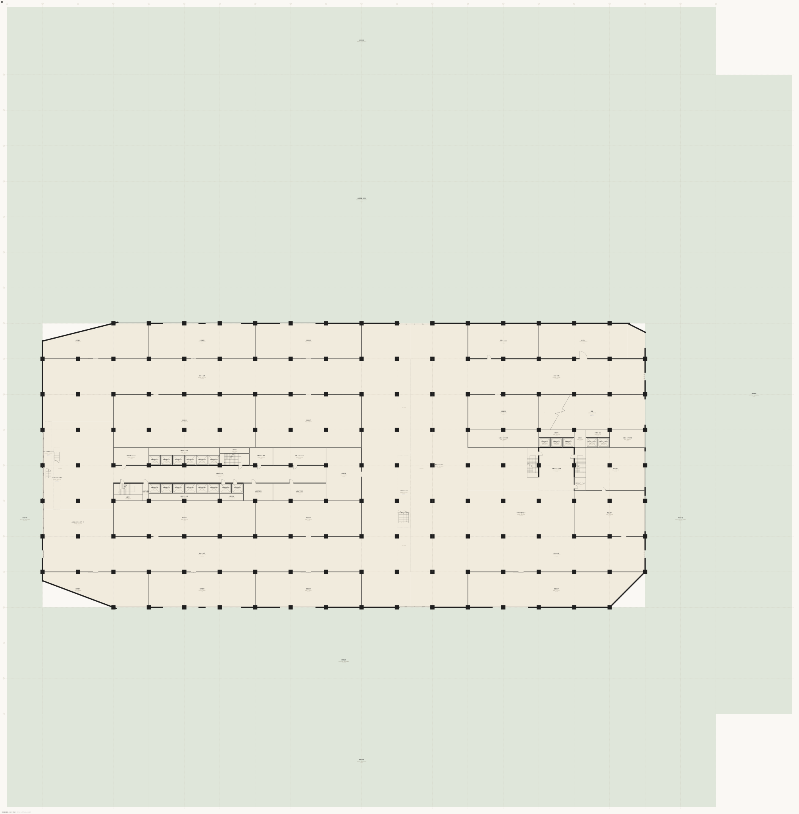
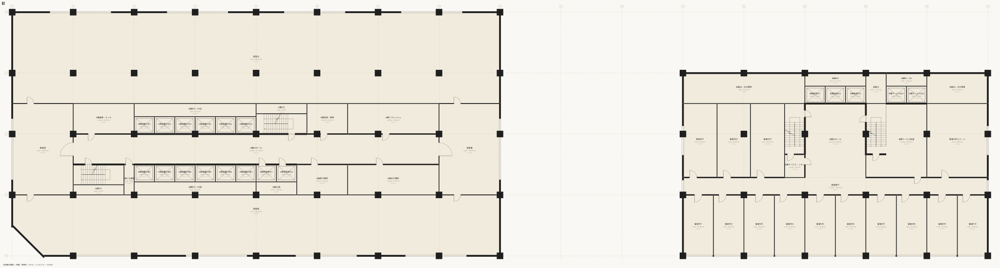

# twin — 双塔再開発

`examples/twin/`。1,220行 / 11ファイル / 空間1,808 / 境界5,973 / 屋内床面積 141,448.56㎡ / 半屋外 6,534.08㎡。地下2階＋地上34階、宣言されたレベルは39。**一棟がレベルを共有したまま二つの塔に分かれる**、この記法で最大の例である。



構成はこうなっている。

| 帯 | 階 | 中身 |
|---|---|---|
| 基壇 | L1〜L4 | 物販・飲食。段々にセットバックし、退いた屋根がテラス緑化になる |
| L5 | L5 | ホテルエントランス・宴会・屋上庭園 (基壇の屋上) |
| A棟 | L6〜L34 | オフィス。板 67.2m × 33.6m。中央コア帯 12.6m |
| B棟 | L6〜L18 | 下がホテル (L6〜L12)、上がレジデンス (L13〜L18)。板 42.0m × 25.2m |
| 機械階 | M1 / M2 | **客の階数に現れない。**宴会場直上と中間 |
| 地下 | B1〜B2 | 駐車場・熱源・受変電・中央監視・MDF・ごみ処理 |

ホテル98室、レジデンス36戸。どちらも実数で、帯の展開から数えられる。

## 初めて示すもの

- **一つのレベルに二つの塔が載る。**`level L6..L20 …` は一度しか宣言されず、A棟のオフィスと B棟のホテルが同じレベルの上で別の板になる。**「棟」という要素は無い** — パスの接頭辞 (`/L8/aoff1` と `/L8/hs01`) と、板が平面上で離れている事実だけがそれを言う。
- **客の階数に現れない階。**`level M1` `level M2` は L5 と L6 の間、L20 と L21 の間に挟まる。エレベーターのボタンにも案内にも無い層が、階高の積み上げには確かに存在する。
- **EVのゾーニングを、ホールの有無で書く。**B棟の客用シャフト (`bev1..3`) は B1..L18 を貫くが、乗場ホール (`bhall1` / `bhall2`) は B1..L1 と L5..L18 にしか無い。**基壇の3層を通過することが、ホールという空間の不在として表現される。**
- **同じ板・同じコア・同じ階高で用途だけが変わる。**B棟の L6〜L12 はホテル、L13〜L18 はレジデンス。変わるのは割りと `daylight:` の宣言だけである。
- **14頂点の敷地**と三方接道。

## 抜粋

base 層のレベル宣言。機械階が客の階数の外側に挟まる。

```muro-part
level L5 21300 h:5500 slab:900
level M1 28200 h:3200 slab:900
level L6..L20 32800 h:2800 slab:1400 pitch:4200
level M2 95800 h:2800 slab:1400
level L21..L34 100000 h:2800 slab:1400 pitch:4200
level R1 158800 h:3000 slab:900
```

縦動線のトポロジー。29行で二つの塔の全シャフトが立つ。

```muro-part
stack aevLs1 B1..L20 type:shaft
stack aevHs1 L1..L34 type:shaft
stack ast1 B2..L34 type:stair
stack bev1 B1..L18 type:shaft
stack bst1 B2..L18 type:stair
stack ramp B2..L1 type:stair
```

A棟の低層バンク (`aevL…`) は B1..L20、高層バンク (`aevH…`) は L1..L34 で、**基壇と低層帯を通過する**。通過は「シャフトはあるが乗場ホールが無い」として書かれる — 装置の運転計画ではなく、空間の有無で表現される。

B棟のホテル階とレジデンス階は、同じ帯の形で別の判断を持つ。

```muro-part
band X X14..X19 Y6..Y7
  space /L6..L12/hs01 room w:4200 name:客室S01 use:rentable daylight:0
  space /L6..L12/hs02 room w:4200 name:客室S02 use:rentable daylight:0
```

```muro-part
band X X14..X19 Y6..Y7
  space /L13..L18/rs01 unit w:8400 name:住戸S01 use:exclusive daylight:1
  space /L13..L18/rs02 unit w:8400 name:住戸S02 use:exclusive daylight:1
```

同じ幅5スパンの帯で、上はホテル客室10室、下は住戸5戸。**`daylight:` の値が逆になっているのは、用途が変われば採光の対象かどうかが変わるからである。**

A棟の基準階は二度だけ書かれる — M2 を挟んで低層帯と高層帯に分かれるため。

```muro-part
space /L6..L20/aoff1 room X3..X11 Y6..Y7 name:貸室南 use:rentable
space /L21..L34/aoff1 room X3..X11 Y6..Y7 name:貸室南 use:rentable
```



## 投げる問い

### 30階のオフィスから南側道路まで

```sh
npx tsx src/cli.ts doors examples/twin/main.muro /L30/aoff1 /road-s
```

```text
5 doors — /L30/aoff1 → /L30/aoffW → /L30/ahall → /L30/ast1 → /L29/ast1 → /L28/ast1 → /L27/ast1 → /L26/ast1 → /L25/ast1 → /L24/ast1 → /L23/ast1 → /L22/ast1 → /L21/ast1 → /M2/ast1 → /L20/ast1 → /L19/ast1 → /L18/ast1 → /L17/ast1 → /L16/ast1 → /L15/ast1 → /L14/ast1 → /L13/ast1 → /L12/ast1 → /L11/ast1 → /L10/ast1 → /L9/ast1 → /L8/ast1 → /L7/ast1 → /L6/ast1 → /M1/ast1 → /L5/ast1 → /L4/ast1 → /L3/ast1 → /L2/ast1 → /L1/ast1 → /L1/ahall → /L1/alobby → /site/plazaW → /road-s
```

**経路に `/M2/ast1` と `/M1/ast1` が現れる。**機械階は客の階数に無いが、避難階段は当然そこを通る。書かれていない事実は導出されない — 機械階の階段を書いたから、経路にそれが出た。

### 収益床はどれだけか

```sh
npx tsx src/cli.ts stats examples/twin/main.muro
```

```text
Total 141448.56 m2 (indoor floor area)
Semi-outdoor 6534.08 m2 (balconies, external stairs and the like — whether they count is a matter of regulatory detail, so it is reported separately)
By use: common 60487.47 m2 (42.8%) / parking 14868.00 m2 (10.5%) / rentable 63462.21 m2 (44.9%) / exclusive 2630.88 m2 (1.9%)
```

(末尾3行。)

`rentable` 44.9% ＋ `exclusive` 1.9% ＝ 収益床 46.7%。**巨大複合はコア・機械階・ホール・テラス緑化が床を食う。**この数字は宣言ではなく `use:` の集計から出ていて、コアを細く描けば上がるが、そのときは便所も PS も入らなくなる。

### 敷地はどう読まれるか

```sh
npx tsx src/cli.ts site examples/twin/main.muro
```

```text
Site /site (敷地)
  Site shape: polygon with 14 vertices (a polygon declaration — given geometry)
  Site area: declared 23167.40 m2 / derived 23167.40 m2
  Road: /road-s (南側道路) width 25000mm / frontage 168000mm
  Road: /road-e (東側道路) width 18000mm / frontage 151200mm
  Road: /road-n (北側道路) width 16000mm / frontage 168000mm
  Building footprint (horizontal projection, rough): 9596.16 m2 → building coverage ratio 41.4%
  Total floor area: 141448.56 m2 → floor area ratio 610.5%
```

三方接道で、宣言した測量値 23,167.40㎡ と14頂点のシューレース面積が一致している。

### 建築的な判定は通るか

```sh
npx tsx src/cli.ts validate examples/twin/main.muro
```

```text
✔ Nothing caught by validation (this is a judgement, not a guarantee about the composition)
```

1,808空間・5,973境界の全体に対して、到達不能・外皮の穴・柱と扉の重なり・斜路の勾配・接道長を含む15の規則が走った。**それでも「使える建物である」とは言っていない** — [`validate`](../reference/cli/validate.md) は判定であって保証ではない。

## 桁の意味

原本の11ファイル合計は 26,630トークン (o200k_base) である。**延床141,449㎡・地上34階の一棟が、どのモデルの文脈にも丸ごと載る。**しかも一つの階を書き換えるのに触るのは一枚のレイヤーだけで済む。

展開後の[正準JSON](../reference/json/index.md)は 450,040トークンになる。**原本と機械形式の間には17倍の開きがあり、その差が「繰り返しを畳む」ということの実体である。**

同じ物差しで IFC4 / IFCX を測った結果は [koyu と IFC の実測比較](vs-ifc.md)にある。

## 次に読む

- 一桁下の複合建築 — [complex](complex.md)
- 書きたい機能から例を引く — [書きたいものから引く](by-pattern.md)
