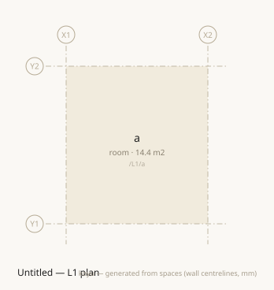
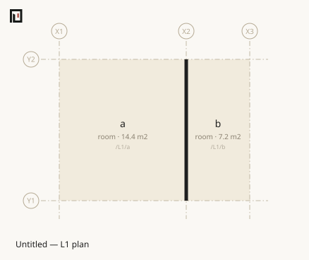

# koyu — writing architecture as text

**muro is the notation** — the language a `.muro` file is written in. **koyu is the toolchain that reads it** — the CLI, the API, the MCP server, the drawings. **koyu is also the name of the undertaking**, this documentation included, which is why the two meet on this page.

The distinction is not housekeeping: the two carry [separate version lines](reference/stability.md), and a file declares which language it is written in, not which program will open it.

**Space is the primary element.** A wall is not a thing; it is the boundary relation between two spaces. An opening is a connection cut into that boundary. What gets authored is spatial regions and the boundary relations between them — plans, areas and circulation are not written but derived.

One room is written like this. Four lines, and it is a complete file.

```muro
grid X 0 3600
grid Y 0 4000
level L1 0 h:2400 slab:150
space /L1/a room X1..X2 Y1..Y2
```

```sh
koyu plan first.muro -o first.svg
```



**Not one wall is drawn.** There is a space, but not one boundary.

Add one more `space` line. Change nothing else.

```muro
grid X 0 3600 5400
grid Y 0 4000
level L1 0 h:2400 slab:150
space /L1/a room X1..X2 Y1..Y2
space /L1/b room X2..X3 Y1..Y2
```



**A wall appears. There is no operation anywhere in this notation that draws a wall.** A wall is the boundary relation between two spaces, derived from how those spaces are laid out. Where a pair of touching spaces carries no declaration at all, that means "wall" rather than "undefined".

The resolution is schematic-design level. Not modelling downstand beams is not an omission but a chosen height of abstraction — the early design phase, where BIM has always been too heavy, is exactly where this notation lives. A whole building fits in a few hundred lines of text, which puts architecture on the same ground as git and LLMs.

## Where to start

| If you are | Go to |
|---|---|
| **new to koyu** | [Your first .muro](start/index.md) — one room to a two-storey house, 30–45 minutes |
| **wanting to run it first** | [Installing koyu](start/install.md) — from npm, or from source |
| **asking why it has this shape** | [Explanations](why/index.md) — space as primary, walls as relations, what green does not mean |
| **already knowing what you want to do** | How-to — [Add a storey](howto/add-a-storey.md) · [Subdivide a unit](howto/subdivide-a-unit.md) · [Let an agent write it](howto/agent-loop.md) |
| **looking a word up** | [Every construct in .muro](reference/muro/index.md) · [The koyu command](reference/cli/index.md) · [The diagnostic code index](reference/diagnostics/index.md) |
| **driving it from a program or an agent** | [Reading a building from a program](start/first-program.md) · [TypeScript API](reference/api/index.md) · [koyu-mcp](reference/mcp/index.md) |

## Two different questions

`koyu check` tells you whether **what is written is consistent as data**. That is all it tells you. A two-storey house that declares no door at all passes green, sealed shut.

Architectural validity is what `koyu validate` says, separately; circulation is answered by `koyu doors` and daylight by `koyu light`. That line is drawn in [Scope — what a green check means](reference/scope.md). Never argue from green that a building works — [the tutorial](start/index.md) walks you into that trap on purpose at stage 5.

## The name

戸牖 (*koyu*) means doors and windows — openings. Laozi, chapter 11: cut doors and windows to make a room; it is the emptiness within, the space, that makes the room useful, not the walls. For a notation in which space is primary, walls are relations, and openings are connections cut into boundaries, this is the oldest source there is. The homophone 固有 (*koyu*, "proper, intrinsic") is intended too — every space is addressed by a human-readable proper name, its hierarchical path.

The file extension is `.muro` (室, *muro* — room). The unit a file holds is not a building component but a room.
