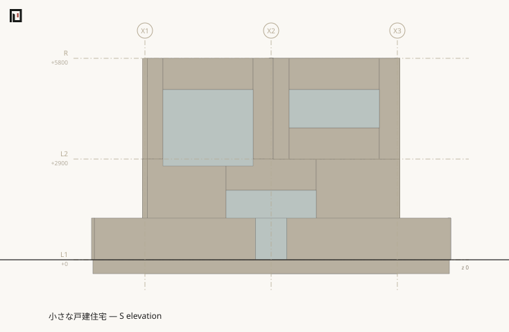

# koyu elevation

Writes the elevation of one face as SVG. **An elevation is a section whose plane stands outside the mass** — so it cuts nothing, and everything is seen head-on.

## Arguments

```text
koyu elevation <entry.muro> [--face N|E|S|W] [-s <scale>] [-o <out.svg>]
```

## Flags

| Flag | Effect |
|---|---|
| `--face <N\|E\|S\|W>` / `-f` | The side the viewer stands on. `S` is the south elevation, seen from the south. Defaults to `S` |
| `-s <n>` / `--scale <n>` | px per mm. Defaults to `0.05` |
| `-o <path>` / `--out <path>` | Where to write. Defaults to `out/elevation-<face>.svg` |

There is no `--at`. The plane is placed at the near extreme of the mass along the line of sight, which is derived rather than named — and naming one is [refused rather than ignored](#a-calling-mistake-is-returned-as-a-calling-mistake).

## Output

```sh
npx tsx src/cli.ts elevation examples/house/main.muro --face S -o out/house-elevation-S.svg
```

```text
Generated the elevation: out/house-elevation-S.svg
```



## Openings are holes, and nothing cuts them

**A wall arrives as the run of intervals its openings split it into.** So an elevation of that wall has the gap in it before any drawing starts: below a window there is a sill wall, above it a head wall, and between them no matter at all. The leaf itself is then drawn into the gap as its own subject.

There is no operation anywhere that paints an opening back out in the paper colour — which is the same sentence [the plan already owns](../form/plan.md), reaching the face of the wall instead of its footprint.

## Why the plane's position does not matter

The projection is orthographic, so moving the plane further back changes no coordinate on the sheet — only the datum that distance is counted from, and only relative distance is used. Putting it at the extreme of the mass is therefore the least surprising choice among many that draw the same picture, and it makes "an elevation cuts nothing" a consequence of where the plane sits rather than a branch in the code.

## The limit

**The plane is axis-parallel.** A building face that is neither runs oblique to the sheet, and its elevation is the elevation of no face. That is the resolution of a schematic design, and [`koyu axo`](axo.md) is the drawing to reach for instead.

## A calling mistake is returned as a calling mistake

```sh
npx tsx src/cli.ts elevation examples/house/main.muro --at X2
```

```text
elevation takes no --at (the plane is placed outside the mass; koyu section takes a cut)
```

```sh
npx tsx src/cli.ts elevation examples/house/main.muro --face SW
```

```text
-f is one of N / E / S / W: SW
```

A flag that was silently ignored would draw a different building from the one asked for, so both stop.

## Exit codes

| Exit code | Meaning |
|---|---|
| 0 | It was written |
| 1 | There was nothing to draw, or the input could not be read |
| 2 | `--face` named no compass point, or `--at` was given |

## See also

- [koyu section](section.md) — the same drawing with the plane inside the mass
- [koyu axo](axo.md) — the solid seen from a corner, where an oblique face still reads
- [The section](../form/section.md) — the classified set this draws
- [orientation and the a side](../muro/orientation.md) — what N/E/S/W mean
