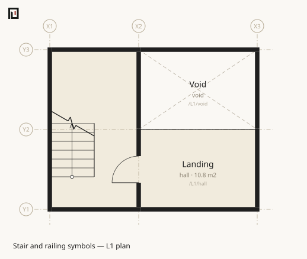
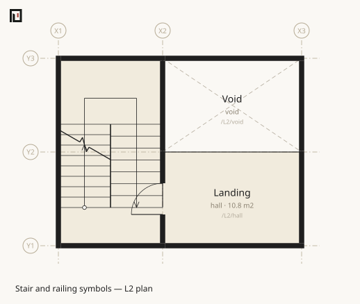
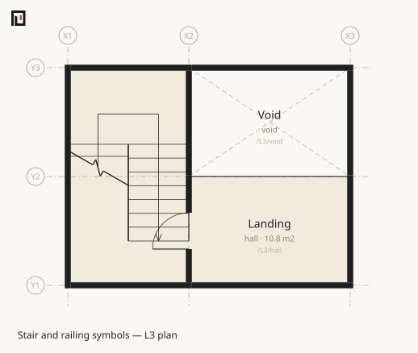
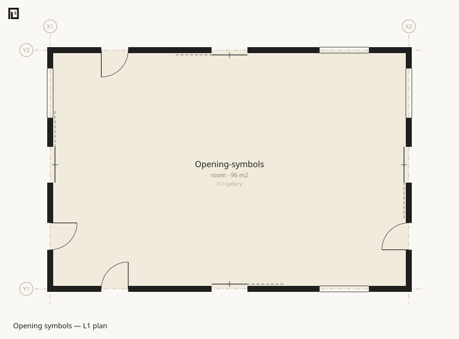
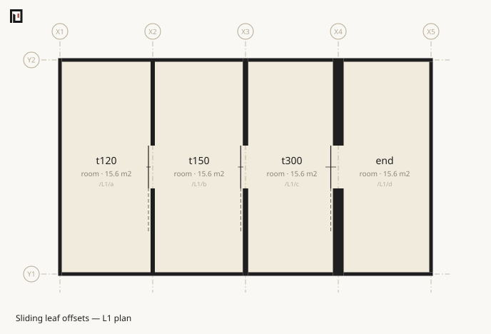
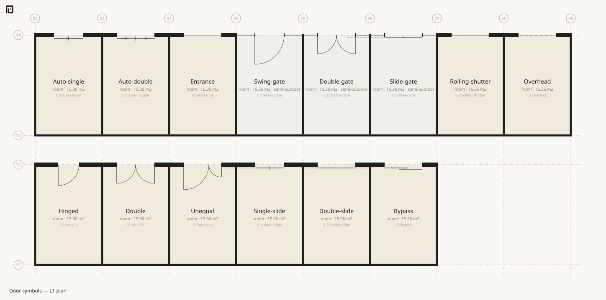
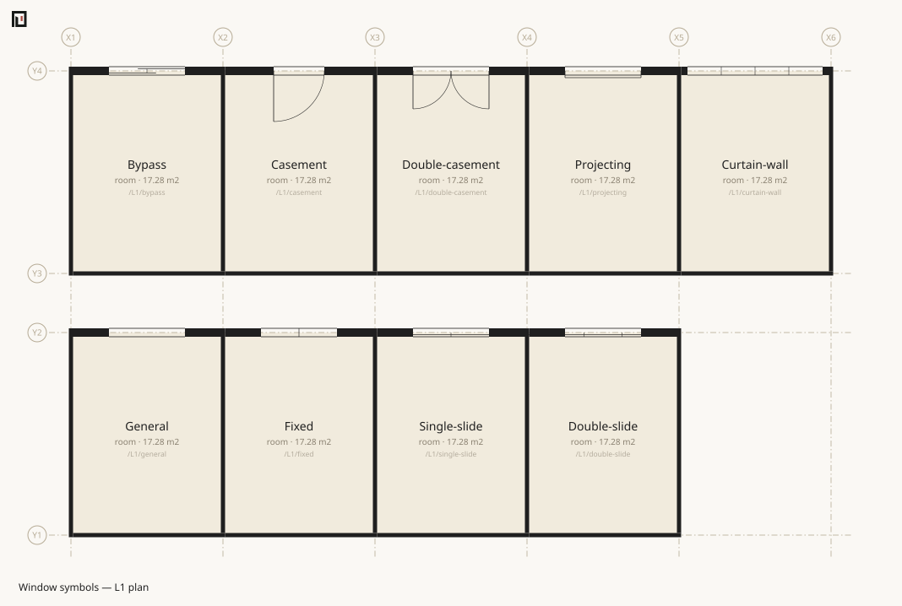

# koyu plan

Writes the plan drawing of one level as SVG. **There is no operation anywhere that draws a wall** — walls appear because they are derived from boundaries.

## Arguments

```text
koyu plan <entry.muro> [-l <level>] [-o <out.svg>]
```

Takes one entry path. The drawing goes to a file; stdout gets one line naming where it went.

## Flags

| Flag | Effect |
|---|---|
| `-l <level>` / `--level <level>` | The level to draw. Defaults to **the first level declared** |
| `-o <path>` | Where to write. Defaults to `<the entry path with .muro removed>-<level>.svg` |

There is no long form of `-o` (no `--out`), and no flag for scale or cut height.

## Output

```sh
npx tsx src/cli.ts plan examples/house/main.muro -l L2 -o out/house-L2.svg
```

```text
Generated the plan: out/house-L2.svg
```

The output directory is created if it does not exist.

Omitting `-o` writes next to the input file: `plan examples/two-rooms.muro` creates `examples/two-rooms-L1.svg`. Pass `-o` when you do not want to dirty the repository.

## Component SVG resources

A component asset keeps its physical footprint in the model and its artwork in a separate SVG
file. `koyu plan` resolves `plan-svg:` relative to the layer that supplied the effective value and
reads only assets placed on the requested level. An unused library entry therefore cannot stop an
otherwise unrelated plan.

The drawing fails if a required file is missing, if its `viewBox` aspect ratio disagrees with the
asset's `w:d`, or if the SVG contains active or external content. `koyu check` does not open
presentation files; it checks the relative reference, component dimensions, host identity and
footprint containment.

The pure TypeScript drawing function has no filesystem access. Supply SVG bytes by asset name.

```ts
import { svgPlan } from "@kensnzk/koyu/draw";
import { componentSvgFiles, parseFile } from "@kensnzk/koyu/node";

const model = parseFile("building/main.muro");
const level = "L1";
const svg = svgPlan(model, {
  level,
  componentSvgs: componentSvgFiles(model, level),
});
```

## Three quirks

**The default for `-l` is not the lowest storey.** It is the first level **in the order the `level` lines were written**. In a file where `level L2 …` comes before `level L1 …`, the default is L2. Pass `-l` explicitly to be sure which storey you get.

**The `-l=L2` form does nothing.** Separate the flag from its value with a space (`-l L2`). `-l=L2` is silently ignored and the default level is drawn. An undeclared level name stops with exit 2, but the `=` spelling does not stop — the flag itself is never recognised.

**A level with no space that has a region cannot be drawn.** Pass a roof level declared without spaces (`level R 5800 slab:500`) to `-l` and you get a raw exception, not a tidy diagnostic.

```sh
npx tsx src/cli.ts plan examples/house/main.muro -l R -o out/house-R.svg
```

```text
<absolute path>/src/draw/plan.ts:39
    throw new Error(`There is no space with a region on level ${level}`);
          ^

Error: There is no space with a region on level R
```

The exit code is 1.

## Exit codes

| Exit code | Meaning |
|---|---|
| 0 | It was written |
| 1 | It could not be drawn (a level with no space that has a region), or the input could not be read |
| 2 | `-l` was given an undeclared level name / no file path was given |

An undeclared level name is treated as a calling mistake. **An empty SVG is never written out silently and announced as "generated".**

```sh
npx tsx src/cli.ts plan examples/house/main.muro -l ZZ9 -o out/x.svg
```

```text
Undeclared level: ZZ9 (declared: L1 L2 R)
```

**A green `check` does not mean `plan` will succeed.** Drawing is not what `check` inspects, and a mistyped `-l` is outside it entirely.

## The north arrow

**When [`azimuth`](../muro/azimuth.md) is declared, the plan draws a north arrow** in the top-right margin, pointing where true north lies on the paper. With no bearing declared there is no arrow — a model with no bearing must not be drawn as though it had one.

The arrow is the reason the bearing is worth drawing at all. A reversed sign, a quadrant taken the wrong way round, a value copied off a drawing that showed magnetic north: every one of those is a well-formed number inside the accepted range, and **no check catches any of them. Looking at the arrow catches all three.**

Like everything else on the paper it is presentation, and how it looks may change. What it points at may not.

## Stair and railing symbols

Stair arrows always point towards increasing elevation. On the lowest floor the arrow leaves that
floor towards the next. A general floor shows that departing arrow plus an arriving arrow from the
preceding floor's FL + 1200mm cut to the current floor. The top floor shows that arriving path.
A departing arrow starts with an open circle centred on the first riser line. An arriving arrow
starts at the preceding floor's cut symbol without a circle. A return stair remains one bent arrow
across its intermediate landing. It enters the landing by half a flight width before crossing to the
returning flight. On the top floor, treads below that cut are omitted and the visible
flight boundaries, including the top riser, remain. The arrowhead is open and no `UP` or `DN` word
is added.
The generic room-name, area and path label is omitted over a stair so it does not cover the treads;
riser and tread dimensions are also omitted.

The run is cut at FL + 1200mm, the existing `FormPlan` cut height. The SVG represents that cut with
the supplied 10 by 40 break glyph, scaled to the flight width and rotated 30 degrees. Changing the
cut to 1500mm
would change the classified geometry and is not part of this presentation convention.







An `air:1` boundary remains the default asset-free railing and fence symbol. It is a light solid
axis with a small post at each endpoint. The renderer does not infer baluster spacing, material or
a railing family from `spec:`.

## Default opening symbols

A plan does not need an asset library to show its openings. Hinged doors show their leaves and
solid swing arcs. A single sliding leaf sits 60mm beyond the wall face, has one short perpendicular
line at its centre and continues as a thin dashed line over its storage pocket. Double sliding
leaves retract to both sides; bypass leaves overlap and have no pocket guide. Automatic doors add
opening-direction marks, and gates add their posts.

A window continues both wall-face lines through its opening without fill, jamb caps or a glazing
centre line. Fixed, sliding, bypass, casement, double-casement and projecting operations are drawn
over that same frame. A window outside the cut plane uses a dashed, faint version of the base mark.

These marks do not add geometry. Their position, width, wall thickness, hinge and swing come from
the [`Form`](../form/index.md). They are the fallback for every opening, including one whose
presentation asset is missing or unsupported.



The sliding leaf stays the same distance beyond the wall face, rather than the same distance from
the wall centreline. Its centreline offset is therefore half the wall thickness plus the drawing
gap. The leaf remains outside each wall below while the wall thickness changes.



The complete asset-free door and window comparisons are generated from explicit `style:` values.
No symbol is selected from a name, width, location or asset identifier.





## See also

- [koyu axo](axo.md) — the same generate-and-look move, in three dimensions
- [koyu levels](levels.md) — the declared levels and how the heights stack up
- [koyu check](check.md) — the gate to pass before drawing
- [The koyu command](index.md) — the shared promises about exit codes
