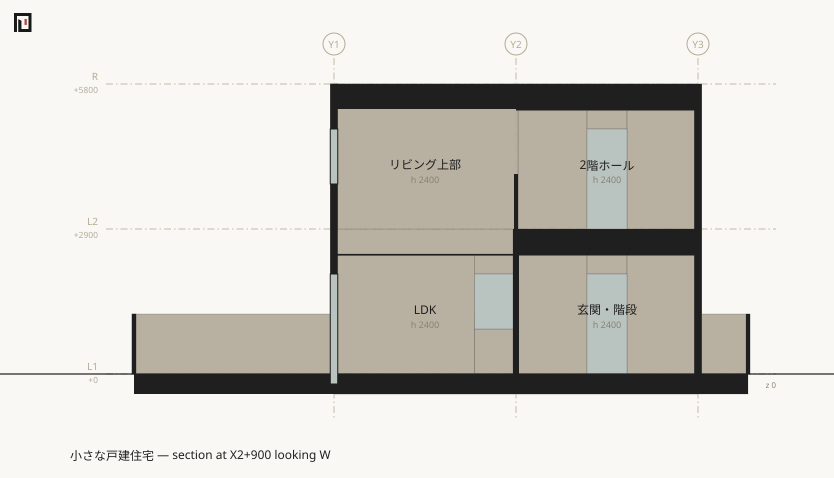

# koyu section

Writes the section cut at one grid reference as SVG. **The plane is named in the notation's own words** — [coordinates are never written directly](../muro/positions.md), so a cut is named the way an opening's position is.

## Arguments

```text
koyu section <entry.muro> --at <X3|X3+450|Y2-600> [--look N|E|S|W] [-s <scale>] [-o <out.svg>]
```

Takes one entry path and one cutting plane. The drawing goes to a file; stdout gets one line naming where it went.

## Flags

| Flag | Effect |
|---|---|
| `--at <reference>` | **Required.** The cutting plane, as a grid line with an optional whole-millimetre offset. The axis of the named line decides which way the plane runs: `X3` is the plane `x = X3` |
| `--look <N\|E\|S\|W>` | The direction of view. It must **cross** the plane: `E` or `W` for an X reference, `N` or `S` for a Y one. Defaults to `W` and `N` |
| `-s <n>` / `--scale <n>` | px per mm. Defaults to `0.05`, the same as [`plan`](plan.md), so a plan and a section of one building can be laid side by side |
| `-o <path>` / `--out <path>` | Where to write. Defaults to `out/section-<the reference>.svg` |

## Output

```sh
npx tsx src/cli.ts section examples/house/main.muro --at X2+900 -o out/house-section.svg
```

```text
Generated the section: out/house-section.svg
```



The output directory is created if it does not exist.

## What is on the sheet

**Solid black is what the plane cut** — walls, floors, ceilings, roofs, columns, the solids of a stair or a ramp. It is the [`cut` classification of the shape](../form/section.md) itself; there is no operation that works out a poché on the paper side.

**Behind it stands what the plane did not cut**, painted far to near. A wall seen head-on carries its openings as holes, because [a wall is the run of intervals its openings split it into](../form/bodies.md) before any drawing starts.

**Down the left margin runs the storey ladder** — every declared level, its name and its height. A level with no space on it still gets its datum, so a roof level declared without spaces widens the sheet rather than falling off it. [`koyu levels`](levels.md) is the same ladder in text.

**Across the top run the grid lines of the other axis.** The axis the plane is named on gets no bubbles: every one of its lines would land on the same point.

## Three quirks

**A plane on a grid line usually runs along a wall.** Spaces are allocated to grid bays, so boundaries land on grid lines — in `examples/two-rooms.muro` the `t:120` partition stands exactly on `X2`, and `--at X2` pochés its whole length. That is a correct drawing of a poor cut. Offset the plane into the bay (`--at X2+900`) to cut through the rooms.

**The ground line is drawn at z 0, and it is a convention of the sheet.** koyu holds no ground level: [`origin elevation:`](../muro/origin.md) is the height of model z 0 in a vertical reference system and is explicitly not GL, not 地盤面, not 平均地盤面. Nothing in the source can say where the ground is, so the line is drawn where the ground storey sits in every model that does not say otherwise. A model whose z 0 is not grade gets the line in the wrong place, and is expected to.

**`--at=X3` does nothing.** Separate a flag from its value with a space. This is the same wart [`plan`](plan.md) carries on `-l`.

## A calling mistake is returned as a calling mistake

```sh
npx tsx src/cli.ts section examples/house/main.muro
```

```text
Usage: koyu section <file.muro> --at <X3|X3+450|Y2-600> [--look N|E|S|W] [-s <scale>] [-o <out.svg>]
```

```sh
npx tsx src/cli.ts section examples/house/main.muro --at X9
```

```text
Undefined grid reference: X9 (declared: X1 X2 X3 Y1 Y2 Y3)
```

```sh
npx tsx src/cli.ts section examples/house/main.muro --at X2 --look N
```

```text
--look N runs along X2 rather than across it (an X reference is looked at from E or W, a Y reference from N or S)
```

## Exit codes

| Exit code | Meaning |
|---|---|
| 0 | It was written |
| 1 | It could not be drawn (the whole building stands behind the viewer), or the input could not be read |
| 2 | `--at` was missing, named no declared grid line, or `--look` ran along the plane instead of across it |

**An empty SVG is never written out silently and announced as "generated".**

## See also

- [koyu elevation](elevation.md) — the same drawing with the plane outside the mass
- [koyu plan](plan.md) — the horizontal cut
- [koyu levels](levels.md) — the storey ladder in text
- [The section](../form/section.md) — the classified set this draws
- [Positions and regions](../muro/positions.md) — the grid reference `--at` takes
