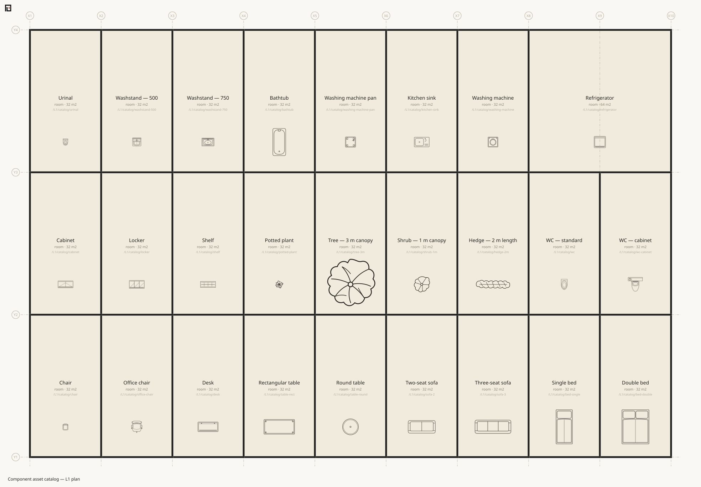

# asset — a reusable opening or component type

```text
asset <name> door|window|component [key:value...]
```

An `asset` is **a reusable definition**. Door and window assets supply defaults to an
[opening](door.md). A component asset supplies a physical plan footprint and a reference to plan
artwork for furniture, sanitary fixtures and equipment.

```muro-part
asset SD1 door   w:800  h:2000 style:sliding name:片引き戸
asset W1  window w:2600 h:2200 sill:0        name:掃き出し窓
```

The first positional argument is the name. The second selects the reference contract.

| Kind | Referenced by | What the definition supplies |
|---|---|---|
| `door` | an indented `door` | opening defaults |
| `window` | an indented `window` | opening defaults |
| `component` | `asset:` on a named [`area`](area.md) | fixed plan dimensions and plan SVG artwork |

## The reference is the first token of the opening

The **first token on the opening line that is not a `key:value`** is read as an asset name.

```muro-part
boundary /home/ldk /home/hall1 t:120 spec:LGS
  door SD1 edge:E hinge:S swing:b
```

The asset's attributes become the defaults, and **the instance's attributes override them**.

```muro
muro 1.5
unit mm
grid X 0 3600 7200
grid Y 0 4500
level L1 0 h:2400 slab:150
asset D1 door w:900 h:2100 style:hinged name:玄関ドア
space /L1/a room X1..X2 Y1..Y2 name:室
space /out name:外部 outside:1
boundary /L1/a /out t:150
  door D1 w:1200 edge:S name:大扉
```

The composed opening comes out like this. `h` and `style` flowed in from the asset; `w` and `name` were replaced by the instance.

```json
{
  "kind": "door",
  "ref": "D1",
  "w": 1200,
  "h": 2100,
  "at": 0.5,
  "edge": "S",
  "attrs": {
    "name": "大扉",
    "style": "hinged"
  }
}
```

The reference itself (`ref`) survives into the canonical JSON, and so does the asset definition, under `assets`. **Assets do not disappear in composition** — their values are baked into the opening and their provenance is kept.

## The writable attributes are the opening's

An asset uses [the opening ledger](door.md) unchanged. There is no attribute writable on an asset but not on an opening, nor the other way round.

| Attribute | Tier |
|---|---|
| `w` `h` `at` `edge` `hinge` `swing` | structure |
| `style` `panels` `name` | interpreted |
| `sill` `spec` `fire` | carried |

A key outside the ledger needs a namespace containing a dot.

```text
✖ asset D1 carries finish:, which is not in the ledger (check the spelling, or add a namespace if the value is only carried — e.g. acme.finish:塗装)
```

## Reference errors

**A mismatched kind stops.** A window asset cannot be used as a door.

```text
✖ The asset W1 is a window (it cannot be used as a door)
```

**An undefined reference stops.** A misspelling never slips through as "a leading token that happens not to be an asset name".

```text
✖ Undefined opening asset: SD9
```

**A duplicate name stops** — within one file and across layers stacked by `import` alike. The message reads `Duplicate asset name: D1`, followed by the provenance (file and line) of the one already seen.

An asset's opening presentation is checked at the declaration too. A door asset cannot carry a
window-only style (OPN09), and `panels:` must describe a whole-count curtain-wall window (OPN10).
An unchanged instance does not repeat the asset's diagnostic.

## Component assets

```muro-part
asset WC component w:700 d:1200 plan-svg:./svg/wc.svg category:sanitary name:Water-closet

space /L1/wc wc X1..X2 Y1..Y2
  area X1+300..X2-300 Y1+300..Y2-300 name:wc-fixture asset:WC align-y:max
```

`w:` is the physical extent along the component's unrotated model X axis. `d:` is its extent
along model Y. Both are millimetres and required. `plan-svg:` is a relative path, resolved from
the layer that supplied its effective value. `name:` is the type's display name. `category:` and
`spec:` are carried and never select artwork, dimensions or behaviour.

The SVG bytes do not enter `Model`, canonical JSON or [`Form`](../form/index.md). The reference
and the physical dimensions do. `koyu plan` reads the resource only while drawing. The TypeScript
drawing API takes the bytes in `PlanOptions.componentSvgs`; Node callers can obtain that map with
`componentSvgFiles(model)` from `@kensnzk/koyu/node`.

The drawing refuses a resource instead of approximating it when the file has no positive
`viewBox`, its aspect ratio disagrees with `w:d`, or it contains active or external content. The
accepted SVG is embedded as an isolated image, so its internal `defs`, masks, clip paths and IDs
cannot collide with those of the plan sheet.

Component assets are not stretched to their host area and are not auto-rotated. Placement is the
contract of the named area; see [area](area.md).

## The standard plan library

The package ships `assets/plan/library.muro` with original furniture, sanitary-fixture and
appliance SVGs. `assets/plan/catalog.muro` places every entry once and is the review sheet; the
library file itself is the asset ledger, so no second list of identifiers is maintained here.

```muro-part
import ./assets/plan/library.muro
```

Use a relative path appropriate to the building's entry file. The same files are available from
the package data subpath `@kensnzk/koyu/assets/*`.



## An asset's name is the name of a type

The `name` in `asset W1 window … name:掃き出し窓` is **the name of a type of leaf**, not of an individual. So hanging the same asset twice on one wall does not collide.

```muro
muro 1.5
unit mm
grid X 0 7200
grid Y 0 4500
level L1 0 h:2400 slab:150
asset D1 door w:900 h:2100 name:片開き戸
space /L1/a room X1..X2 Y1..Y2 name:室
space /out name:外部 outside:1
boundary /L1/a /out t:150 edge:S
  door D1 at:0.25
  door D1 at:0.75
boundary /L1/a /out edge:E
boundary /L1/a /out edge:N
boundary /L1/a /out edge:W
```

`check` comes back green. An opening's identity comes from a `name` unique inside its boundary, but **only a name written on the opening's own line counts as a claim** — the same value inherited from a referenced asset is not one. Write `name:D9` on both and it collides then, and only then.

```text
✖ Duplicate opening name within boundary /L1/a | /out: D9 — the name is what identifies it inside its container
```

## Keep them in their own file

The standard practice is to keep the asset set in its own layer and stack it with `import`.

```muro-part
import ./assets.muro
```

A layer is composed once, so a double `import` and a cycle are both idempotent.

## Neighbouring pages

- [door](door.md) / [window](window.md) — boundary-hosted asset references
- [area](area.md) — space-hosted component placement
- [boundary](boundary.md) — the relation openings sit on
- [koyu check](../cli/check.md)
