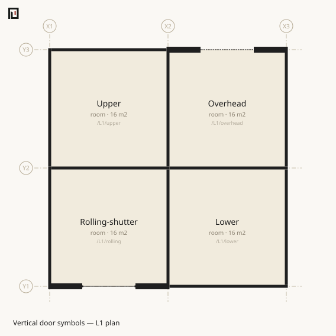

# door — the opening you pass through

```text
boundary /pathA /pathB …
  door [AssetName] w:900 [h:2100] [at:…] [edge:…] [hinge:…] [swing:…] [style:…] [name:…]
```

A `door` is written **one level of indentation** under a [boundary](boundary.md). There is one level only; nothing nests further. The four things that may sit under a boundary are `door`, `window`, `seg` and [`line`](line.md).

A door carries **passage**. A `wall` boundary cannot be passed unless it has at least one door — no number of [windows](window.md) will ever make it passable. `koyu doors` counts doors and nothing else, and every question about escape and circulation goes through them.

## Width and height

| Attribute | Required | Meaning |
|---|---|---|
| `w` | **yes** | width in mm along the segment. A referenced [asset](asset.md) may supply it |
| `h` | no | height in mm |

Without `w` no form can be built, so parse stops there and then.

```text
✖ door requires a width w:(mm) (the asset may supply it)
```

`h` may be left out. **A door rises from the floor: to `h` if it is written, and to the lintel height of 2000mm if it is not.**

| Written | z range of the opening (above FL) |
|---|---|
| `door w:900 h:2100` | 0 … 2100 |
| `door w:900` | 0 … 2000 |

The 2000mm lintel is a constant of the derivation; no attribute moves it.

A wall appears as a run of intervals divided by its openings. Where a door sits there is a hole from the floor to the head, with a spandrel above it. **So long as that rule holds, there is no such operation as painting over a black wall band in the paper colour to fake a hole.**

## at — where along the segment

`at` has two spellings.

| Written | Meaning |
|---|---|
| `at:0.4` | a **ratio** 0..1 of the segment length. Default 0.5. **Clamped** so the centre stays on the segment (no diagnostic is raised) |
| `at:X2+450` | an **absolute position** by grid reference. Not clamped — overrunning is an error |

The centre is taken as a parameter from the start of the segment to its end. **Segments — both derived ones and those of a [drawn line](line.md) — always run in ascending coordinate order**, so the same `at:` lands in the same place regardless of which space was written as `a` and which end of the line was written first.

An absolute position picks an axis. A horizontal segment takes an X grid reference, a vertical segment a Y one. A diagonal segment takes no absolute position at all — only a ratio.

```text
✖ The door position Y1+1000 is on the wrong axis: a horizontal segment takes an X grid line
✖ At X1+100 the door (width 900) runs off the boundary segment (segment 0-3600mm, center allowed 450-3150mm)
```

Where several openings share a segment, their centres must be at least `(w₁+w₂)/2` apart.

```text
✖ Openings overlap (door and door — center to center 720mm < the required 1800mm)
```

## edge — which side

Where one boundary has split into several segments, no door can be placed until a side is picked. A boundary with the outside usually splits across all four sides of the room, so `edge:` is near enough mandatory there.

```text
✖ There is more than one boundary segment; pick an edge with edge:N/E/S/W (/L1/living | /out)
```

The compass is N=+Y, S=−Y, E=+X, W=−X, and it reads **the side as seen from the form of a — the space written first**. An `edge:` on the boundary applies first; an `edge:` on the opening narrows within what is left.

With no segments at all, nothing can be placed (OPN04). Nor can an opening wider than the segment (OPN06 — equal lengths are fine).

## hinge — which jamb it hangs on

| Segment | Accepted | Default |
|---|---|---|
| horizontal | `W` / `E` | the start end (west) |
| vertical | `N` / `S` | the start end (south) |
| diagonal | — | fixed at the start end |

The wrong axis is an error.

```text
✖ hinge:N: a horizontal segment takes W/E
```

N/E/S/W are words of the axes, so they do not reach a diagonal segment. There the hinge always sits at the start end.

## swing — which side it opens into

`swing:a` / `swing:b` says whether the door opens toward the a side or the b side of the boundary. **Written nothing, it is "a if a has a region, otherwise b".** This is one of the two things that read [the order in which the boundary was written](boundary.md).

The **direction** it swings is not written. It follows from the component pointing at the centre of the nearest convex piece of the **derived form** of the side it opens into. The arc is a quarter circle centred on the hinge with a radius equal to the width.

## style — the kind of leaf

| Value | How the plan reads it |
|---|---|
| `hinged` | a swing door (default) — hinge plus a quarter-circle arc |
| `hinged-double` | two equal swing leaves |
| `hinged-unequal` | two swing leaves meeting at two-thirds of the width |
| `sliding` | one sliding leaf — no arc; it retracts toward the hinge side |
| `sliding-double` | two leaves meeting at the centre and retracting to opposite sides |
| `sliding-bypass` | two overlapping leaves inside the opening |
| `auto` / `auto-double` | an automatic double-sliding door; moving leaves park behind fixed sidelights inside the opening |
| `auto-single` | an automatic single-sliding door; its moving leaf parks behind a fixed sidelight inside the opening |
| `entrance` | a general entrance threshold with no claimed leaf operation |
| `gate-hinged` | one hinged gate leaf, with its posts |
| `gate-hinged-double` | two hinged gate leaves, with their posts |
| `gate-sliding` | one sliding gate leaf, with its posts |
| `rolling-shutter` | a shutter that coils above the opening; its plan has no horizontal storage tail |
| `overhead` | a sectional door that rises above the opening; its plan has no swing arc or horizontal storage tail |



`fixed`, `projecting` and `curtain-wall` are window-only presentations. Writing one on a door is
OPN09 (error). `panels:` is limited to a curtain-wall window and is OPN10 on a door.
Anything outside the complete style vocabulary is ATT02 (error).

The operation is never inferred from `name:`, width, position or an asset name. An asset may
supply `style:`, but it supplies the same explicit fact as an opening that writes it directly.
The values after the original `hinged`, `sliding` and `auto` set require muro 1.5; writing
one under an older version declaration is VER08.

## Written out

```muro
muro 1.5
name Door operations
unit mm

grid X 0 3600 7200
grid Y 0 4500
level L1 0 h:2400 slab:150

asset SD1 door w:800 h:2000 style:sliding name:Single-sliding-door

space /L1/a room X1..X2 Y1..Y2 name:Room-A
space /L1/b room X2..X3 Y1..Y2 name:Room-B
space /out name:Outside outside:1

boundary /L1/a /L1/b t:120 spec:LGS
  door SD1 hinge:N swing:b

boundary /L1/a /out t:150 spec:EW
  door w:900 h:2100 edge:S at:X1+1200 name:Service-door hinge:W
boundary /L1/b /out t:150 spec:EW
  door w:1200 h:2100 edge:S at:0.4 style:auto name:Main-entrance
```

The three doors are derived at centres (3600, 2250), (1200, 0) and (5040, 0) in that order. The second sits exactly where its grid reference says; the third sits 0.4 along a 3600-long segment that starts at x=3600.

## Attribute tiers

| Attribute | Tier |
|---|---|
| `w` `h` `at` `edge` `hinge` `swing` | structure — parse lifts these into typed fields |
| `style` `panels` `name` | interpreted — the values are checked |
| `sill` `spec` `fire` | carried — carried and nothing more |

A key outside the ledger cannot be written unless it carries a namespace containing a dot (`acme.hardware:lever`), or it is ATT03.

`name` is **a name unique inside that boundary**, and it is the key to the opening's identity. Two openings on one boundary with the same name is UID04. A name inherited from an [asset](asset.md) is the name of a type, though, and does not count as a claim of identity — hanging the same leaf twice on one wall does not collide.

## Diagnostics

| Code | Severity | What it says |
|---|---|---|
| OPN01 | error | `hinge` is on the wrong axis |
| OPN02 | error | two openings overlap on one segment |
| OPN03 | warning | a door on an `open` boundary — no effect on passage (it is always passable) |
| OPN04 | error | there is no boundary segment to place the opening on |
| OPN05 | error | there is more than one segment and none is chosen |
| OPN06 | error | the opening is wider than the segment |
| OPN07 | error | an absolute position on the wrong axis, or on a diagonal segment |
| OPN08 | error | an absolute position runs off the segment |
| VRT05 | warning | an opening on a vertical boundary — not interpreted |
| UID04 | error | duplicate `name` within one boundary |

To look a code up by cause and cure, there is [the list of diagnostic codes](../diagnostics/index.md).

## Neighbouring pages

- [boundary](boundary.md) — the relation a door sits on
- [window](window.md) — the opening you do not pass through
- [asset](asset.md) — putting the defaults of a leaf in one place
- [seg](seg.md) — a segmentation along a boundary that cuts no hole
- [koyu check](../cli/check.md)
