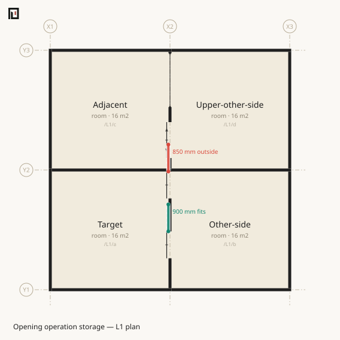

# Openings — operation space

| rule | level |
|---|---|
| [`koyu.schematic.opening.storage-leaves-space`](#opening-storage-leaves-space) | violation |
| [`koyu.schematic.opening.storage-overlaps-opening`](#opening-storage-overlaps-opening) | violation |

An opening width says where the wall is absent. It does not by itself say where a moving leaf
parks. A single sliding leaf needs its full width beside the aperture; a double sliding opening
needs half its width at each jamb. A bypass sash and an automatic door park their moving leaves
behind panels inside the aperture and need no wall length beyond it.

The analysis uses the operation side already derived for the opening. It places the parked leaf at
the wall face, probes 5mm into that side's space, and clips the complete parked segment against the
derived region of the space. The 60mm gap used to separate a sliding symbol from a wall on paper is
not read. Changing a drawing convention cannot change this judgement.



`rolling-shutter` and `overhead` move vertically. They have no horizontal storage segment and are
outside this rule. Their upper operation will be visible in a section representation.

## `koyu.schematic.opening.storage-leaves-space` — a parked leaf leaves its space {#opening-storage-leaves-space}

`violation`

```muro-fail
muro 1.6
grid X 0 4000 8000
grid Y 0 4000 8000
level L1 0 h:2700 slab:150
space /L1/a room X1..X2 Y1..Y2 level:L1
space /L1/b room X2..X3 Y1..Y2 level:L1
space /L1/c room X1..X2 Y2..Y3 level:L1
space /L1/d room X2..X3 Y2..Y3 level:L1
boundary /L1/a /L1/b
  door w:900 style:sliding hinge:y+ at:Y2-500
```

```text
✖ [koyu.schematic.opening.storage-leaves-space] main.muro:line 10: /L1/a|/L1/b@0/0 has 850 mm of sliding-leaf storage outside /L1/a
Validation — 1 violation / 0 cautions
```

The 900mm opening ends 50mm before the north end of the boundary. Its leaf retracts another 900mm
north, so 850mm of the parked leaf leaves `/L1/a` and enters `/L1/c`. The analysis reports both the
outside length and the crossed space as geometry facts; the rule supplies the fail verdict.

It is a violation because the explicit operation cannot be carried out in the space selected for
it. This remains design lint rather than a structural diagnostic: a product with another operation
must select another style, and a future external rule pack may make a different judgement.

### Fixes

Move the opening far enough from the end of the space, reverse `hinge:`, or select the operation
that describes the actual product. An ordinary full-height bypass sash is
`style:sliding-bypass`, not `style:sliding`. A shutter that coils above its opening is
`style:rolling-shutter`.

An [asset](../muro/asset.md) may supply the width, style and hinge. The analysis runs after the
asset defaults and instance overrides have been composed, so an asset reference and the same
attributes written inline produce the same geometry.

## `koyu.schematic.opening.storage-overlaps-opening` — a parked leaf covers another aperture {#opening-storage-overlaps-opening}

`violation`

```muro-fail
muro 1.6
grid X 0 4000 8000
grid Y 0 4000 8000
level L1 0 h:2700 slab:150
space /L1/a room X1..X2 Y1..Y2 level:L1
space /L1/b room X2..X3 Y1..Y2 level:L1
space /L1/c room X1..X2 Y2..Y3 level:L1
space /L1/d room X2..X3 Y2..Y3 level:L1
boundary /L1/a /L1/b
  door w:900 h:2100 style:sliding hinge:y+ at:Y2-1500
  door w:900 h:2100 style:hinged hinge:y- at:Y2-500
```

```text
✖ [koyu.schematic.opening.storage-overlaps-opening] main.muro:line 10: /L1/a|/L1/b@0/0 stores a sliding leaf across /L1/a|/L1/b@0/1 for 800 mm
Validation — 1 violation / 0 cautions
```

The two apertures do not overlap: 100mm of wall remains between them, so the composition is
consistent. The first leaf nevertheless parks across 800mm of the second aperture.

The comparison is one-dimensional on a shared wall axis and also requires overlapping `z0..z1`
ranges. Parallel openings on another wall and a high window above a low door do not collide. It is
a violation because opening one element blocks the other element's aperture.

Move one opening, reverse the sliding direction, or select a bypass operation that parks inside
its own aperture.

## See also

- [door](../muro/door.md) — the operation vocabulary
- [marks](../form/marks.md) — the presentation symbols that do not decide this geometry
- [Columns](column.md) — another collision visible only after placement
- [The validation ledger](index.md) — every built-in judgement
