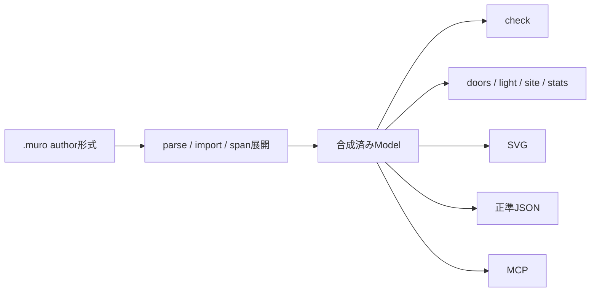
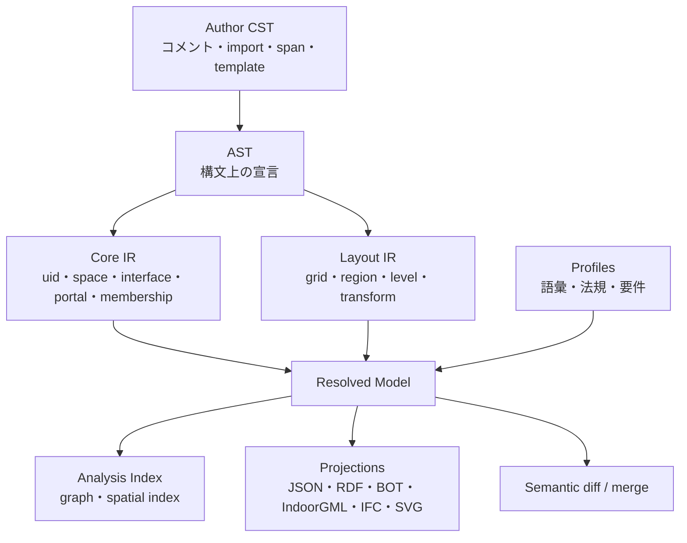

# koyu DSL 設計レビュー

- 対象: [kensnzk/koyu](https://github.com/kensnzk/koyu)
- 対象コミット: [`0d8a8a6`](https://github.com/kensnzk/koyu/commit/0d8a8a62f54e7fc0482715c46dad2b397d562953)
- 評価日: 2026-07-25
- 評価対象: 思想、DSL、意味論、正準JSON、合成、検査、CLI/MCP、相互運用、研究としての検証計画

## 0. 結論

koyuは、空間を一次要素に置き、部材形状を導出側へ追い出すという主張を、実際に動くDSL・検査器・グラフ問合せ・図面生成・MCPまで通した、完成度の高い研究プロトタイプである。思想、仕様、実装、テストが同じ方向を向いている点は強い。

一方、現在のDSLは次の三層を一つの記述へ重ねている。

1. 建築プログラム・空間構成
2. 具体的な平面割付
3. 境界・開口の構法的実現

そのため、「形は生成物」「壁は関係」「パスが同一性」「USD流の合成」といった強い主張が、実際の意味論より先まで進んでいる箇所がある。

最重要の提案は、koyuを巨大化させることではない。次の境界を明示することである。

- **koyu Core**: 空間、境界、接続、安定同一性、複数の空間分類
- **Layout**: グリッド、領域、レベル、配置
- **Realization**: 壁・床・開口などの生成規則と仕様
- **Profiles**: 法規、用途、語彙、交換要件
- **Projections**: SVG、IFC、BOT、IndoorGML、RDF、解析モデル

現在の優先課題は機能追加ではなく、意味を失わない中間表現、安定ID、境界の一貫性、言語バージョン、外部検証である。

## 1. 評価方法

以下を確認した。

- `README.md` / `README.ja.md`
- `docs/writing-architecture.md`
- `docs/roadmap.md`
- `docs/horizon.md`
- `docs/ifc-coverage.md`
- `docs/decisions/`
- `spec/language.md`
- `spec/semantics.md`
- `spec/canonical-json.md`
- `spec/vocabulary.md`
- `spec/tools.md`
- `src/` 全実装
- `test/` 全テスト
- `examples/` の主要モデル

実行確認:

- TypeScript型検査: 成功
- ビルド: 成功
- テスト: **99/99成功**
- 主要6サンプルの`check`: すべて成功

また、レビュー中に最小ケースを作り、正準JSON、境界矛盾、敷地判定、属性重複について実挙動を確認した。

外部比較には次の一次資料を用いた。

- [W3C Building Topology Ontology](https://w3c-lbd-cg.github.io/bot/)
- [OGC IndoorGML 2.0](https://docs.ogc.org/is/22-045r5/22-045r5.html)
- [IFC 4.3 IfcRelSpaceBoundary](https://ifc43-docs.standards.buildingsmart.org/IFC/RELEASE/IFC4x3/HTML/lexical/IfcRelSpaceBoundary.htm)
- [buildingSMART IDS](https://technical.buildingsmart.org/projects/information-delivery-specification-ids/)
- [buildingSMART bSDD](https://technical.buildingsmart.org/services/bsdd/data-structure/)
- [OpenUSD Composition](https://openusd.org/release/glossary.html#composition)
- [Speckle Data Model / Version Control](https://docs.speckle.systems/developers/key-concepts)

## 2. 現在のDSLが実際に保持しているもの

現在の処理はおおむね次の形である。



合成済みモデルの主な要素:

| 要素 | 現在の意味 |
|---|---|
| `space` | 型、矩形合併、所属レベル、属性を持つ空間 |
| `boundary` | 二空間間の関係。線分は空間領域から導出 |
| `opening` | 境界上の扉・窓 |
| `zone` | パス接頭辞で空間を束ねる集約 |
| `asset` | 扉・窓属性の既定値セット |
| `level` | z、標準天井高、slab |
| `grid` | 全体で一つの直交座標グリッド |
| `polygon` | 敷地形状だけに認められた座標列 |
| `area` / `seg` | 数えない属性分節 |

重要なのは、現在のkoyuが「幾何を持たない空間グラフ」ではないことである。

- 各空間の平面領域は`X1..X2 Y1..Y2`として原本に直接書かれる。
- 境界関係は原本に直接書かれる。
- そこから壁芯線分、面積、図面、接続グラフが導出される。

したがって、現在の正確な説明は次である。

> **部材ソリッドや壁線は生成物であり、空間領域と境界関係が原本である。**

これは思想の後退ではない。むしろ、何が原本で何が生成物かを誤解なく説明するために必要な限定である。

## 3. 思想とDSLの整合

### 3.1 強く整合している点

#### 空間が問合せの主語になっている

`doors`、`light`、`site`、`stats`が、同じ空間モデルを異なる視点から読んでいる。これは「一つの原本から複数の帰結を得る」という主張を実装で示している。

#### 部材モデルより早い段階を狙っている

基本計画に解像度を限定し、施工詳細を持たないことを欠陥ではなく抽象度の選択としている。対象範囲の自己認識は適切である。

#### エラーが設計の言葉になっている

出所ファイルと行番号を持ち、「開口が境界からはみ出す」「空間が重なる」などの診断を返す。これは建築をコードとして扱うための基礎になる。

#### 繰返しをauthor形式に残している

基準階を一度だけ書き、展開後モデルを別に持つ考え方は、設計意図と実行結果を分ける方向として正しい。

### 3.2 修正すべき主張

| 現在の主張 | 実際 | 推奨する表現 |
|---|---|---|
| 形はソースではなく生成物 | 空間の矩形形状はソース | 部材形状は生成物、空間領域は原本 |
| 壁は空間から導出される | 線分は導出されるが、境界関係は手書き | 壁線は境界関係と空間領域から導出 |
| パスが同一性 | パスは可読アドレスだが、改名で変わる | パスはアドレス。永続同一性は別ID |
| USD流の合成 | 現在は加算importと重複検査 | USDに着想を得た加算合成 |
| Gitで履歴問題が解ける | ファイル履歴は解けるが、意味的同一性・改名・マージは未解決 | Gitを履歴基盤にし、意味的diff/mergeを上に作る |
| 一棟がLLMのコンテキストに入る | 読めることは示したが、正しく編集できることは未検証 | コンテキストに収まり、編集evalが可能になった |
| 都市スケールに載る | データ量は軽いが、実装は二乗走査と全展開を含む | 都市接続の候補となる軽量表現 |

### 3.3 「同じ構成から複数の形」の不足

現状では、グリッド座標と空間矩形が具体的に決まっているため、同じモデルから生成される平面形状はほぼ一意である。複数の「表現」は生成できるが、複数の「建築形態」を生成する意味論はまだない。

本当に同じ構成から複数形態を生成したいなら、次を分離する必要がある。

1. **Program**: 必要室、目標面積、要求隣接、分離条件
2. **Topology**: 空間と接続のグラフ
3. **Layout**: 具体的な領域と位置
4. **Realization**: 壁厚、構法、開口、床、屋根

現状のDSLは2〜4を一つに含み、1を持たない。

## 4. DSL意味論の主要課題

### 4.1 空間プログラムと解決済みレイアウトが分かれていない

現在の`space`は「LDKが必要で、30㎡程度で、食堂と隣接すべき」という要求ではなく、「この座標範囲がLDKである」という解決済み案を表す。

不足しているもの:

- 目標面積・許容範囲
- 必須隣接・望ましい隣接
- 分離要求
- 最小幅・アスペクト比
- 採光や避難の目標
- 室数・定員
- 優先順位
- 要求と実現値の差

これらをコアDSLへ直接増やす必要はないが、少なくともProgram層または外部要件プロファイルが必要である。

### 4.2 パスはアドレスであり、永続IDではない

`/L5/A/ldk`は可読性が高い。しかし以下で変化する。

- 室名変更
- 住戸タイプ変更
- 階層再編
- 階移動
- ゾーン再分類
- 改修による分割・統合

パスをセンサーや外部DBのジョインキーにすると、設計変更で時系列が切れる。Git上でもrenameではなくdelete/addに見える場合がある。

必要なもの:

- 不変の`uid`
- 可読パス
- alias / rename履歴
- split / mergeの系譜
- 外部ID・URIとの対応

推奨:

```text
space /L5/A/ldk uid:sp_01J... type:ldk ...
```

またはauthor形式を汚さないsidecar ID台帳を検討する。重要なのは、`uid`をパスから決定的生成しないことである。パス由来ではrename耐性を得られない。

### 4.3 `zone`が単一のパス階層に拘束される

現在のzone集約はパス接頭辞で決まる。これは住戸や階の集計には強いが、実務上のゾーンは重なり合う。

同じ室が同時に属し得るもの:

- 住戸・テナント
- 防火区画
- HVACゾーン
- セキュリティゾーン
- 清掃区画
- 音響区画
- 避難区画
- センサー観測範囲

これらは一つの木に入らない。OGC IndoorGML 2.0も、異なる主題ごとの空間レイヤーとレイヤー間接続を持つ。

必要な変更:

- パス階層は既定の集計として残す
- 明示的membershipを追加する
- zoneの種類・語彙・多重所属を許す
- zone間の包含・交差・対応を表現する

### 4.4 境界関係を手書きしながら「壁は導出」としている

towerでは178空間に対して542境界がある。壁線の座標は書かないが、境界関係は大量に書く。

現在は、接している空間間にboundaryがなくても警告だけで`check`は成功する。その結果:

- 形状上は接している
- しかしグラフには辺がない
- 壁・開口・通行の意味が欠落する
- 「valid model」の意味が曖昧になる

設計判断が必要である。

**案A: adjacencyから既定wall境界を導出**

- 接する空間には自動でwall境界を作る
- `boundary`は属性付与または`open`などの例外だけを書く
- DSLの思想と簡潔性に最も合う

**案B: boundaryを必須にする**

- 未宣言を警告ではなくエラーにする
- 明示性は高いが、記述量は多い

現状の「不足しても警告」は、両案の悪い中間になっている。

### 4.5 境界の関係と物理的な壁の連続性が分かれていない

一枚の連続壁の片側に廊下、反対側に複数の室がある場合、同じ物理壁が複数boundaryへ分割される。`spec`、耐火、遮音、壁厚を各boundaryへ繰り返す必要がある。

不足:

- 同一壁・同一境界アセンブリのグルーピング
- 複数空間にまたがる連続性
- 鉛直方向に連続する壁
- 境界の物理層と熱・音・防火上の界面の区別
- 1st level / 2nd level boundary相当の粒度

IFCの`IfcRelSpaceBoundary`は、空間から見た境界、物理/仮想、内外、関連要素、必要に応じた接続幾何を分けている。koyuがIFCを模倣する必要はないが、境界の「関係」と境界を実現する「物」を完全に一つの属性束へ潰すと、後段の生成・解析で限界が来る。

推奨:

- Coreでは`interface`として空間間関係を保持
- Realization側で`assembly`または導出された物理要素へ対応
- 同一assemblyを複数interfaceが参照可能にする

### 4.6 adjacency、connectivity、portalが一つのboundaryへ集約されている

現在の通行グラフはboundaryごとに一本の辺を張る。wall境界に扉が一つ以上あれば通行可能で、コストは1である。

不足:

- どの扉を通ったか
- 同じ境界上の複数扉
- 扉ごとの有効幅
- 一方向通行
- 施錠・時間帯・アクセス権
- 車椅子可否
- 防火戸・防煙戸
- 距離・移動時間・混雑
- 階段、スロープ、EVの違い
- 水平経路の実距離

推奨するグラフ:

- adjacency edge: 接している
- portal edge: 実際に通れる開口
- connector edge: 階段・EV・スロープ等の垂直接続
- 各edgeに重み、方向、能力、状態を持てる

Coreを重くしないため、属性はプロファイル化してよい。

### 4.7 垂直モデルがレベル間の既定床に依存しすぎる

現状では、隣接レベル間に重なりがあれば床があることが既定で、`stair` / `shaft` / `void`だけが例外になる。

弱いケース:

- スキップフロア
- 中間階・メザニン
- 傾斜床・スロープ
- 段床
- 屋根勾配
- 一室内の異なる天井高
- 部分的な床厚
- 二重床・天井懐
- 上階が遠く離れている場合

必要な概念:

- storeyとlevel/reference planeの分離
- 空間ごとの下端・上端またはvertical extent
- connectorの始端・終端
- floor/ceiling realizationの別レイヤー

### 4.8 直交矩形合併は良い制約だが、コア意味論と結び付きすぎている

直交グリッドへの限定はプロトタイプとして妥当である。ただし、現在は共有辺、重なり、面積、敷地判定、図面生成が矩形代数へ直接依存する。

その結果、斜め対応が単なる新しいregion型の追加ではなく、モデル全体の書換えになる。

推奨:

- Coreの空間・境界・接続をgeometry backendから分離
- Layout側に`rect-union` backendを置く
- 将来必要なら`polygon`、`external-ref`、`mesh-derived`を追加
- 非直交対応は実案件コーパスが要求するまで実装しない

つまり、「今すぐ斜めを実装する」ではなく、「斜めを追加してもCoreを壊さない境界を作る」が先である。

### 4.9 グリッドが一棟一組で、軸名も固定

不足:

- 建築実務の任意軸名（A/B/C、1/2/3等）
- 複数グリッド
- ローカル座標系
- 回転した棟・翼
- import時のtranslate/rotate
- 真北
- 測地座標、CRS、標高基準
- 設計原点と測量原点の対応

敷地・都市・PLATEAU接続を目指すなら、測地は後付け属性ではなく座標系モデルとして設計する必要がある。

### 4.10 開かれた属性が型安全でない

自由な`key:value`は拡張性が高い一方、現在は次を検出できない。

- `fire`の綴り間違い
- `floor`と`finish`の語彙分裂
- 数値であるべき値への文字列
- 単位違い
- 非推奨語彙
- 同じキーの二重指定

現実装では同じ属性を二度書くと後勝ちで黙って上書きされる。

推奨:

- コア属性は型付きスキーマ
- 拡張属性はnamespaceまたはURI付き
- 未知属性はprofileに応じてwarning/error
- 同一行の重複属性はerror
- 語彙バージョンを記録
- bSDD等の外部辞書URIを参照可能にする

### 4.11 時間、フェーズ、状態、根拠がない

Gitは変更履歴を持つが、モデル内の意味として次は持たない。

- 既存 / 解体 / 新設
- 計画 / 設計 / as-built / 実測
- 有効期間
- 暫定値 / 確定値
- 測量値 / 推定値 / 法定値
- 誰が、どの根拠で決めたか
- split / mergeの履歴

動的センサ値を`.muro`へ入れない方針は正しい。一方、静的なライフサイクル状態と値の根拠は、外部レイヤーを含めて扱える必要がある。

### 4.12 設計意図をすべてプロンプト側へ置く方針は再検討が必要

「なぜこの室が隣接するのか」「この幅を下回ってはいけない」といった設計意図をプロンプトだけに置くと、次の問題が起きる。

- プロンプトとモデルが分離する
- 設計変更後に意図が検証できない
- 人間のレビューで根拠を追えない
- LLMが別セッションで意図を失う

文章的な設計思想はプロンプトや文書でよい。しかし、検証可能な意図はconstraintまたはrequirementsとして機械可読にすべきである。

## 5. 言語設計・ツーリングの課題

### 5.1 言語バージョンとパッケージバージョンが混在

- DSL先頭は`koyu 0.1`
- 仕様文書は`v0.8.0`
- `package.json`は`0.8.0`
- npm公開版は確認時点で`0.5.0`
- `package-lock.json`のルート情報も`0.5.0`

必要:

- language version
- tool/API version
- package version
- canonical schema version

を明示的に分離する。

また、parserは現在`koyu`宣言の値を受け入れるだけで、対応バージョンを検証しない。互換性ポリシーとmigrationが必要である。

### 5.2 正式な文法・AST・CSTがない

現状は一行ごとに直接Modelへ取り込む手書きparserである。小さいうちは強いが、次が難しい。

- 複数エラーの回復
- 列位置つき診断
- formatter
- refactor / rename
- コメント保持
- semantic diff
- migration
- LSP
- 構文ハイライト
- 自動補完

推奨:

1. EBNF等で文法を明示
2. comment/whitespaceを保持するCST
3. 意味解析前のAST
4. ASTからCore IRへの変換
5. source mapを保持

### 5.3 文字列と数値の構文が狭い

現状:

- 引用符のescapeがない
- 数値に指数表記や明示単位がない
- 真偽値は`0/1`
- `null`やunsetの意味がない
- 属性値はscalarだけ
- 同名属性は後勝ち

すべてを一般言語並みにする必要はないが、最低限、escape、boolean、重複検査、単位型、URI参照は必要である。

### 5.4 author形式とresolved形式の二層では不足

現在:

- author `.muro`
- 展開済み正準JSON

必要:

1. **Author CST/AST**: コメント、import、span、記述意図を保持
2. **Resolved semantic IR**: 展開後の空間・境界・接続
3. **Analysis IR**: グラフ、空間インデックス、導出境界
4. **Projection outputs**: JSON/RDF/IFC/SVG等

正準JSONだけをdiffや外部接続の土台にすると、author意図を失う一方、現在のJSONには意味保存上の欠陥がある。

### 5.5 `import`は合成よりincludeに近い

現在のimportは:

- 再帰読込み
- 加算
- 重複時エラー
- 同一ファイルは一回だけ

OpenUSDのcompositionは、layer strength、references、variants、inherits、payloads、path translation、list editing等を持つ。koyuへ全て導入すべきではないが、現在の機能を「USD流のcomposition」と呼ぶと期待値がずれる。

将来必要になり得る最小セット:

- additive include
- module namespace / alias
- reusable template / instance
- parameter
- explicit overlay
- explicit delete/tombstone
- variant selection
- provenance / opinion stack
- transform

重要なのは「強い層が黙って上書き」ではなく、どの操作がどの意味で合成されるかを明示することである。

### 5.6 テンプレートとインスタンスが弱い

`L2..L9`は行展開であり、展開後モデルでは基準階・住戸タイプとの関係を失う。

必要になり得るもの:

- space group template
- unit type
- instance
- instance override
- exception floor
- template更新の伝播
- resolved instanceとsource templateの対応

これは「同じものを一度だけ書く」という主張を、階だけでなく住戸、ホテル客室、病室、教室等へ広げる。

### 5.7 診断が機械処理しにくい

現在のdiagnosticは日本語文字列配列である。

必要:

```json
{
  "code": "K-BND-003",
  "severity": "error",
  "message": "接している空間に境界がありません",
  "path": "/L5/A/ldk",
  "file": "L5.muro",
  "range": {"line": 18, "column": 1},
  "related": [],
  "fix": "既定境界を採用するか boundary を宣言してください"
}
```

これによりCI、LSP、MCP、外部ツールが同じ契約を使える。

### 5.8 formatter、lint、LSPはオーサリングツールとは別である

「オーサリングツールを作らない」という方針でも、言語として最低限必要なものはある。

- `koyu fmt`
- `koyu lint`
- rename / find references
- completion
- hover vocabulary
- quick fix
- syntax highlighting

これらはBIM UIを作ることではなく、テキスト言語の保守性を作ることである。

## 6. 検査・問合せの課題

### 6.1 構文・幾何整合と法規が同じ層にある

現在の`check`はモデル成立条件を扱い、`light`や`site`が粗い法規的問合せを持つ。

将来は次を分けるべきである。

| 層 | 例 |
|---|---|
| Core validity | 未定義参照、自己境界、重なり、壊れた座標 |
| Model completeness | 境界不足、天井高不足、語彙不足 |
| Domain profile | 住宅、オフィス、病院等の要求 |
| Jurisdiction profile | 日本、自治体、法令版 |
| Project requirements | 発注者・BEP・IDS |

法規ロジックをkoyu本体へ増やし続けると、コアが地域・時点依存になる。

### 6.2 `light`は法適合ではなく早期警報

現在も「粗い判定」と明記している点は良い。さらに出力へ次を含めるべきである。

- profile名
- jurisdiction
- rule version / effective date
- 仮定
- 未評価項目
- 適合ではなくscreeningである旨

### 6.3 `doors`は避難検証ではない

現在の`doors`が答えるのは最少扉枚数であり、避難安全ではない。

不足:

- 歩行距離
- 二方向避難
- 行止まり距離
- 扉幅・階段幅
- 避難容量
- 一方向性
- 防火区画
- エレベーター除外条件
- 車椅子経路
- 外部到達点の定義

名称や説明で「避難の問い」と広く呼ぶ場合は、現状の評価範囲を明示すべきである。

### 6.4 警告の扱いが弱い

警告が残っても`check`は終了コード0である。CI用には以下が必要である。

- `--strict`
- warning codeごとのdeny/allow
- profile別severity
- baselineとの差分のみ失敗

### 6.5 数値精度と丸め

面積は空間ごとに0.01㎡へ丸めてから集計される箇所がある。大量の室では累積誤差になる。

原則:

- 内部計算は丸めない
- 比較時に許容差を明示
- 表示時だけ丸める
- 単位と精度をschemaで持つ

### 6.6 都市スケールを支えるアルゴリズムではない

現実装には以下がある。

- 空間重なり・接触の全組合せ走査
- グラフ探索中のboundary全走査
- queueの反復sort
- 典型階を全展開
- 空間ごとのboundary再走査

小規模では十分高速だが、都市スケールの主張には次が必要である。

- adjacency index
- spatial index
- path/zone index
- graph adjacency list
- lazy instance expansion
- incremental check
- benchmark suite

## 7. 外部標準との関係

### 7.1 W3C BOT

BOTは最小の建物トポロジーとして`Zone`、`Space`、`Interface`、`adjacentZone`等を持つ。koyuはBOTとよく整列する。

koyuの独自性:

- 人・LLMが書けるauthor形式
- 領域から境界線分を導出
- 基本計画向けの検査
- Git前提の小さいソース

不足:

- URI
- 安定ID
- 外部ontologyとのmapping
- interfaceと物理elementの分離

推奨: BOTを競合ではなくCore IRの外部射影として使う。

### 7.2 OGC IndoorGML 2.0

IndoorGMLは、koyuに最も近い比較対象の一つである。

共通点:

- space-centred
- CellSpace
- CellBoundary
- adjacency / connectivity graph
- 空間の非重複
- ナビゲーション

IndoorGMLが持ち、koyuがまだ持たないもの:

- unique identifier
- primal spaceとdual graphの明示的分離
- thematic layers
- inter-layer connection
- directed / weighted edge
- external reference
- creation / termination date
- logical networkとmetric networkの区別

推奨: 物理AI・屋内経路・都市接続ではBOTだけでなくIndoorGML 2.0へのmappingを先に設計する。

### 7.3 IFC

IFCとの比較では「IFCが部材中心、koyuが空間中心」という整理は有効だが、IFCにも`IfcSpace`と`IfcRelSpaceBoundary`があり、space boundaryは物理/仮想、内外、関連要素、接続幾何を持つ。

したがって、koyuの主張は次の方が強い。

> IFCに存在する空間境界概念を、交換用の付随関係ではなく、author形式の中心へ置く。

また、ファイルサイズ比較は同じ情報量の比較ではない。今後は以下を分けて測る。

- 同じ問合せに必要な最小情報
- 同じ幾何精度
- 同じ属性範囲
- 同じ由来情報
- author sourceとexchange artifact

### 7.4 IDS

IDSは交換要件を機械可読にする。koyuのhardcoded checksを増やす前に、Project Requirementsや外部profileの設計参考にすべきである。

### 7.5 bSDD

bSDDはclass/property、URI、辞書バージョン、翻訳、単位、外部参照を持つ。koyuの自由語彙を閉じるのではなく、必要な語だけ外部辞書へ結び付ける用途に合う。

### 7.6 OpenUSD

OpenUSDから学ぶべき中心は「ファイルを分けること」より次である。

- author opinionsとresolved stageの分離
- namespace
- composition provenance
- reference / instance
- variant
- sparse override
- path translation

全機構を輸入する必要はない。koyuの規模に合わせ、意味を明示した最小演算へ落とすべきである。

## 8. 実装上確認できた具体的問題

### D-001: 正準JSONがboundaryの方向性を失う — Critical

[実装](https://github.com/kensnzk/koyu/blob/main/src/model.ts#L394-L428)は`between`を辞書順に並べる。一方、`edge`はboundary.a側基準、`swing`はa/b基準である。

例:

```text
boundary /z /a edge:N
  door w:800 swing:a
```

出力:

```json
{
  "between": ["/a", "/z"],
  "edge": "N",
  "openings": [{"swing": "a"}]
}
```

元のaが`/z`だった情報が失われ、`edge:N`と`swing:a`の意味を復元できない。

対応:

- canonicalで`a` / `b`を保持する
- または方向属性を絶対参照へ変換する
- boundaryにstable IDを付与してそれでsortする

### D-002: 正準JSONは意味的canonicalではない — High

同じboundary上の二つのdoorの記述順を入れ替えると、意味が同じでもJSONのbyte列が変わる。openings、segs、areas、同一pairのboundaries等の順序規則が不十分である。

「同じ構成から常にbyte同一」という仕様を満たすには、順序が意味を持つ配列と持たない集合を定義し、集合には完全なcanonical sort keyが必要である。

### D-003: 矛盾するboundaryを同時に宣言できる — High

同じ二空間・同じ線分に:

```text
boundary /a /b
boundary /a /b type:open
```

と書いても`check`はerrors/warningsともに0になる。グラフ上はopen側によって扉0枚で通行可能になる。

対応:

- boundary identityを定義
- 同一interface上の重複・矛盾を検査
- 複数線分を許す場合はsegment keyを明示

### D-004: 凹敷地のはみ出し判定が角だけ — High

[敷地チェック](https://github.com/kensnzk/koyu/blob/main/src/check.ts#L320-L350)は矩形の四隅だけをpoint-in-polygon判定する。

U字型敷地を横切る矩形では、四隅が敷地内でも矩形中央が凹部の外に出る。実際に最小ケースで`check.errors=[]`を確認した。

対応:

- rectangle/polygonの包含判定
- 辺交差判定
- polygonの自己交差・重複頂点・向きの検査
- holesの方針

### D-005: 敷地宣言面積の不一致が`check`に入っていない — Medium

仕様は宣言面積と導出面積を照合するとするが、`check`は不一致を返さない。`site` CLIが表示上warningを出すだけで終了コードも0である。50㎡宣言、100㎡polygonの最小ケースで`check.errors=[]`を確認した。

対応:

- core completenessまたはsite profileのdiagnosticへ移す
- 許容差をprofile化
- MCPも一致状態を返す

### D-006: 重複属性が黙って後勝ち — Medium

```text
space /a room ... use:first use:second
```

は`use:second`になる。typoやmerge事故を隠すため、同一行の重複はerrorが望ましい。

### D-007: specと実装のseverity不一致 — Medium

`void`境界の上側が`type:void`でない場合、仕様文書にはerrorと読める記述がある一方、実装はwarningを返す。

対応:

- diagnostic codeごとに規範severityをspecへ明記
- conformance testを生成

### D-008: MCPのwriteは門番ではなく事後検査 — High

[write_layer](https://github.com/kensnzk/koyu/blob/main/src/mcp.ts#L154-L185)は、ファイルを上書きしてからparse/checkする。不正な内容でも壊れたファイルが残る。

対応:

1. temporary/virtual model上でparse/check
2. success時のみatomic rename
3. base hashによる楽観ロック
4. dry-run / preview
5. rollback

### D-009: MCPのディレクトリ境界判定が文字列prefix — High

`target.startsWith(entryDir)`では、`/work/project`に対する`/work/project-escape/x.muro`を同一配下と誤認し得る。symlink経由も別途考慮が必要である。

対応:

- `path.relative()`で`..`とabsoluteを検査
- realpath後にも境界検査
- allowlisted workspace root

### D-010: `layers`が全importを列挙できない場合がある — Medium

layer一覧はspaces/zones/assets/polygons/boundariesの出所集合から再構成される。grid/level/nameだけを持つimport layerは列挙から落ち得る。

対応:

- Modelに明示的なlayer graph/provenanceを保持

### D-011: release情報が同期していない — Medium

確認時点:

- repository package: 0.8.0
- npm latest: 0.5.0
- lockfile root: 0.5.0
- READMEの実装行数やレイヤー数に一部古い記述

対応:

- release checklist
- package metadata test
- docs assertions
- changelog / tag

## 9. 推奨する内部アーキテクチャ



### 9.1 Core IRの候補

#### Space

- `uid`
- `path`
- `typeRef`
- zero or one primary layout region
- external references
- lifecycle state

#### Interface

- `uid`
- endpoint spaces
- physical / virtual
- internal / externalは導出可能
- realization reference
- source provenance

#### Portal

- `uid`
- interface reference
- kind
- direction
- clear width / height
- accessibility / security / fire profile

#### Connector

- stair / ramp / elevator等
- endpoint spaces
- direction
- cost / capacity
- accessibility

#### Collection / Membership

- zoneや主題レイヤー
- spaceとの多対多membership
- contains / intersects / corresponds

#### Requirement

- Core外でもよい
- target
- rule/profile reference
- expected value/range
- severity

### 9.2 方向依存属性をa/bから外す

`swing:a`は簡潔だが、並べ替え、diff、canonical化、外部出力に弱い。

候補:

```text
swing-into:/L5/A/hall
edge-of:/L5/A/hall:N
```

author形式では短縮記法を残しても、Core IRでは絶対参照へ正規化する。

### 9.3 provenanceを第一級にする

各resolved entityへ:

- author file
- source range
- template origin
- instance path
- contributing layers
- overridden opinions

を残す。Git履歴とは別に、「現在の値がどの宣言から来たか」を説明できる必要がある。

## 10. 何をCoreへ入れ、何を外へ出すか

すべてのIFC概念をDSLへ追加すると、koyuの価値が失われる。次の境界を推奨する。

| 区分 | 入れるもの |
|---|---|
| Core必須 | stable ID、space、interface、portal/connector、membership、units、version、provenance |
| Layout | region、grid、level、transform、CRS、geometry backend |
| Realization | boundary assembly、opening type、floor/roof generation rule |
| Profile/plugin | 法規、用途、分類、必要属性、project requirements |
| Projection | SVG、IFC、BOT、IndoorGML、RDF、解析入力 |
| 外部時系列 | センサー、予約、人流、BEMS。path/uidでjoin |
| 当面対象外 | 施工詳細、自由曲面、構造解析要素、MEP配管形状 |

構造・設備は「存在しない」のではなく、Core space graphへ結び付く別レイヤーまたは外部モデルとして扱う。

## 11. 網羅的バックログ

優先度:

- **P0**: 意味破壊・安全性・仕様矛盾。次の機能追加前
- **P1**: DSL基盤。外部利用を始める前
- **P2**: 実証・相互運用。研究主張を強くする
- **P3**: コーパスが必要性を示した後

### 11.1 P0 — 意味の正しさ

| ID | 課題 | やること | 受け入れ条件 |
|---|---|---|---|
| P0-01 | 正準JSONのa/b喪失 | endpoint方向を保持、方向属性を絶対化 | JSONだけでedge/swingを復元可能 |
| P0-02 | canonical順序不足 | collectionごとのsort key定義 | 意味同一モデルがbyte同一 |
| P0-03 | boundary矛盾 | interface identityと重複検査 | wall/open重複がerror |
| P0-04 | 凹polygon包含 | 辺交差を含む包含判定 | U字敷地ケースがerror |
| P0-05 | polygon validity | 自己交差・重複点検査 | invalid polygonに診断code |
| P0-06 | site面積不一致 | check/profile診断へ統合 | CLI/API/MCPで同じ結果 |
| P0-07 | 言語版 | language/tool/schema版分離 | 未対応版をparserが拒否 |
| P0-08 | diagnostic契約 | code、severity、range、related | specと実装のseverity一致 |
| P0-09 | MCP transaction | validate-before-write、atomic commit | invalid contentで原本不変 |
| P0-10 | MCP sandbox | realpath/relative境界とsymlink対策 | sibling prefixへ書けない |
| P0-11 | release同期 | npm、lock、README、tag同期 | CIでmetadata driftを検出 |
| P0-12 | 主張の校正 | README/原稿の表現修正 | 原本/生成物の境界が明記 |

### 11.2 P1 — 言語基盤

| ID | 課題 | やること | 受け入れ条件 |
|---|---|---|---|
| P1-01 | 文法 | EBNFとconformance examples | 独立実装が可能な規範 |
| P1-02 | CST/AST | comment保持parser | parse→formatで意味・コメント保持 |
| P1-03 | formatter | `koyu fmt --check` | 同じ入力へ冪等 |
| P1-04 | lint | 未知語彙、重複、非推奨を診断 | profileでseverity制御 |
| P1-05 | LSP | completion/hover/diagnostic/rename | path renameが全参照更新 |
| P1-06 | stable ID | uid、alias、split/merge方針 | renameしても同一性維持 |
| P1-07 | 多重zone | explicit membership | fire/HVAC/tenantを同時表現 |
| P1-08 | boundary方針 | 自動既定または必須化をADR | missing boundaryのvalidityが一意 |
| P1-09 | portal graph | door単位の接続edge | 通過したdoor IDを返す |
| P1-10 | connector | stair/ramp/elevator分離 | route profileで利用可否を変更 |
| P1-11 | typed vocabulary | core schema + external URI | typoと型違いを検出 |
| P1-12 | units | quantity型と表示単位 | mm以外入力でも内部一貫 |
| P1-13 | 座標系 | named axes/local grid/transform | 回転棟をCore変更なしで表現 |
| P1-14 | vertical extent | space上下端とsplit level | 中間階を表現・検査 |
| P1-15 | provenance | layer graph/source map | 全resolved値の由来を説明 |
| P1-16 | 二つのIR | author/resolved分離 | template意図と展開結果を両方保持 |
| P1-17 | template/instance | unit typeとoverride | 同じ住戸を階以外でも再利用 |
| P1-18 | composition最小演算 | include/overlay/delete/variantを設計 | 暗黙上書きなし、由来追跡可 |
| P1-19 | strict CI | warning policy | profile別にCI判定可能 |
| P1-20 | semantic diff | entity/attribute/area差分 | 「室が600mm拡大」を出力 |
| P1-21 | semantic merge | uid単位3-way merge | 行位置が違っても独立変更を統合 |

### 11.3 P2 — 検証と相互運用

| ID | 課題 | やること | 受け入れ条件 |
|---|---|---|---|
| P2-01 | 実案件コーパス | 用途・規模・形状の異なる案件 | 書けない要素を公開台帳化 |
| P2-02 | 第三者author試験 | 建築家が説明なしで記述 | 時間、誤り、質問数を計測 |
| P2-03 | LLM eval | tower変更課題群 | success率と意味誤りを再現測定 |
| P2-04 | 比較の公平性 | 同情報範囲のIFC/IFCX比較 | scope別サイズ・query比較 |
| P2-05 | 実IFC import | 実務出力から一方向変換 | loss report付きで変換 |
| P2-06 | BOT projection | URI付きRDF出力 | SPARQLで既存query再現 |
| P2-07 | IndoorGML projection | CellSpace/Boundary/Dual graph対応 | route結果を相互検証 |
| P2-08 | bSDD連携 | type/property URI | 外部辞書versionを固定 |
| P2-09 | IDS/profile | requirementsを外部化 | hardcoded ruleなしで要件検査 |
| P2-10 | property-based test | 幾何・canonical・parser生成試験 | 反例を自動縮小 |
| P2-11 | fuzz | parser/MCP入力 | crash・hangなし |
| P2-12 | mutation test | checkの検出力 | 重要validatorのmutationを殺す |
| P2-13 | 性能基準 | 1棟/団地/都市のbenchmark | 目標件数と時間・メモリを公開 |
| P2-14 | incremental check | 変更部分だけ再計算 | 小変更が全棟再計算にならない |
| P2-15 | cross-version migration | fixtureで旧版移行 | 旧モデルの意味を保持 |

### 11.4 P3 — コーパス要求後の拡張

| ID | 候補 | 実装条件 |
|---|---|---|
| P3-01 | Program/brief layer | 第三者試験で要求管理が主要課題になる |
| P3-02 | polygon region backend | 実案件がrect-unionで表せない |
| P3-03 | roof/sloped plane | 基本計画queryが要求する |
| P3-04 | phase/as-built overlay | 改修・実測デモが必要になる |
| P3-05 | structure link layer | 柱型等が空間成立に影響する |
| P3-06 | MEP/service zones | 空間グラフへの接続用途が定まる |
| P3-07 | accessibility profile | portal/connectorモデル完成後 |
| P3-08 | fire/egress profile | routeが距離・幅・区画を扱える |
| P3-09 | geospatial/city projection | CRSとstable ID完成後 |
| P3-10 | sensor/twin demo | 外部時系列をuidでjoin可能になった後 |

## 12. 推奨する実施順序

### Phase A — 意味を失わない

対象:

- P0全件
- stable IDのADR
- boundary validityのADR

完了条件:

- 正準JSONがlossless
- 矛盾モデルがvalidにならない
- 不正MCP編集で原本が壊れない
- language/schema versionが固定

### Phase B — 言語として自立する

対象:

- CST/AST
- formatter/lint
- structured diagnostics
- author/resolved IR
- multi-membership
- portal/connector

完了条件:

- 人間とLLMが同じ診断契約を使う
- rename、format、diffが安定
- path変更と同一性変更が分離

### Phase C — 外部の建築で壊す

対象:

- 実案件コーパス
- 第三者author試験
- LLM eval
- matched-scope比較
- performance benchmark

完了条件:

- 「書ける」ではなく、成功率・時間・欠落率を数字で説明
- 新機能が自己作成例だけで決まらない

### Phase D — 外部標準へ射影する

順序:

1. BOT
2. IndoorGML
3. bSDD/IDS
4. IFC import/export

完了条件:

- mappingとlossが文書化
- 同じqueryを相互モデルで検算

### Phase E — 形状範囲を広げる

非直交、屋根、構造、設備は、コーパスが必要性を示してから追加する。Coreとgeometry backendが分離される前に斜めを実装しない。

## 13. 実装前にADRで答えるべき問い

1. koyuの原本はProgramか、Topologyか、Resolved Layoutか。
2. pathは同一性か、可読アドレスか。
3. 接する空間にboundaryが無い場合、既定wallか、invalidか。
4. boundaryは二空間間のinterfaceか、物理壁の代理か。
5. 一枚の物理壁を複数interfaceが共有できるか。
6. zoneは木か、複数主題の集合か。
7. doorはboundaryの属性か、graph edgeとしてのportalか。
8. storey、level、space vertical extentをどう分けるか。
9. Coreが必要とする最小geometry契約は何か。
10. 合成で許す操作はinclude、override、delete、variantのどこまでか。
11. author ASTとresolved modelのどちらをsemantic diffの基準にするか。
12. 自由語彙と型付き語彙の境界はどこか。
13. 法規checkをcore、profile、external ruleのどこに置くか。
14. language versionの互換期間とmigration方針は何か。
15. 外部利用者が最初に解く一つのユースケースは何か。

## 14. 成功を測る指標

### DSL

- 実案件の表現可能率
- 1000行あたりのdiagnostic数
- formatter差分の安定性
- semantic diffの正答率
- migration後の意味一致

### 人間

- 初回モデル作成時間
- 仕様を読まずに完遂できた割合
- 質問数
- 語彙誤り
- 変更レビュー時間

### LLM

- task success rate
- check greenだが意味が誤っている割合
- 平均tool call数
- rollback回数
- hallucinated attribute率
- token数だけでなく修正コスト

### 相互運用

- IFC/BOT/IndoorGML mapping coverage
- round-tripではなくone-way loss count
- query parity
- stable ID保持率

### 性能

- parse/check時間
- peak memory
- incremental update時間
- spaces/boundaries数に対する計算量

## 15. 直近でIssue化するなら

1. `canonical: boundary a/b orientationを保持する`
2. `check: 同一interfaceの重複・wall/open矛盾を検出する`
3. `site: concave polygonに対するrectangle containmentを正しく検査する`
4. `language: tool versionとlanguage/schema versionを分離する`
5. `identity: pathとは別のstable uidを設計する`
6. `diagnostics: code/severity/rangeを持つ構造化形式へ移行する`
7. `MCP: write_layerをtransactionalかつatomicにする`
8. `MCP: workspace境界とsymlink escapeを防ぐ`
9. `semantics: missing boundaryの既定をADRで決める`
10. `model: zoneの明示membershipと複数主題レイヤーを設計する`
11. `IR: author ASTとresolved semantic modelを分離する`
12. `research: tower用LLM edit evalを定義する`

## 16. 最終評価

koyuの価値は、IFCを小さくしたことではない。空間境界と接続を、交換形式の奥にある関係から、人間とLLMが直接扱うauthor sourceへ移したことにある。

その価値を守るためには、IFCの概念を次々追加するよりも、次を先に固めるべきである。

- 何が原本か
- 何が同一性か
- 何が導出か
- 何が有効なモデルか
- どの層が法規や実務語彙を担うか
- どの情報が外部標準へlosslessに出せるか

現状は「説得力の高い実行可能な思想」である。次の段階は機能数ではなく、第三者の建築、意味保存、変更耐性、相互運用によって、この思想が方法論として成立するかを検証することである。
