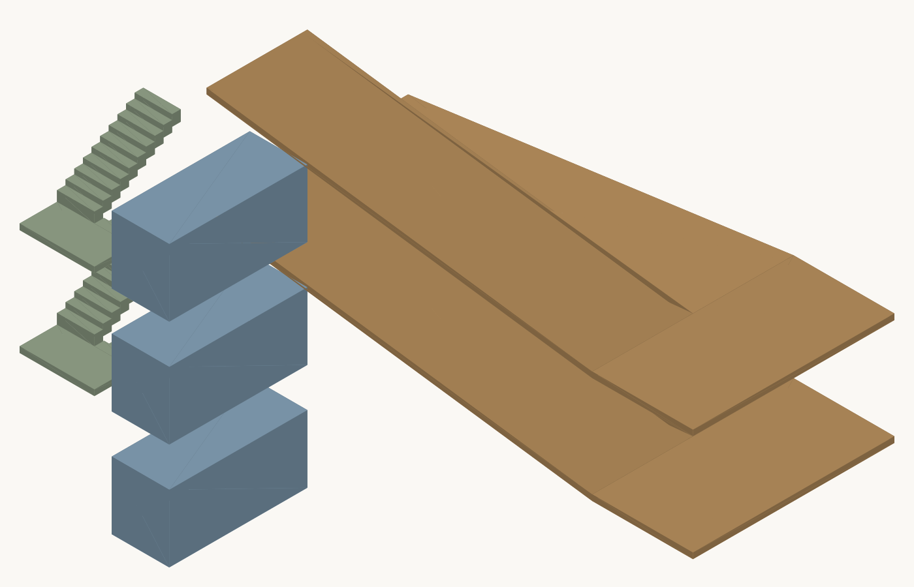

# export/ifc — writing a koyu building out as IFC4

```sh
pip install -e export/ifc
npm run build                                    # the export reads dist/, so build it first
koyu-ifc export examples/tower/main.muro -o out/tower.ifc
```

```text
Wrote out/tower.ifc
  174 Space / 545 Wall / 155 Door / 158 Window / 378 Slab / 1102 RelSpaceBoundary
```

There is an MCP server too — `koyu-ifc-mcp`, one tool, `export_ifc`. **It is this package's
server, not koyu's.** koyu's own twelve tools stay free of runtime dependencies; asking `koyu-mcp`
to shell out to Python would make Python a requirement of koyu in everything but the manifest. An
agent that needs both connects both.

**Nothing here ships on npm.** `package.json` lists what goes to the registry as an allowlist
(`dist`, `src`, `examples`, `editors`, `NOTICE`), so `ifcopenshell` and `pyproj` never become
dependencies of koyu.

## Two inputs, joined by path

`bin/koyu-form.mjs` writes one JSON document holding both, because neither half is enough alone.

| | Holds | Does not hold |
|---|---|---|
| **Form** (`derive`) | outlines, wall segments and thicknesses, opening centres, z ranges, slabs, runs | attributes, `uid`, and any space declaring `outside:1` |
| **canonical JSON** (`toCanonical`) | names, `uid`, attributes, assets, zones, the geodetic frame | any coordinate at all |

**Matter is raised on the koyu side, by koyu's own constructors.** `thicken`, `band`, `columnRect`
and `runPrism` turn centre lines and thicknesses into outlines, and that is part of the derivation
rather than a detail of this exporter. Rewriting them here would share the parts while forking the
rules of assembly — which is how one composition comes to have two shapes. So **no file in
`koyu_ifc/` contains a geometry rule**; outlines arrive finished and only the IFC spelling is
decided here.

**Imports come from `dist/`, never `src/`.** The export runs against what is actually published,
which puts the build inside the test and keeps the public surface exercised by its most demanding
consumer. `test/domains.test.ts` holds that by machine.

## What comes out

| koyu | IFC4 |
|---|---|
| `level` | `IfcBuildingStorey` |
| space with a region | `IfcSpace`, extruded from its outline |
| space with `outside:1` | `IfcExternalSpatialElement` |
| `zone` | `IfcZone` |
| `boundary` of kind `wall` | `IfcWall`, built at full length |
| `boundary` of kind `open` | `IfcVirtualElement` |
| `door` / `window` | `IfcOpeningElement` + `IfcDoor`/`IfcWindow`, joined by `IfcRelVoidsElement` and `IfcRelFillsElement` |
| `asset` | `IfcDoorType` / `IfcWindowType` + `IfcRelDefinesByType` |
| derived floors, ceilings, roofs | `IfcSlab` |
| `column` | `IfcColumn` |
| `seg` | `IfcCovering` over the stretch it names |
| `stair` / `ramp` | `IfcStair` / `IfcRamp`, treads and landings as solids |
| `escalator` / `lift` | `IfcTransportElement` |
| the site `polygon` | `IfcSite` with its boundary |
| `use:` | `IfcClassification` |
| `spec:` | `IfcMaterial` |
| derived areas and volumes | `IfcElementQuantity` |
| `azimuth` | `TrueNorth` on the representation context |
| `origin` + `azimuth` | `IfcProjectedCRS` + `IfcMapConversion` |
| **the boundary relation itself** | **`IfcRelSpaceBoundary`** |

That last row is the point. `IfcRelSpaceBoundary` is the first thing a working export drops — it
is often absent even where `IfcSpace` survives — and koyu holds the relation as a first-class
edge, so it is written rather than inferred.

### The wall is built whole and the opening is cut out of it

`material.panels` is already divided by the openings, so the panels alone would give correct
geometry. But then no `IfcOpeningElement` exists and **which wall hosts a door is nowhere in the
file**. So the wall is built at full length and the openings are subtracted.

The panels are not wasted: `test_boolean_result_equals_the_panels` requires the volume left after
the boolean to equal theirs. The two derivations never met on the way in.

### The meridian convergence is applied

A projected system's axes follow **grid north**; koyu's `azimuth` is measured from **true north**.
They differ by the meridian convergence γ at the origin, and koyu's own reference page warns that
a consumer will drop it.

```text
rotation written into IfcMapConversion = azimuth + 90° − γ(origin)
```

For `examples/tower` — system IX, central Tokyo — γ is 0.040°. Small, and not zero:
`test_the_meridian_convergence_is_applied` fails if the naive rotation is written instead.

**Georeferencing is written only when both halves of the frame are present.** A position with no
bearing cannot place anything, and writing a map conversion without a rotation would claim one.

## Identity

`GlobalId` is derived, not drawn. **The same model gives the same identifiers on any machine, on
every run**, with no state kept on the side — so editing one room leaves every other object's
identifier alone. Where identity comes from is `docs/reference/identity.md`, unchanged: a space
carrying `uid:` keeps its identifier across a rename, and one without it does not.

Every space, wall, opening and run also carries a `koyu` property set holding its path and its
`ref`, so a file leads back to the source it came from even without the identifiers.

## Tests

None of them reads the file's spelling. Each asks the IFC a question koyu can also answer.

```sh
pytest export/ifc/tests -q
```

| Test | What it holds |
|---|---|
| `test_the_file_passes_the_schema` | no express-rule violation and no attribute of the wrong type |
| `test_every_identifier_is_unique` | no two objects share a `GlobalId` |
| `test_the_spatial_structure_is_complete` | project → site → building → storey, and every space sits in one |
| `test_every_shape_builds` | every representation resolves to a solid through the geometry engine |
| `test_space_area_agrees` | area measured off the built solid equals koyu's figure |
| `test_every_space_is_present` | no space is lost, at any size |
| `test_adjacency_agrees` | the pairs of spaces sharing a boundary are the same on both sides |
| `test_door_count_agrees` | walking door → opening → wall → space boundary gives koyu's door count |
| `test_boolean_result_equals_the_panels` | the wall left after the cut equals koyu's panels |
| `test_nothing_koyu_holds_is_dropped` | every block koyu produced reaches the file |
| `test_the_meridian_convergence_is_applied` | the rotation is `azimuth + 90 − γ`, not `azimuth + 90` |
| `test_a_model_with_no_frame_claims_no_position` | no origin means no map conversion and no true north |
| `test_identity_is_stable` | exporting twice is identical; one edit moves nothing else; a `uid` survives a rename |

Every bundled building is exported and checked. Building every solid of the two largest takes
minutes, so `test_every_shape_builds`, `test_space_area_agrees` and the panel check run on the
first four; the rest still answer every question that does not need a tessellation.

## The bundled buildings, measured

| | Contents | Size |
|---|---|---|
| two-rooms | 2 Space · 7 Wall · 2 Door · 2 Window · 6 Slab · 14 SpaceBoundary | 0.03 MB |
| office | 16 Space · 48 Wall · 14 Door · 8 Window · 38 Slab · 98 SpaceBoundary | 0.2 MB |
| house | 9 Space · 26 Wall · 4 Door · 4 Window · 17 Slab · 60 SpaceBoundary | 0.1 MB |
| basement | 13 Space · 43 Wall · 7 Door · 29 Slab · 90 SpaceBoundary | 0.2 MB |
| mansion | 121 Space · 386 Wall · 103 Door · 72 Window · 245 Slab · 780 SpaceBoundary | 1.6 MB |
| tower | 174 Space · 545 Wall · 155 Door · 158 Window · 378 Slab · 1102 SpaceBoundary | 2.5 MB |
| complex | 422 Space · 1254 Wall · 330 Door · 193 Window · 811 Slab · 2606 SpaceBoundary | 6.2 MB |
| twin | 1807 Space · 5305 Wall · 901 Door · 479 Window · 3066 Slab · 10806 SpaceBoundary | 24.8 MB |

### What it costs to say the same thing in IFC

Measured with `o200k_base`, the tokeniser `examples/comparison/README.md` uses.

| | Bytes | Lines | Tokens | ×`.muro` |
|---|---:|---:|---:|---:|
| `two-rooms.muro` | 917 | 26 | 361 | 1× |
| two-rooms canonical JSON | 2,160 | 140 | 728 | 2× |
| **two-rooms as IFC4** | 30,397 | 575 | **13,743** | **38×** |
| `tower` source (9 files) | 22,024 | 462 | 8,843 | — |
| **tower as IFC4** | 2,483,042 | 41,850 | **1,125,986** | **127×** |

`examples/comparison/README.md` estimated a complete IFC of `tower` at about 110,000 tokens by
scaling up its hand-written minimum. **The real figure is 1.13 million — ten times that estimate.**
The idealised file it scaled from carried no space boundaries, no property sets, no quantities and
no types; a file that carries them costs an order of magnitude more. The claim that estimate was
supporting still holds, and holds harder: a building that is 8,843 tokens as koyu fits in a
context window, and the same building as IFC does not.

## The geometry, seen



Drawn from the tessellation of `examples/basement`'s own IFC, with no koyu code in the path:
stair treads and landings in green, lift cars in blue, the car ramp's inclined slabs in brown.
An inclined slab is the one shape that cannot be an extrusion — it becomes a closed shell — so it
is the part worth looking at rather than only measuring.

## Not yet

- **Reading IFC back into `.muro`.** Deliberately not attempted.
- **Material layer sets.** `spec:` is a name, so it becomes an `IfcMaterial` and no layer build-up
  is invented.
- **`IfcRelSpaceBoundary2ndLevel`.** The boundaries written are first level. koyu holds enough to
  go further, but the second level's rules about which space owns a shared face need their own
  decision.
