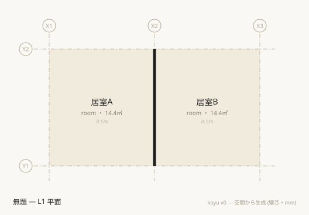
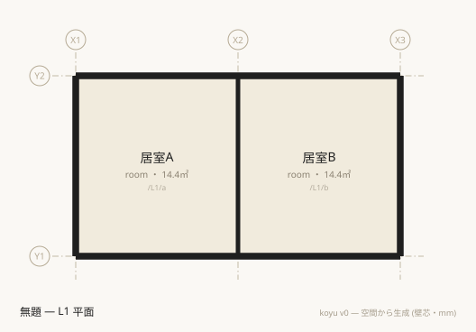

**English** · [日本語](../concepts.md)

# Six ideas

koyu's notation is short. Not because there is little to remember, but because **there is much that is not written**. Read the syntax tables without knowing what goes unwritten, and what going unwritten means, and you cannot tell whether a line is missing or superfluous.

This document explains, in order, the six ideas you need first for the notation to read. It writes no procedure — the order in which to move your hands is held by [start.md](start.md), and the exact definitions by [spec/](../../spec/en/README.md). The six are not independent pieces of knowledge but a chain of consequences from one decision, so read in order, each falls out of the one before. It takes about ten minutes. The argument in full is in [docs/writing-architecture.md](../../docs/writing-architecture.md) (in Japanese).

## 1. Space is the primary element

Architectural data has long been a description of things to be built. Walls, floors, and columns are laid out, and rooms are derived afterwards as the result of what those enclose. koyu reverses the order. **Enumerate the rooms and the walls between them come along.**

So what stands at the center of a .muro is `space`. These four lines are the smallest file that is consistent and can be drawn as a plan.

```muro
grid X 0 3600
grid Y 0 4000
level L1 0
space /L1/a room X1..X2 Y1..Y2
```

`koyu check` returns this.

```text
✔ 整合 — 空間 1 / 境界 0
```

("Consistent — 1 space / 0 boundaries.")

Neither `koyu 0.3`, nor `unit mm`, nor `name` is needed. **All that is required is that there be a grid on both axes, that it precede any line using it, that a level be declared, and that `space` carry a type (its second positional).** Coordinates are never written directly — position is always written in the language of grid lines ([spec/language.md §2, grid references and offsets](../../spec/en/language.md)).

Add one room. Not one boundary line is written.

```muro
grid X 0 3600 7200
grid Y 0 4000
level L1 0
space /L1/a room X1..X2 Y1..Y2 name:居室A
space /L1/b room X2..X3 Y1..Y2 name:居室B
```

```text
✔ 整合 — 空間 2 / 境界 1
```

It says "1 boundary" although no boundary was written. Because the two rooms touch, the wall between them has been derived (§3). `koyu graph` shows that wall.

```text
/L1/a (居室A)
  | 壁 → /L1/b
/L1/b (居室B)
  | 壁 → /L1/a
```

(`壁` is "wall". The names 居室A and 居室B are "Room A" and "Room B".)

That a file of nothing but `space` lines is a complete description of architecture, rather than a drawing with pieces missing, is where this notation starts.

## 2. A boundary is a relation, not a thing

`boundary /L1/a /L1/b` is not a line that places a wall. It is **a line declaring that a boundary relation exists between two spaces**. The wall centerline segment itself is not written — it is derived as the shared edge of the two rectangles ([spec/semantics.md §2, derivation in plan](../../spec/en/semantics.md)).

From this one fact, three rules that stand as separate table rows in the specification all fall out at once. You do not need to memorize three things. Remembering that it is a relation is enough.

**One — you cannot write a boundary between spaces that do not touch.** A declared relation from which no segment can be derived does not stand up.

```muro-bad
grid X 0 3600 7200
grid Y 0 4000 8000
level L1 0
space /L1/a room X1..X2 Y1..Y2
space /L1/b room X2..X3 Y2..Y3
boundary /L1/a /L1/b
```

The error is `空間が接していないため境界を導けません: /L1/a | /L1/b` — "the spaces do not touch, so no boundary can be derived" (BND04). These two rooms meet at a corner, but "touching" in koyu means **sharing an edge of nonzero length**. A single corner point is not contact.

**Two — one relation can split into several segments.** A boundary with a space that has no region (the outside, say) is what remains of the room's perimeter once the intervals shared with other spaces are removed, and it usually splits across several edges. One relation, several segments. So **when placing an opening on an external wall you select which edge with `edge:`**.

```muro-bad
grid X 0 3600
grid Y 0 4000
level L1 0
space /L1/living room X1..X2 Y1..Y2
space /out exterior
boundary /L1/living /out
  door w:900
```

The error is `境界線分が複数あります。edge:N/E/S/W で辺を指定してください (/L1/living | /out)` — "there are several boundary segments; specify the side with edge:N/E/S/W" (OPN05).

The compass follows from the coordinate system. **X is east-positive and Y is north-positive, so N=+Y, S=-Y, E=+X, W=-X** (`Edge` in `src/model.ts`). And `edge` is **the side as seen from the rectangle of the a side — the space written first**. In `boundary /L1/living /out`, `edge:S` means the south edge of living's rectangle. Swap the order in which they are written and the meaning changes.

```muro
grid X 0 3600
grid Y 0 4000
level L1 0
space /L1/living room X1..X2 Y1..Y2
space /out exterior
boundary /L1/living /out t:150
  door w:900 edge:S
```

**Three — you cannot write a boundary twice for the same pair of spaces.** A relation has identity. Two lines for one relation would mean two answers to one question.

```muro-bad
grid X 0 3600 7200
grid Y 0 4000
level L1 0
space /L1/a room X1..X2 Y1..Y2
space /L1/b room X2..X3 Y1..Y2
boundary /L1/a /L1/b t:120
boundary /L1/a /L1/b type:open
```

The error is `境界が重複しています: /L1/a | /L1/b (既出: …6行目)` — "duplicate boundary, first seen at line 6" (BND02). If the later one silently won, whether this wall is a wall or an opening would be settled by the order of the lines ([ADR-0013](../../docs/decisions/0013-semantic-guarantees.md)).

Note that a `boundary` may be written before the spaces — a declared relation may refer forward. The only things that need to come first are `grid` and `level`, which must precede any line that uses them.

## 3. Three tiers of default

Not writing something carries meaning. But **there are three kinds of "not writing", and they mean different things.**

| Kind of contact | What not writing it means | What declaring it is for |
|---|---|---|
| Two spaces with regions touching in plan on the same level | **A wall** (derived) | The exceptions (`type:open`, `air:1`), and attributes and openings |
| Two spaces overlapping in plan on consecutive levels | **A floor** (derived) | The exceptions (`stair`, `shaft`, `void`) |
| Contact with a space that has no region (`exterior` and the like) | **Nothing at all** | The envelope itself |

The first two are symmetric and rather beautiful. Horizontally a wall, vertically a floor, neither written ([ADR-0014](../../docs/decisions/0014-default-boundaries.md), [spec/semantics.md §2, §3](../../spec/en/semantics.md)). Only the third differs. Miss it and your drawing breaks.

The two-room file in §1 is green under `check` and yet has not one external wall. The plan shows it.



The only thing drawn in black is the single band in the middle — the derived default wall. There is nothing around the perimeter. Only when you write an exterior space, and boundaries with it, does an envelope come into being.

```muro
grid X 0 3600 7200
grid Y 0 4000
level L1 0
space /L1/a room X1..X2 Y1..Y2 name:居室A
space /L1/b room X2..X3 Y1..Y2 name:居室B
space /out exterior name:外部
boundary /L1/a /out t:150 spec:EW
boundary /L1/b /out t:150 spec:EW
```



**Internal walls are automatic; external walls are manual.** This asymmetry does not appear in the table of defaults. There is a reason — naming *which* outside (a road, a neighbor, a garden, a shared corridor) is itself information, and cannot be derived by default. But the consequence is that **there is no mechanism that checks for a missing envelope**. A green `check` is not looking at it.

The dividing line is not "is it an exterior?" but "does it have a region?". An exterior space that carries a region and a level, as in `space /out/garden exterior X2..X3 Y1..Y2 level:L1`, does get a default wall derived between it and the rooms it touches (and it counts toward road frontage).

A derived boundary is not part of the authored composition, so it does not appear in the canonical JSON ([spec/canonical-json.md](../../spec/en/canonical-json.md)). That is why `check` saying "1 boundary" and `koyu json` saying `"boundaries": []` look contradictory: the former counts the meaning after derivation, the latter the authored source.

## 4. A path is an address and, at the same time, an aggregation hierarchy

`/L1/a` is not a name but an address. And the hierarchy cut by `/` doubles as the unit of aggregation. A path plays two roles.

**The first segment becomes a level only when a `level` of the same name has been declared.** Writing `/L1/` does not bring a level into being; a separate `level L1 0` line is needed. Without it `check` emits a warning but **does not error**.

```text
⚠ nolevel.muro:3行目: /L1/x は領域を持ちますが、レベルが特定できません (パス先頭か level: で指定します)
✔ 整合 — 空間 1 / 境界 0 (警告 1)
```

("/L1/x has a region but its level cannot be determined — specify it at the head of the path or with level:." Then: consistent, 1 space / 0 boundaries, 1 warning.)

The warning text points at the path, but the cause is not the path — it is the absent `level` line. And this file, which `check` passed with exit code 0, cannot be drawn by `plan`.

```text
Error: レベルが定義されていません
    at svgPlan (/…/src/plan.ts:29:21)
```

("No level is defined.") This is a hole in the current implementation, and a worked instance of a green `check` not meaning "drawable" (see the table at the end). Note also that only one level can be expressed at the head of a path, so a grouping that spans levels (a maisonette) states it with the `level:` attribute.

**A space with a region cannot have child spaces with regions.** Parent and child would overlap.

```muro-bad
grid X 0 3600 7200
grid Y 0 4000
level L1 0
space /L1/home unit X1..X3 Y1..Y2
space /L1/home/a room X1..X2 Y1..Y2
space /L1/home/b room X2..X3 Y1..Y2
```

The error is `空間の領域が重なっています: /L1/home と /L1/home/a` — "the regions of these spaces overlap" (GEO01). **When you subdivide a dwelling into rooms, make the parent a `zone` rather than a `space`.** A zone has no geometry; it is a counted aggregation that only bundles what lies beneath it by path prefix.

```muro
grid X 0 3600 7200
grid Y 0 4000
level L1 0
zone /L1/home name:住戸
space /L1/home/a room X1..X2 Y1..Y2
space /L1/home/b room X2..X3 Y1..Y2
```

`koyu stats` reports the individual rooms while keeping the total over the path prefix.

```text
ゾーン別 (数える集約):
  /L1/home	住戸	28.80㎡
```

("By zone (counted aggregation): /L1/home, dwelling, 28.80 m².")

That "subdividing into rooms never loses the language of the dwelling" is what this double role buys ([spec/semantics.md §6, stats](../../spec/en/semantics.md)). So **the unit you want to aggregate by belongs toward the head of the path.** The bundled examples show two idioms — `/L1/room`, putting the level first (two-rooms, office, mansion, tower), and `/home/room` with `level:L1`, putting the dwelling first (house). Neither is better; they differ in what you want to bundle by.

Paths change. When a rename or a reorganization changes a path, the correspondence with any sensor or register that used it as a foreign key is severed. When you need a reference that outlives the path, use `uid:` — an opaque token, unique across the whole model, never derived from the path ([ADR-0015](../../docs/decisions/0015-identity-uid.md)). References inside the repository (`boundary`, `doors`, zone aggregation) stay on paths as before.

## 5. The authored source and what is derived

There is no form in a .muro. **Form, quantity, and the inside/outside distinction are none of them written in the source; all are derived.**

The two columns are not paired rows; each is its own list.

| Written (the source) | Derived |
|---|---|
| The region of a space (a rectangle union in grid references) | Wall centerline segments |
| The boundary relation (a, b, kind, attributes) | Default boundaries (the horizontal wall, the vertical floor) |
| Openings (door / window) | Area (to centerlines), interior floor area |
| grid, level | Vertical adjacency |
| The site shape (polygon) | Semi-outdoor, covered above |
| Assets, zones | Passability |
| Uncounted subdivisions (area, seg), `uid` | The plan drawing, the daylight verdict, road frontage and coverage ratio, the canonical JSON |

This one table answers two beginner questions at once.

**"Where do I write the floors?"** — You do not. Spaces overlapping in plan on consecutive levels are vertically adjacent by that overlap, and the default reading is "there is a floor". Only the exceptions (stairs, shafts, voids) are declared as boundaries.

**"I want to declare that this space is semi-outdoor."** — You cannot. Semi-outdoor is derived, not declared. A space with a region that carries an `open` or `air:1` boundary with the outside becomes semi-outdoor ([spec/semantics.md §4](../../spec/en/semantics.md)). Writing `type:terrace` on a terrace does not make it semi-outdoor. What makes it so is on the boundary side.

```muro
grid X 0 3600 5400
grid Y 0 4000
level L1 0 h:2400
space /L1/room ldk X1..X2 Y1..Y2
space /L1/balcony balcony X2..X3 Y1..Y2
space /out exterior
boundary /L1/room /L1/balcony t:150
  window w:1600 h:2000
boundary /L1/balcony /out type:open
```

That last line is what makes the balcony semi-outdoor. The area table in `stats` shows it.

```text
  /L1/room	room	ldk	14.40㎡
  /L1/balcony	balcony	balcony	7.20㎡ (半屋外・別掲)
  小計 14.40㎡
合計 14.40㎡ (屋内床面積)
半屋外 7.20㎡ (バルコニー・屋外階段等 — 算入条件は法規細部のため別掲)
```

(`半屋外・別掲` = "semi-outdoor, reported separately"; `合計 … (屋内床面積)` = "total … interior floor area"; the last line notes that whether semi-outdoor area counts depends on regulatory detail, so it is kept separate.)

One step outside derivation there is **generation**. The plan drawing is generated rather than derived, and several forms come from one composition. That is not a defect but an expression of the position that if the composition is the same, a difference in form does not damage the identity of the architecture ([spec/semantics.md §7](../../spec/en/semantics.md)).

## 6. The vocabulary is open

The second positional of `space` (its type) is required, but **any value passes**. The same holds for attribute keys: anything may be written and is carried through. This openness is intended — it is the consequence of choosing to give meaning by a vocabulary rather than a vast class hierarchy ([spec/vocabulary.md](../../spec/en/vocabulary.md)).

The price is that **a typo passes silently**.

```muro
grid X 0 2000
grid Y 0 2000
level L1 0
space /L1/a room X1..X2 Y1..Y2 nmae:居間
```

```text
✔ 整合 — 空間 1 / 境界 0
```

`nmae:` is a typo for `name:`, but it is neither an error nor a warning, and it comes out in the canonical JSON as `"nmae": "居間"`. A word absent from the ledger is not "wrong" — it is "not interpreted".

Of the types, only two are interpreted structurally by the tools.

| Type | Interpretation |
|---|---|
| `exterior` | The outside. May have no region. Adding `road:` makes it a subject of road frontage |
| `void` | A void through the floor. Excluded from floor area, and not passable |

Five more are subjects of the daylight check (`light`): `unit`, `room`, `ldk`, `bedroom`, `living` (added with `hab:1`, excluded with `hab:0`). **Every other type, however meaningful it looks, is a free word equivalent to any other as far as the tools are concerned.**

The bundled examples actually use 31 type words (across 135 `space` lines). Not as a ledger but as usage, they are distributed like this.

| Category | Words (occurrences) |
|---|---|
| Interpreted structurally | `exterior` (15) · `void` (4) |
| Subjects of the daylight check | `unit` (14) · `bedroom` (5) · `ldk` (4) · `room` (2) · `living` (0 — in the vocabulary but absent from the examples) |
| Uninterpreted, by usage | `stair` (11) · `yard` (9) · `hall` (8) · `corridor` (8) · `balcony` (6) · `wc` (5) · `terrace` (5) · `machine` (5) · `ev` (5) · `shop` (4) · `service` (4) · `office` (4) · `shaft` (3) · `ps` (2) · `garden` (2) · `wet` (1) · `water` (1) · `waste` (1) · `trunk` (1) · `plaza` (1) · `parking` (1) · `meeting` (1) · `lobby` (1) · `bicycle` (1) · `backyard` (1) |

The third row is de facto usage, not a contract. One confusing overlap is worth noting — `stair`, `shaft`, and `void` are also words for a **boundary kind**, but as space types `stair` and `shaft` are not interpreted (only `void` is interpreted as a space type as well).

Where this openness bites is when the choice of type silently moves a verdict. Write a windowless bathroom as `room` and it enters the daylight check.

```muro
grid X 0 2000
grid Y 0 2000
level L1 0 h:2400
space /L1/bath room X1..X2 Y1..Y2 name:浴室
space /out exterior
boundary /L1/bath /out edge:S t:150
```

```text
✖ /L1/bath	浴室	窓 0.00㎡ / 床 4.00㎡ = 窓なし (必要 1/7 ≈ 0.57㎡)
✖ 1室中 1室が不足しています
```

("Window 0.00 m² / floor 4.00 m² = no windows, requires 1/7 ≈ 0.57 m². 1 of 1 room falls short.")

Change one word of the type.

```muro-part
space /L1/bath wet X1..X2 Y1..Y2 name:浴室
```

```text
対象の居室 (住居系) がありません
```

("There are no habitable rooms in scope.") `check` is green on both files. A type is not a description of a room; it is the entrance to a verdict.

## What a green check does not guarantee

What `check` looks at is whether the authored composition stands up. **It is not looking at whether the building can be used.**

| Not guaranteed | How to see it |
|---|---|
| Circulation — what can be reached from where | `koyu doors <A> <B>` · `koyu graph` |
| Envelope completeness — whether external walls were written | Your own eyes (look at the `koyu plan` drawing). There is no automatic check |
| Whether it can be drawn — whether a level was declared | `koyu plan` (`check` stops at a warning) |
| Vocabulary correctness — the spelling of a type or attribute key | Nothing |

The first is the dangerous one. As §3 says, the default between touching spaces is a wall, and **a wall with no door cannot be passed**. So writing a two-storey building without a single door gets you a sealed building, in green.

```muro
koyu 0.3
grid X 0 3600
grid Y 0 4000
level L1 0 h:2400
level L2 3000 h:2400 slab:300
space /L1/hall hall X1..X2 Y1..Y2
space /L2/bed bedroom X1..X2 Y1..Y2
space /out exterior
boundary /L1/hall /out t:150
boundary /L2/bed /out t:150
boundary /L1/hall /L2/bed type:stair
```

```text
✔ 整合 — 空間 3 / 境界 3
```

There are external walls, there is a stair, and it is consistent. But there is no way out.

```text
$ koyu doors two.muro /L2/bed /out
/L2/bed から /out へは到達できません
```

("/L2/bed cannot reach /out.")

A warning saying "these touch but no boundary is declared" once existed, but making the default a wall ended its job and it was retired (BND07 is a retired number — [ADR-0014](../../docs/decisions/0014-default-boundaries.md)). **The instrument for looking at circulation is `doors`, not `check`.**

As the extreme case of this asymmetry, **`check` is green on an empty file too** — `✔ 整合 — 空間 0 / 境界 0`. Since there is no composition that fails to stand up, that is correct. `check` tests that what is written is free of contradiction, not that what is needed has been written.

## Onward

- The order in which to move your hands — [start.md](start.md)
- The list of constructs — [cheatsheet.md](cheatsheet.md)
- Looking up a word — [glossary.md](glossary.md)
- The cause and fix for each diagnostic code — [diagnostics.md (日本語)](../diagnostics.md)
- The norms (grammar, semantics, the vocabulary ledger, canonical JSON, tool contracts) — [spec/](../../spec/en/README.md)
- Why it is the way it is — [docs/decisions/](../../docs/decisions/) and [docs/writing-architecture.md](../../docs/writing-architecture.md)
