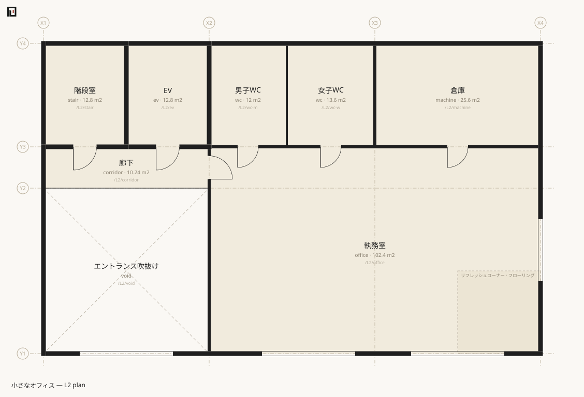
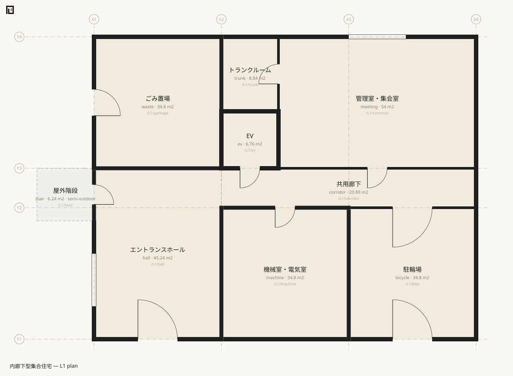
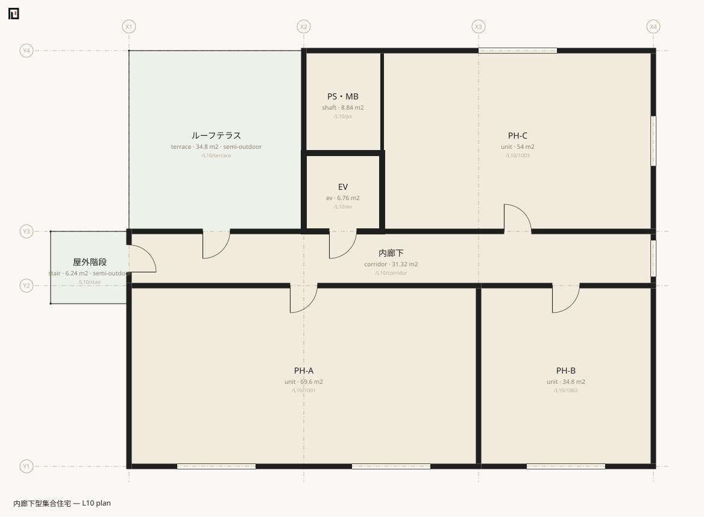
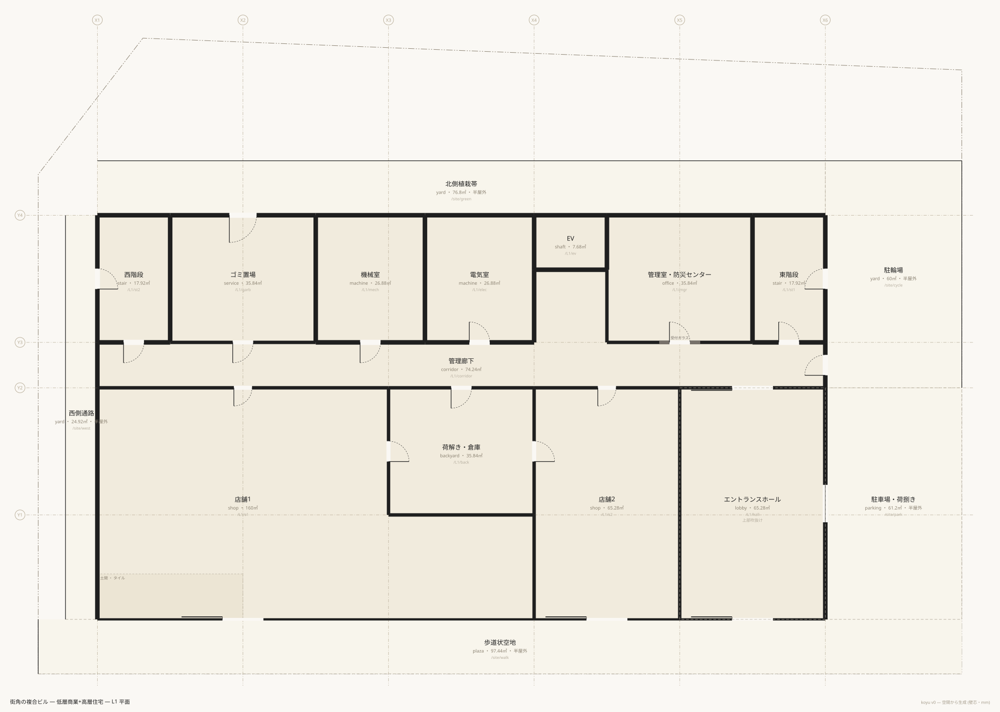
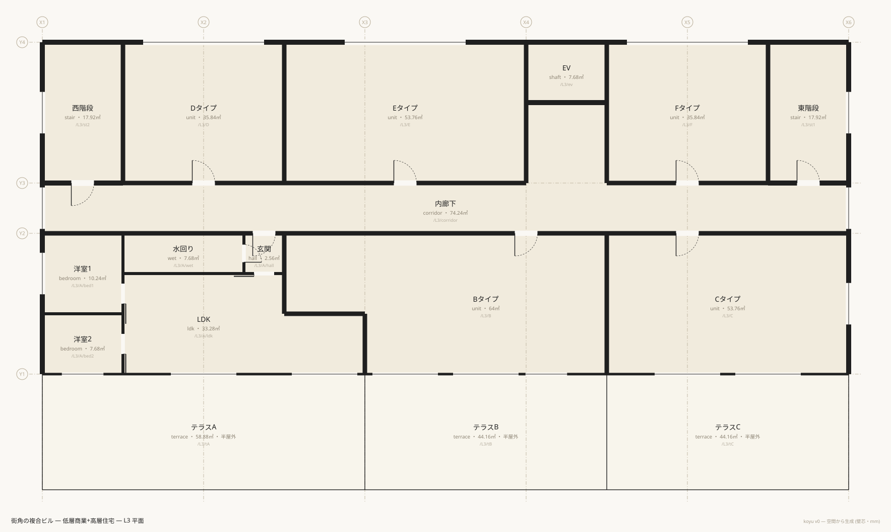
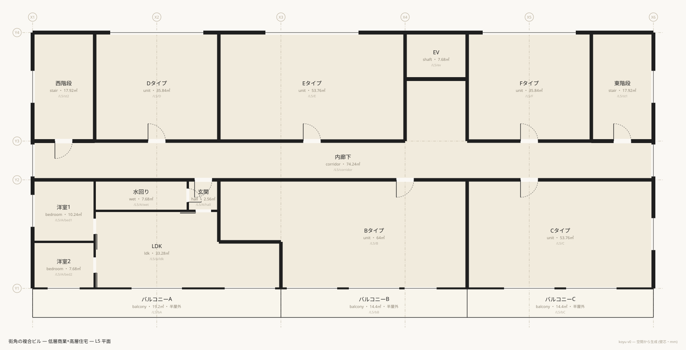
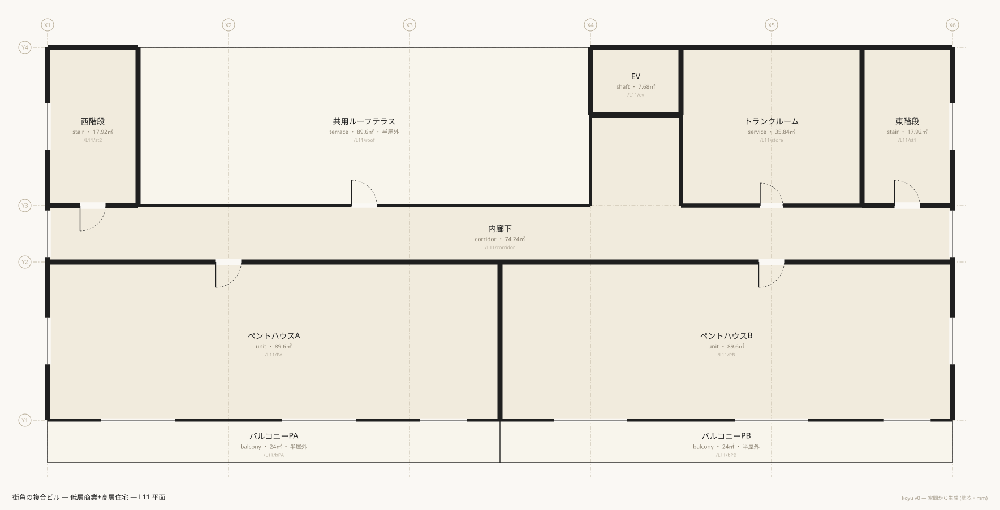

[English](en/gallery.md) · **日本語**

# 実例集

図から入るための入口である。生成される図が読めれば書けたことになる記法なので、実例集は付録ではない。

同梱の5例は難度順に並んでおり、おおむね前の例の上に積み上がる。各節は「この例が**初めて**示すもの」「代表的な抜粋」「投げる価値のある問いと実際の答え」からなる。**図も数字も出力も、すべてこのリポジトリのファイルから生成した実測である** — 貼るときに手で書き換えていない。

| 例 | 規模 | 初めて示すもの |
|---|---|---|
| [two-rooms](#examplestwo-roomsmuro) | 26行 / 空間3 / 境界3 / 32.40㎡ | 空間・境界・扉・外部。記法の最小単位 |
| [office](#examplesofficemuro) | 110行 / 17 / 43 / 419.84㎡ | 複数階・吹抜け・垂直境界・数えない分節・open境界 |
| [house](#exampleshousemuro-と-exampleshouse) | 89行 (単一) / 102行5ファイル (合成) / 13 / 31 / 92.75㎡ | 敷地と外構・半屋外・L字の合併・アセット・レイヤー合成 |
| [mansion](#examplesmansionmuro) | 192行 / 122 / 332 / 2366.40㎡ | 基準階のスパン展開・stack・粒度の混在 |
| [tower](#examplestower) | 453行9ファイル / 178 / 543 / 4785.92㎡ | 敷地形状 polygon・例外階の差分レイヤー・複数道路 |
| basement | 84行3ファイル / 15 / 49 / 1242.08㎡ | 縦動線の最小例 — 折返し斜路・階段・EV・地下の宣言 |
| complex | 647行10ファイル / 425 / 1364 / 31606.24㎡ | 特大複合建築 (B2〜19F)。帯・柱・描かれた線・エスカレーター・敷地10角形 |

全例の整合は `npm run check:examples` が一度に確かめる。

## examples/two-rooms.muro


22行 / 空間3 / 境界3 / 32.40㎡。室を二つ並べ、その間に扉を一枚、外へ出る扉を一枚。この記法の最小の単位が一通り出そろう。

**この例が初めて示すもの**

- `space` — パスが同一性で、型が第2位置引数。
- `boundary` — 壁が二つの空間を結ぶ**関係**であること。壁芯線分は書かれておらず、両室の矩形から導出されている。
- 字下げの `door` — 扉は壁 (境界) に属し、空間には属さない。
- `/out` — 外部も一つの空間。領域を持たないので、外皮の境界は**明示的に書かれている**。
- `edge:S` — 外部への開口は辺を選ぶ必要がある。`/L1/b` の外周は3辺に分かれるため。

**抜粋** — ファイル後半がそのまま「壁は関係である」の実演になっている。

```muro-part
space /L1/a room X1..X2 Y1..Y2 name:居室A
space /L1/b room X2..X3 Y1..Y2 name:居室B
space /out exterior name:外部

boundary /L1/a /L1/b t:120 spec:PW1
  door w:780 h:2000

boundary /L1/a /out t:150 spec:EW1 fire:60
boundary /L1/b /out t:150 spec:EW1 fire:60
  door w:900 h:2100 edge:S name:玄関
```

**投げる問い**

外へ出るのに何枚の扉を通るか。居室Aには外部への扉が無いので、答えは居室Bを経由する。

```sh
npx tsx src/cli.ts doors examples/two-rooms.muro /L1/a /out
```

```text
2枚 — /L1/a → /L1/b → /out
```

隣接の全体を見る。「壁」と「扉1」の区別が、そのままグラフの辺の重みになっている。

```sh
npx tsx src/cli.ts graph examples/two-rooms.muro
```

```text
/L1/a (居室A)
  — 扉1 → /L1/b  (spec:PW1)
  | 壁 → /out  (spec:EW1 fire:60)
/L1/b (居室B)
  — 扉1 → /L1/a  (spec:PW1)
  — 扉1 → /out  (spec:EW1 fire:60)
/out (外部)
  | 壁 → /L1/a  (spec:EW1 fire:60)
  — 扉1 → /L1/b  (spec:EW1 fire:60)
```

同じ場面を IFC4 / IFCX で書くとどうなるかは、この頁の末尾 [examples/comparison/](#examplescomparison) にある。

## examples/office.muro




110行 / 空間17 / 境界43 / 419.84㎡。2フロア+屋上レベルの小さなオフィス。基本計画の解像度で書かれており、垂れ壁や建具詳細は表現しない — 省略ではなく抽象度の選択である。

**この例が初めて示すもの**

- **複数レベル** — `level L1` `level L2` と、空間を持たない `level R`。屋上レベルはL2の高さ検査の上限を与えるためだけに宣言されている。
- **吹抜け** — `space /L2/void void …` と、垂直の `boundary /L1/hall /L2/void type:void`。床の不在も境界で書く。
- **垂直境界** — `type:stair` (通行可) と `type:shaft` (連続するが通行不可)。床は書かない。書くのは例外だけ。
- **`type:open`** — 何も無い境界。常に通行可能。
- **`air:1`** — 物はあるが外気・光を遮らない (吹抜けに面する腰壁+手すり)。
- **数えない分節** — 字下げの `area` (床材の切替) と `seg` (壁材の切替)。どちらも面積・室数・グラフに現れない。
- **空間ごとの天井高** — `h:6700` でホールだけ2層分。`levels` が個別天井高として別掲する。
- **開口の比率位置** — `at:0.8` `at:0.25`。0..1の比率で線分内にクランプされる。

**抜粋** — 垂直方向の書き方はこの3行しかない。残りの床はすべて既定である。

```muro-part
# ---- 垂直: 床は書かない (levelのslabが既定)。例外 — 繋がる場所と抜ける場所 — だけ書く ----
boundary /L1/stair /L2/stair type:stair
boundary /L1/ev /L2/ev type:shaft
boundary /L1/hall /L2/void type:void   # エントランスは2層吹抜け — 床の不在も境界で書く
```

数えない分節は、室を割らずに材料だけを変える。

```muro-part
space /L1/hall     hall     X1..X2 Y1..Y2       name:エントランスホール use:common floor:フローリング h:6700   # 吹抜けで2層分
  area X1..X1+1800 Y1..Y2 name:土間 floor:モルタル   # 数えない分節: 室は割れない。面積はホールのまま
space /L1/office   office   X2..X4 Y1..Y2       name:事務室 use:rentable
boundary /L1/office /L1/corridor t:120 spec:LGS
  door w:900
  seg at:0.75 w:3600 spec:ガラスパーティション   # 数えない分節: 同じ境界のまま壁材だけ変わる
```

**投げる問い**

2階の執務室から外へ。EVはシャフト (通行不可) なので、経路は階段室を通る。

```sh
npx tsx src/cli.ts doors examples/office.muro /L2/office /out
```

```text
4枚 — /L2/office → /L2/corridor → /L2/stair → /L1/stair → /L1/corridor → /L1/hall → /out
```

高さの積み上がりを見る。`h:6700` のホールが個別天井高として最後に出る。

```sh
npx tsx src/cli.ts levels examples/office.muro
```

```text
R	z:8000	slab:1300
L2	z:4000	h:2700	slab:1300
  ↑ 階高 4000 = 天井2700 + slab1300
L1	z:0	h:2700
  ↑ 階高 4000 = 天井2700 + slab1300
個別天井高: /L1/hall h:6700
```

面積では、吹抜けが床面積に算入されないことが読める。

```sh
npx tsx src/cli.ts stats examples/office.muro
```

```text
L2
  /L2/void	エントランス吹抜け	吹抜け (床面積不算入)
  /L2/office	執務室	office	102.40㎡
  …
合計 419.84㎡ (屋内床面積)
use別: common 235.52㎡ (56.1%) / rentable 184.32㎡ (43.9%)
```

## examples/house.muro と examples/house/


89行の単一ファイル版と、102行5ファイルの合成版。**同じ一棟を二通りに書いたもの**である (どちらも空間13 / 境界31 / 92.75㎡)。

**この例が初めて示すもの**

- **`level:` 属性** — パスが `/home/…` なのでレベルは先頭セグメントから読めない。階は属性で明示する。パスの第一義は集計の階層であって階ではない、という帰結。
- **`zone`** — `/home` (住戸) と `/site` (敷地)。幾何を持たず、パス接頭辞で束ねる。
- **敷地** — `zone /site … site:1 area:126.24` と `space /out/road exterior … road:6000`。`/out` が方角・性格ごとの複数のexteriorに割れる。
- **地上の外部空間** — 庭・通路がL1上の実在の空間として建物の周りをタイルする。L1の平面図がそのまま配置図を兼ねる。
- **半屋外の導出** — 庭は宣言していないのに半屋外になる。外部に対して `air:1` (ブロック塀) の境界を持つからである。
- **L字の合併** — `X1..X2 Y1..Y3 + X2..X3 Y1..Y2`。
- **`hinge:` / `swing:`** — 扉の開き勝手。
- **部分吹抜け** — `boundary /home/ldk /home/void type:void`。被覆が99%未満なので、LDKの天井高は階高内のままに保たれる。

合成版 (`examples/house/`) が加えて示すもの:

- **`import`** — `main.muro` が base層として `koyu`/`name`/`unit`/`grid`/`level` を一度だけ宣言し、`assets` / `site` / `L1` / `L2` を重ねる。階を跨ぐ境界 (階段・吹抜け) は base層が持つ。
- **`asset`** — 建具の型を一箇所に宣言し、開口が名前で参照する。インスタンス側の属性が上書きする。
- **通り芯基準の明示位置** — `at:X2` `at:Y2+1820`。比率と違ってクランプされず、はみ出せばエラーになる。

**抜粋** — 塀は境界の `spec` 語彙であり、門扉はその境界の扉である。物 (塀・フェンス) が要素ではなく関係の属性になる、という転回がここに出る。

```muro-part
# ---- 敷地境界: 塀は境界のspec語彙 (外気は遮らない air:1)。門扉はアセット参照+明示位置 ----
boundary /site/garden /out/road edge:S t:120 spec:ブロック塀+フェンス air:1 h:1200
  door GT1 at:X2 name:門扉   # 位置は通り芯基準の明示 — はみ出せばエラーになる
boundary /site/garden /out/w edge:W t:120 spec:ブロック塀 air:1 h:1200
```

合成版の base層。ここが一貫性を持ち、層が加算される。

```muro-part
grid X 0 3640 7280
grid Y 0 3640 7280

level L1 0 h:2400
level L2 2900 h:2400 slab:500
level R 5800 slab:500

import ./assets.muro
import ./site.muro
import ./L1.muro
import ./L2.muro
```

**投げる問い**

敷地の数字は宣言ではなく構成から出る。`area:126.24` は測量値の宣言で、導出値と突き合わされている。

```sh
npx tsx src/cli.ts site examples/house.muro
```

```text
敷地 /site (敷地)
  敷地面積: 宣言 126.24㎡ / 導出 126.24㎡ ✔ 一致
  接道: /out/road (南側道路) 幅員6000mm ・ 接道長 10280mm ✔ 2m以上
  建築面積 (水平投影・粗): 53.00㎡ → 建蔽率 42.0%
  延べ面積: 92.75㎡ → 容積率 73.5%
```

採光。LDKの窓面積 7.54㎡ は掃き出し窓 (2.6×2.2=5.72㎡) と腰窓 (1.65×1.1=1.815㎡) の和である — 庭は上が開いているので係数1.0がかかる。

```sh
npx tsx src/cli.ts light examples/house.muro
```

```text
✔ /home/ldk	LDK	窓 7.54㎡ / 床 39.75㎡ = 1/5.3 (必要 1/7 ≈ 5.68㎡)
✔ /home/bed1	主寝室	窓 5.72㎡ / 床 26.50㎡ = 1/4.6 (必要 1/7 ≈ 3.79㎡)
✔ 全2室が 1/7 を満たします (補正係数なしの粗い判定)
```

**二つの書き方はどう違うか。** `stats` / `light` / `site` の出力は完全に一致する。違うのは開口の書き方だけで、それを `diff` が構成の言葉で言う。

```sh
npx tsx src/cli.ts diff examples/house.muro examples/house/main.muro
```

```text
+ asset D1
+ asset GT1
+ asset SD1
+ asset W1
+ asset W2
+ asset W3
± 境界 /home/bed1 | /home/hall2: + door at:0.5 ref SD1 / + door at:0.5 h 2000 / + door at:0.5 name 寝室引き戸 / + door at:0.5 style sliding
…
± 境界 /home/hall1 | /site/east: + door at:Y2+1820 D1 w:900 h:2100 style:hinged name:玄関 / − door at:0.5 (w:900 name:玄関)
± 境界 /home/ldk | /site/garden: + window at:X2 W1 w:2600 h:2200 sill:0 name:掃き出し窓 / − window at:0.5 (w:2600 h:2200 sill:0 name:掃き出し窓)
…
```

(出力は全14行。境界の行を5行省いた。)

差分に出るのは「アセットが増えたこと」と「扉の位置が比率から通り芯基準になったこと」であって、行の順序や書式ではない。**ファイルを分けたこと自体は差分ではない。**

## examples/mansion.muro






187行 / 空間122 / 境界332 / 2366.40㎡。10階建て43戸の内廊下型集合住宅。**122の空間が187行で書けている**のは、基準階を一度しか書いていないからである。

**この例が初めて示すもの**

- **レベルの範囲宣言** — `level L3..L9 6700 pitch:2900 h:2400 slab:500`。等差の7レベルが1行。
- **パスのスパン展開** — 先頭セグメントが `L2..L9` なら、宣言済みレベルのz順の並びに展開される。`space` も `zone` も `boundary` も展開され、**字下げの扉も展開先すべてに付く**。
- **`stack`** — `stack ev L1..L10 type:shaft` が連続レベル対に垂直境界を一括で張る。EV9本・階段9本が2行。
- **粒度の混在** — Aタイプだけ間取りまで割り、B〜Eは住戸のまま。`zone /L2..L9/A` が専有面積の言葉を保つので、割った住戸も割らない住戸も同じ土俵で数えられる。
- **バルコニー越しの採光** — バルコニーの上に空間があれば係数0.7、無ければ1.0。掃き出し窓 (2.6×2.2=5.72㎡) は2〜8階では `窓 4.00㎡` と数えられ、上に何も無い9階だけ `窓 5.72㎡` になる。**同じ一行から、階ごとに違う答えが出る。**
- **屋外階段** — `spec:手すり air:1` の境界だけで半屋外になり、階段室が屋内床面積から別掲へ移る。

**抜粋** — 基準階8フロアぶんの記述はここから始まる。`/L2..L9/` が8回展開される。

```muro-part
# ============ 基準階 (2〜9F) — 一度だけ書く ============
zone /L2..L9/A name:Aタイプ use:exclusive
space /L2..L9/A/ldk     ldk     X1+2600..X2 Y1..Y2-1800 + X1..X1+2600 Y1..Y1+1400 name:LDK
space /L2..L9/A/bedroom bedroom X1..X1+2600 Y1+1400..Y2-1800 name:洋室
space /L2..L9/A/balcony balcony X1..X2 Y1-1400..Y1 name:バルコニー   # 半屋外 — 専有面積に数えない
space /L2..L9/B unit X2..X3 Y1..Y2               name:Bタイプ use:exclusive
```

垂直は最後の2行だけである。

```muro-part
# ============ 垂直 — 積層するものだけ書く。床は既定 (levelのslab) ============
stack ev L1..L10 type:shaft        # EVシャフト: 連続するが人は通れない
stack stair L1..L10 type:stair     # 屋外階段: 扉0枚で階をまたぐ
```

**投げる問い**

5階のLDKから外へ。屋外階段は `type:stair` で通行可、しかも扉を持たないので、10階分を降りても扉は増えない。

```sh
npx tsx src/cli.ts doors examples/mansion.muro /L5/A/ldk /out
```

```text
3枚 — /L5/A/ldk → /L5/A/hall → /L5/corridor → /L5/stair → /L4/stair → /L3/stair → /L2/stair → /L1/stair → /out
```

採光。基準階の窓は一度しか書かれていないが、判定は展開後の全51室に対して出る。8階と9階のLDKが違う答えになるのは、9階のバルコニーの上に何も無いからである。

```sh
npx tsx src/cli.ts light examples/mansion.muro
```

```text
✔ /L2/A/ldk	LDK	窓 4.00㎡ / 床 17.08㎡ = 1/4.3 (必要 1/7 ≈ 2.44㎡)
…
✔ /L8/A/ldk	LDK	窓 4.00㎡ / 床 17.08㎡ = 1/4.3 (必要 1/7 ≈ 2.44㎡)
✔ /L9/A/ldk	LDK	窓 5.72㎡ / 床 17.08㎡ = 1/3.0 (必要 1/7 ≈ 2.44㎡)
…
✔ 全51室が 1/7 を満たします (補正係数なしの粗い判定)
```

ゾーン別集計は、間取りに割った住戸も一戸として数える。

```sh
npx tsx src/cli.ts stats examples/mansion.muro
```

```text
合計 2366.40㎡ (屋内床面積)
半屋外 162.16㎡ (バルコニー・屋外階段等 — 算入条件は法規細部のため別掲)
ゾーン別 (数える集約):
  /L2/A	Aタイプ	34.80㎡
  /L3/A	Aタイプ	34.80㎡
  …
use別: common 662.40㎡ (28.0%) / exclusive 1704.00㎡ (72.0%)
```

## examples/tower/



453行9ファイル / 空間178 / 境界543 / 4785.92㎡。11階建ての複合ビル (低層商業+高層住宅)、角地・非矩形敷地。この記法のショーケースであり、分担して書かれたレイヤーが一棟としてビルドされる例である。

構成は `main.muro` が base層、`assets` / `site-geometry` / `site` / `L1` / `L2` / `typical` / `L3` / `L11` の8層。

**この例が初めて示すもの**

- **`polygon` — 敷地形状。** この記法で唯一、格子に載らない自由頂点で「書かれる形」。敷地は設計の生成物ではなく測量由来の所与だから例外として認められている。隔離レイヤー (`site-geometry.muro` は実質1行) に置く運用が標準。
- **例外階を差分レイヤーとして書く。** `typical.muro` が L3..L10 の住戸と L3..L11 のコアを供給し、`L3.muro` は「南のバルコニーの代わりに低層部屋根のテラスが来る」という**差分だけ**を28行で書く。
- **要素ごとに異なるスパン。** 住戸は `/L3..L10/`、コアは `/L3..L11/`、バルコニーは `/L4..L10/`。一つのファイルの中で使い分けられる。
- **複数道路の接道** — 南12m・東6mの角地。接道長は境界線分長の合計として導出される。
- **「上に何があるか」の導出** — 屋根や庇を書く場所はどこにも無く、上階の空間の重なりから読まれる。L3のテラス (奥行4600mm) は建物際の1500mmがL4のバルコニーの下に入るため「覆われている」と判定され、採光係数は0.7のままになる。結果、L3とL5のLDKの窓面積はどちらも6.01㎡ と出る。
- **`band` — 寸法と並びで割る。** A タイプの洋室2室と水回り・玄関は、領域ではなく幅 `w:` の並びで書かれている。どちらも `w:rest` を使わない「閉じた帯」で、合計が帯幅と一致することを parse が照合する。帯は展開されてモデルに残らないので、位置で書いた版と同じ正準JSONを与える ([ADR-0019](../docs/decisions/0019-position-and-lines.md)・[チートシート band](cheatsheet.md))。
- **`style:auto`** — 自動ドア。平面の建具表現が変わる。

**抜粋** — 敷地形状の層。コメントを除けば本体は1行である。

```muro-part
# 敷地形状 — 所与のジオメトリの隔離レイヤー (ADR-0011)
# 頂点はmm、グリッド原点と同じ座標系。南西から反時計回り。
# 北側隣地境界が斜め (2点で振れる) の五角形 — シューレースで 1,097.80㎡。

polygon /site -2600,-7000 38000,-7000 38000,19600 2000,21000 -2600,15000
```

例外階の差分レイヤー (`L3.muro` の冒頭)。基準階の住戸には一切触れず、テラスを足して窓を張り替えるだけである。

```muro-part
space /L3/tA terrace X1..X3 Y1-4600..Y1 name:テラスA
space /L3/tB terrace X3..X4+3200 Y1-4600..Y1 name:テラスB
space /L3/tC terrace X4+3200..X6 Y1-4600..Y1 name:テラスC

boundary /L3/A/ldk /L3/tA t:100 spec:サッシ
  window W1 at:X2 name:掃き出し
  window W3 at:X2+4800
boundary /L3/tA /L3/tB t:60 spec:隔て板 air:1
boundary /L3/tA /out/road-s edge:S t:120 spec:パラペット+手すり air:1 h:1200
```

その帰結が図に出る。L3とL5は屋内床面積が同じ 422.40㎡ でありながら、半屋外がテラス147.20㎡ とバルコニー48.00㎡ に分かれる。





最上階のペントハウスと共用ルーフテラス。



**投げる問い**

9階のLDKから南側道路まで。塔状部から低層部を抜け、外構を横切って道路に出る経路が、階をまたいで一本に繋がる。

```sh
npx tsx src/cli.ts doors examples/tower/main.muro /L9/A/ldk /out/road-s
```

```text
4枚 — /L9/A/ldk → /L9/A/hall → /L9/corridor → /L9/st2 → /L8/st2 → /L7/st2 → /L6/st2 → /L5/st2 → /L4/st2 → /L3/st2 → /L2/st2 → /L1/st2 → /site/west → /site/walk → /out/road-s
```

敷地の数字。宣言した測量値 1,097.80㎡ と、polygonのシューレース面積が一致している。

```sh
npx tsx src/cli.ts site examples/tower/main.muro
```

```text
敷地 /site (敷地)
  敷地形状: 多角形 5頂点 (polygon宣言 — 所与のジオメトリ)
  敷地面積: 宣言 1097.80㎡ / 導出 1097.80㎡ ✔ 一致
  接道: /out/road-s (南側道路) 幅員12000mm ・ 接道長 40600mm ✔ 2m以上
  接道: /out/road-e (東側道路) 幅員6000mm ・ 接道長 20200mm ✔ 2m以上
  建築面積 (水平投影・粗): 569.60㎡ → 建蔽率 51.9%
  延べ面積: 4785.92㎡ → 容積率 436.0%
```

66室の採光判定が、432行の記述から一度に出る。

```sh
npx tsx src/cli.ts light examples/tower/main.muro
```

```text
✔ /L3/A/ldk	LDK	窓 6.01㎡ / 床 33.28㎡ = 1/5.5 (必要 1/7 ≈ 4.75㎡)
…
✔ /L11/PA	ペントハウスA	窓 15.07㎡ / 床 89.60㎡ = 1/5.9 (必要 1/7 ≈ 12.80㎡)
✔ /L11/PB	ペントハウスB	窓 15.07㎡ / 床 89.60㎡ = 1/5.9 (必要 1/7 ≈ 12.80㎡)
✔ 全66室が 1/7 を満たします (補正係数なしの粗い判定)
```

## examples/comparison/

同じ二室 — [two-rooms](#examplestwo-roomsmuro) と同じ場面 — を IFC4 (SPF) と IFCX (IFC5 alpha) でも書いたものが `examples/comparison/` にある。形式の巧拙ではなく、**記述の主語を「建築物 (物)」から「建築 (空間)」に取り替えると何が起きるか**を測るための比較である。

LLMが読み書きする単位 (o200k_base) での実測:

| 形式 | 主語 | トークン | 対DSL倍率 |
|---|---|---:|---:|
| koyu DSL (原本) | 空間と境界 | 241 | 1.0x |
| koyu 正準JSON | 同上 | 541 | 2.2x |
| IFC4 (理想化最小) | 部材 | 3,379 | 14.0x |
| IFCX (alpha) | 部材+メッシュ同梱 | 6,030 | 25.0x |

IFC4のトークンの57%は幾何・配置系の行が、IFCXの26%はメッシュ座標配列が占める。どちらも、「形は生成物」が原本から追放した層に相当量を費やしている。

同じ物差しで [tower](#examplestower) を測ると、**原本9ファイル合計で453行・8,574トークン (o200k)** — 延床4,786㎡・178空間・543境界の11階建てが、どのLLMのコンテキストにも収まる。

内訳・IFC4版で実際に何が起きるか・再現手順は [examples/comparison/README.md](../examples/comparison/README.md) が持つ。この頁の数字はそこからの引用である。
