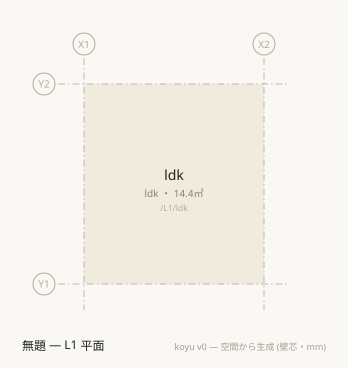
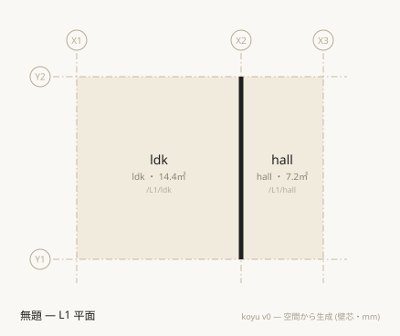
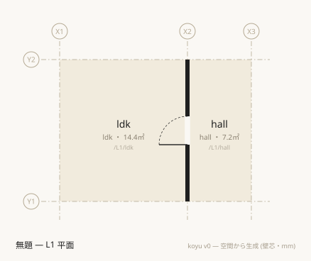
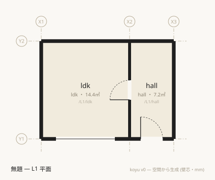
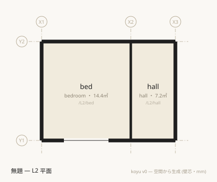
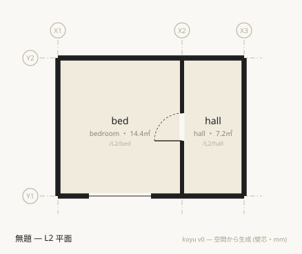
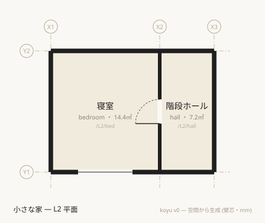

[English](en/start.md) · **日本語**

# はじめの一歩 — 一室から二階建てまで

koyu で二階建ての家を一つ書き、平面図を出し、動線と採光を確かめるまでを通す。所要 30〜45分。

この文書は**レッスン**である。上から順に、書いてあるとおりに進めてほしい。選択肢は出てこない。説明は最小限にとどめ、代わりにリファレンスへの入口を置いてある — 一度通り抜けてから読めばよい。

終わったときに手元にあるもの:

- 30行の `.muro` ファイル一つ
- 各階の平面図 (SVG)
- 「二階の寝室から外まで扉何枚か」「居室の採光は足りているか」への答え

各段の到達点は [examples/steps/](../examples/steps/) にそのまま置いてある。迷ったら突き合わせてほしい。

## 準備

必要なのは Node.js だけである。

```sh
git clone https://github.com/kensnzk/koyu.git
cd koyu
npm install
mkdir -p out
```

この先で書くファイルは `out/house.muro` 一つだけである。`out/` は `.gitignore` に入っているので、ここに置くものはリポジトリを汚さない。コマンドはすべてリポジトリのルートから実行する。

## 第1段 — 一室

`out/house.muro` を作り、次の4行を書く。

```muro
grid X 0 3600 5400
grid Y 0 4000
level L1 0
space /L1/ldk ldk X1..X2 Y1..Y2
```

4行の中身はこうである。

- `grid X 0 3600 5400` — X軸の**通り芯**を宣言する。左から順に `X1` `X2` `X3` と自動で名が付く。位置は常にこの通り芯の言葉で書く — 座標を直に書く行は (敷地の形を除いて) この記法に無い。
- `grid Y 0 4000` — 同じくY軸。`Y1` `Y2` が生える。
- `level L1 0` — 高さ0mmに `L1` というレベルを置く。
- `space /L1/ldk ldk X1..X2 Y1..Y2` — 空間を一つ置く。`/L1/ldk` がこの空間の**パス** (同一性そのもの)、続く `ldk` が**型**、残りが領域である。

型は第2位置引数で、**省略できない**。パスの先頭が `L1` なので、この空間はレベル `L1` に属する。

`grid` と `level` は、それを使う行より前に書く。行の順序が意味を持つのはここだけで、たとえば `boundary` はまだ書いていない空間を先に参照してもよい。

検査する。

```sh
npx tsx src/cli.ts check out/house.muro
```

```text
✔ 整合 — 空間 1 / 境界 0
```

平面図を出す。

```sh
npx tsx src/cli.ts plan out/house.muro
```

```text
平面図を生成しました: out/house-L1.svg
```

`out/house-L1.svg` をブラウザで開く。



**壁が一本も描かれていない。** 空間はあるが、境界が一つも無いからである。壁は空間に付属する持ち物ではない。

なお `check` が見るのは「書かれたものが整合しているか」だけである。空のファイルも `✔ 整合 — 空間 0 / 境界 0` で通る。緑は「正しい建物」の意味ではない — この点は第5段で正面から扱う。

## 第2段 — 二室、そして書いていない壁

`space` を1行足す。他は何も変えない。

```muro
grid X 0 3600 5400
grid Y 0 4000
level L1 0
space /L1/ldk ldk X1..X2 Y1..Y2
space /L1/hall hall X2..X3 Y1..Y2
```

検査する。

```sh
npx tsx src/cli.ts check out/house.muro
```

```text
✔ 整合 — 空間 2 / 境界 1
```

**境界が 0 から 1 に増えている。** 境界の行は一つも書いていない。

平面図を出し直して開く。

```sh
npx tsx src/cli.ts plan out/house.muro
```



SVGの中身にはこの一行が増えている。

```text
<rect x="261.5" y="84" width="5" height="200" fill="#1f1f1f"/>
```

これが壁である。前の段の図に黒い帯は0本、この段では1本 — 増やした行は `space` 一行だけである。

ここで手を止めてほしい。**この記法には壁を描く操作が無い。** 壁は二つの空間の間の境界であり、空間の割付から導出される。接する空間の組に境界の宣言が一つも無ければ、それは「未定義」ではなく「壁」を意味する。垂直方向の「床は書かない、既定は床」と対称の規定である。

- 共有辺から壁芯線分がどう導かれるかは [spec/semantics.md §2](../spec/semantics.md)。
- なぜ既定を壁にしたかは [ADR-0014](../docs/decisions/0014-default-boundaries.md)。

## 第3段 — 扉

導出された壁は物として立っているので、扉が無ければ通れない。穴をあけるには、その境界を**宣言**する必要がある。末尾に `boundary` と `door` の2行を足す (読みやすいように空行も入れた)。

```muro
grid X 0 3600 5400
grid Y 0 4000
level L1 0

space /L1/ldk ldk X1..X2 Y1..Y2
space /L1/hall hall X2..X3 Y1..Y2

boundary /L1/ldk /L1/hall t:120
  door w:800 h:2000
```

`boundary` は二つの空間パスを結ぶ関係である。線分は書かない — 両空間の割付から導かれる。`t:120` は壁厚mm。

`door` の行は**字下げしてある**。字下げされた行は直前の親行に従属する、というのがこの記法の唯一の入れ子である。`door` には幅 `w` が要る。

検査して図を出す。

```sh
npx tsx src/cli.ts check out/house.muro
npx tsx src/cli.ts plan out/house.muro
```

```text
✔ 整合 — 空間 2 / 境界 1
平面図を生成しました: out/house-L1.svg
```

境界の数は 1 のままである。導出されていた壁が、宣言された壁に置き換わっただけだからである。



扉が通っているか、モデルに訊く。

```sh
npx tsx src/cli.ts doors out/house.muro /L1/ldk /L1/hall
```

```text
1枚 — /L1/ldk → /L1/hall
```

**境界を宣言するのは、その境界について何か言うことがあるときだけである** — 厚み、仕様、開口。言うことが無ければ書かない。書かなくても壁はそこにある。

`boundary` に書ける属性は [spec/language.md §4](../spec/language.md)、開口の位置指定は同 §4 の「開口」節にある。

## 第4段 — 外

外部は空間である。`space /out exterior` で宣言し、外皮の境界を自分で書く。

型が `exterior` の空間は領域を持たなくてよい。次のように書き足す。

```muro-bad
grid X 0 3600 5400
grid Y 0 4000
level L1 0

space /L1/ldk ldk X1..X2 Y1..Y2
space /L1/hall hall X2..X3 Y1..Y2
space /out exterior

boundary /L1/ldk /L1/hall t:120
  door w:800 h:2000

boundary /L1/ldk /out t:150
  window w:2400 h:1800
boundary /L1/hall /out t:150
  door w:900 h:2000
```

検査すると落ちる。

```sh
npx tsx src/cli.ts check out/house.muro
```

```text
✖ …/out/house.muro:13行目: 境界線分が複数あります。edge:N/E/S/W で辺を指定してください (/L1/ldk | /out)
✖ …/out/house.muro:15行目: 境界線分が複数あります。edge:N/E/S/W で辺を指定してください (/L1/hall | /out)
```

(エラーは絶対パスで位置を言う。前半は `…` で省いてある。)

これは外部が内部と違うところである。室と室の境界は一本の共有辺だが、室と外部の境界は**外周から他の空間と接する区間を除いた残り**であり、複数の辺に分かれる。`/L1/ldk` は北・南・西の3辺が外に面しているので、窓をどこに置きたいのか記法からは決まらない。

`edge:` で辺を選ぶ。方角は次のとおりである。

| 記号 | 向き | 図の上では |
|---|---|---|
| `N` | +Y | 上 |
| `S` | -Y | 下 |
| `E` | +X | 右 |
| `W` | -X | 左 |

X は東が正、Y は北が正である。`edge` の方角は**先に書いた空間の矩形から見る**。

南面に窓と玄関を置く。13行目と15行目に `edge:S` を足す。

```muro
grid X 0 3600 5400
grid Y 0 4000
level L1 0

space /L1/ldk ldk X1..X2 Y1..Y2
space /L1/hall hall X2..X3 Y1..Y2
space /out exterior

boundary /L1/ldk /L1/hall t:120
  door w:800 h:2000

boundary /L1/ldk /out t:150
  window w:2400 h:1800 edge:S
boundary /L1/hall /out t:150
  door w:900 h:2000 edge:S
```

```sh
npx tsx src/cli.ts check out/house.muro
npx tsx src/cli.ts plan out/house.muro
```

```text
✔ 整合 — 空間 3 / 境界 3
平面図を生成しました: out/house-L1.svg
```



黒い帯は1本から7本になった — 内壁1本と外周6本である。**内壁は自動、外壁は宣言。** 外部との境界は書かなければ存在せず、書かなくても `check` は緑のままである。外皮は自分の目で確かめる持ち場だと憶えてほしい。

窓を入れたので、採光を訊ける。ただしその前に一つ宣言が要る。**koyu は「どの室を判定すべきか」を推測しない** — 型を `ldk` と綴ったことも `bedroom` と綴ったことも、判定の根拠にはならない ([ADR-0020](../docs/decisions/0020-daylight-scope-is-declared.md))。判定してほしい室に `daylight:1` を書く。5行目をこう直す。

```muro-part
space /L1/ldk ldk X1..X2 Y1..Y2 daylight:1
```

```sh
npx tsx src/cli.ts light out/house.muro
```

```text
✔ /L1/ldk	ldk	窓 4.32㎡ / 床 14.40㎡ = 1/3.3 (必要 1/7 ≈ 2.06㎡)
✔ 全1室が 1/7 を満たします (補正係数なしの粗い判定)
```

`hall` が出てこないのは、`daylight:1` を書いたのが `ldk` だけだからである。型は判定に一切関与しない — `hall` を `room` に書き換えても対象にはならず、`hall` のまま `daylight:1` を足せば対象になる。空間の型で構造として解釈されるのは `exterior` と `void` の二語だけで、残りは koyu が解釈しない自由な語である。台帳は [spec/vocabulary.md](../spec/vocabulary.md) にある。

## 第5段 — 二階、そして緑の罠

二階を載せる。`level` を1行足して `L1` にも `h:` を書き加え、空間2行、階段の境界1行、二階の外皮2つを足す。

```muro
grid X 0 3600 5400
grid Y 0 4000
level L1 0 h:2400
level L2 2800 h:2400 slab:400

space /L1/ldk ldk X1..X2 Y1..Y2 daylight:1
space /L1/hall hall X2..X3 Y1..Y2
space /L2/bed bedroom X1..X2 Y1..Y2 daylight:1
space /L2/hall hall X2..X3 Y1..Y2
space /out exterior

boundary /L1/ldk /L1/hall t:120
  door w:800 h:2000

boundary /L1/ldk /out t:150
  window w:2400 h:1800 edge:S
boundary /L1/hall /out t:150
  door w:900 h:2000 edge:S

boundary /L1/hall /L2/hall type:stair

boundary /L2/bed /out t:150
  window w:1800 h:1200 edge:S
boundary /L2/hall /out t:150
```

`level L1 0 h:2400` の `h:` は基準天井高、`level L2 2800 ... slab:400` の `slab:` は床組みの厚みである。`/L2/…` のパスを持つ空間は `L2` に属する。

`boundary /L1/hall /L2/hall type:stair` が階段である。上下階の空間は平面が重なれば自動で隣接し、既定の解釈は「床がある」— 例外だけを境界で宣言する。`stair` は通行可、`shaft` は繋がるが通行不可、`void` は床の不在を意味する。

検査する。

```sh
npx tsx src/cli.ts check out/house.muro
```

```text
✔ 整合 — 空間 5 / 境界 7
```

高さの積み上がりを見る。

```sh
npx tsx src/cli.ts levels out/house.muro
```

```text
L2	z:2800	h:2400	slab:400
L1	z:0	h:2400
  ↑ 階高 2800 = 天井2400 + slab400
```

テキストの矩計である。天井高 + 上階のslab が階高を超えれば `check` がエラーにする。ここでは 2400 + 400 = 2800 でぴたりと収まっている。

二階の平面図を出す。レベルは `-l` で選ぶ。

```sh
npx tsx src/cli.ts plan out/house.muro -l L2
```

```text
平面図を生成しました: out/house-L2.svg
```



普通の二階の平面に見える。`check` も緑である。ここで動線を訊く。

```sh
npx tsx src/cli.ts doors out/house.muro /L2/bed /out
```

```text
/L2/bed から /out へは到達できません
```

**寝室は完全に密閉されている。** `/L2/bed` と `/L2/hall` は接しているので既定の壁が導出されており、その壁には扉が無い。書き忘れではなく、書かなかったことが「壁」という意味を持ったのである。

直す。寝室と階段ホールの境界を宣言し、扉を切る。`boundary /L1/hall /L2/hall type:stair` の次に2行足す。

```muro
grid X 0 3600 5400
grid Y 0 4000
level L1 0 h:2400
level L2 2800 h:2400 slab:400

space /L1/ldk ldk X1..X2 Y1..Y2 daylight:1
space /L1/hall hall X2..X3 Y1..Y2
space /L2/bed bedroom X1..X2 Y1..Y2 daylight:1
space /L2/hall hall X2..X3 Y1..Y2
space /out exterior

boundary /L1/ldk /L1/hall t:120
  door w:800 h:2000

boundary /L1/ldk /out t:150
  window w:2400 h:1800 edge:S
boundary /L1/hall /out t:150
  door w:900 h:2000 edge:S

boundary /L1/hall /L2/hall type:stair

boundary /L2/bed /L2/hall t:120
  door w:800 h:2000

boundary /L2/bed /out t:150
  window w:1800 h:1200 edge:S
boundary /L2/hall /out t:150
```

```sh
npx tsx src/cli.ts check out/house.muro
npx tsx src/cli.ts doors out/house.muro /L2/bed /out
```

```text
✔ 整合 — 空間 5 / 境界 7
2枚 — /L2/bed → /L2/hall → /L1/hall → /out
```

寝室から玄関ホールを抜けて外まで扉2枚。階段は扉ではないので数に入らない。

**境界の数は 7 のまま変わっていない。** 導出されていた壁が、扉つきの壁に置き換わっただけである。`check` の出力も前後で一字も違わない — 密閉された家と使える家を、`check` は区別しない。

図を出し直すと、壁に扉が現れている。

```sh
npx tsx src/cli.ts plan out/house.muro -l L2
```



ここが koyu を使ううえで一番大事なところである。

> `check` が緑でも建物が使えるとは限らない。動線は `doors` で、採光は `light` で、外皮は自分の目で確かめる。

`check` が答えるのは「書かれた構成が整合しているか」であって、「その建物が成り立つか」ではない。何が検査されるかの一覧は [spec/semantics.md §5](../spec/semantics.md) にある。

## 第6段 — 仕上げ

最後に、これまで省いてきたものを足す。

```muro
koyu 0.4
name 小さな家

grid X 0 3600 5400
grid Y 0 4000
level L1 0 h:2400
level L2 2800 h:2400 slab:400

space /L1/ldk ldk X1..X2 Y1..Y2 name:LDK floor:オーク daylight:1
space /L1/hall hall X2..X3 Y1..Y2 name:玄関ホール floor:タイル
space /L2/bed bedroom X1..X2 Y1..Y2 name:寝室 floor:オーク daylight:1
space /L2/hall hall X2..X3 Y1..Y2 name:階段ホール
space /out exterior name:外部

boundary /L1/ldk /L1/hall t:120 spec:PW1
  door w:800 h:2000 name:LDK扉

boundary /L1/ldk /out t:150 spec:EW1
  window w:2400 h:1800 edge:S name:掃き出し窓
boundary /L1/hall /out t:150 spec:EW1
  door w:900 h:2000 edge:S name:玄関

boundary /L1/hall /L2/hall type:stair

boundary /L2/bed /L2/hall t:120 spec:PW1
  door w:800 h:2000

boundary /L2/bed /out t:150 spec:EW1
  window w:1800 h:1200 edge:S
boundary /L2/hall /out t:150 spec:EW1
```

足したものは三種類である。

- **`koyu 0.4`** — 言語版の宣言。省いたファイルは常に最新版の意味論で読まれるので、ツールの版が上がると意味が動きうる。**新しく作るファイルには書く。**
- **`name`** — 建物名 (図面のタイトルになる) と、空間・境界・開口それぞれの名前。
- **`floor:` `spec:`** — koyu が解釈しない自由な属性。そのまま運ばれる。物の名 (RC・LGS・EW1…) は `spec` の値として書く、というのがこの記法の構えである。

同梱の例に見える `unit mm` は書かなくてよい。v0 の長さは mm しかない。

検査して、面積を出す。

```sh
npx tsx src/cli.ts check out/house.muro
npx tsx src/cli.ts stats out/house.muro
```

```text
✔ 整合 — 空間 5 / 境界 7
L1
  /L1/ldk	LDK	ldk	14.40㎡
  /L1/hall	玄関ホール	hall	7.20㎡
  小計 21.60㎡
L2
  /L2/bed	寝室	bedroom	14.40㎡
  /L2/hall	階段ホール	hall	7.20㎡
  小計 21.60㎡
合計 43.20㎡ (屋内床面積)
  ldk: 14.40㎡
  hall: 14.40㎡
  bedroom: 14.40㎡
```

面積は壁芯である。両階の図を出す。

```sh
npx tsx src/cli.ts plan out/house.muro -l L1
npx tsx src/cli.ts plan out/house.muro -l L2
```




最後に、第5段の言いつけどおり動線と採光を確かめる。

```sh
npx tsx src/cli.ts doors out/house.muro /L2/bed /out
npx tsx src/cli.ts light out/house.muro
```

```text
2枚 — /L2/bed → /L2/hall → /L1/hall → /out
✔ /L1/ldk	LDK	窓 4.32㎡ / 床 14.40㎡ = 1/3.3 (必要 1/7 ≈ 2.06㎡)
✔ /L2/bed	寝室	窓 2.16㎡ / 床 14.40㎡ = 1/6.7 (必要 1/7 ≈ 2.06㎡)
✔ 全2室が 1/7 を満たします (補正係数なしの粗い判定)
```

30行のテキストから、二階建ての家と、その平面図と、動線と採光の答えが出た。

この記法で行頭に来る語は13種類、字下げに置ける語は5種類しかない。ここまでで使ったのは `grid` `level` `space` `boundary` と、字下げの `door` `window`、それに `koyu` と `name` — 家一軒はそれで足りる。残る `zone` `import` `asset` `polygon` `stack` `band` `unit` と字下げの `area` `seg`、そして帯の要素として字下げされる `space` は、規模が大きくなったときの語である。全部の一覧は [cheatsheet.md](cheatsheet.md) にある。

## 次に読むもの

- **なぜこう書くのかが腑に落ちていないなら** → [concepts.md](concepts.md)。記法が腑に落ちるために先に要る考えを扱う。
- **やりたいことが決まっているなら** → [howto/](howto/)。目的別の手順が並んでいる。
- **書きながら手元に置くなら** → [cheatsheet.md](cheatsheet.md)。全構文が1ページに収まっている。
- **エラーが出たら** → [diagnostics.md](diagnostics.md)。診断ごとに原因と直し方がある。
- **コマンドをもっと知りたいなら** → [cli.md](cli.md)。ここで使わなかった `graph` `stats` `site` `diff` `json` も扱う。
- **他人の書いたものを読みたいなら** → [gallery.md](gallery.md)。同梱の例を、図と「何を示す例か」つきで並べてある。
- **正確な定義が要るなら** → [spec/](../spec/README.md)。文法は [language.md](../spec/language.md)、導出と検査は [semantics.md](../spec/semantics.md)、属性の契約は [vocabulary.md](../spec/vocabulary.md)、CLI/MCP/APIは [tools.md](../spec/tools.md) が持っている。
